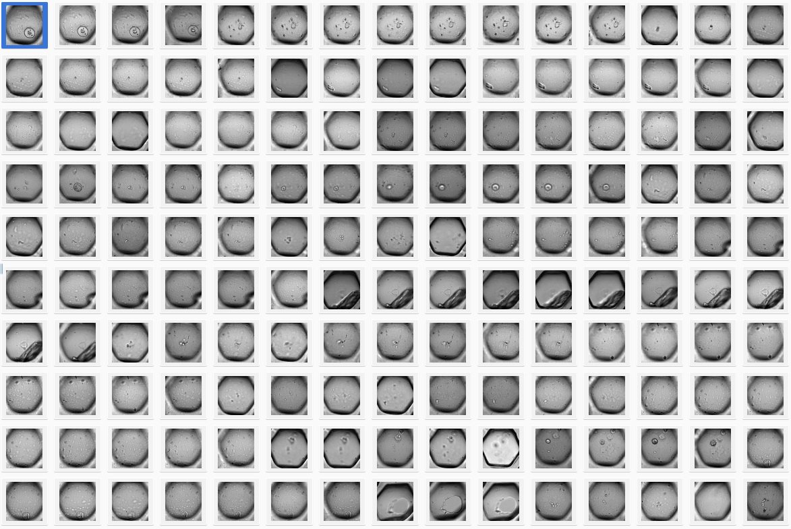

# Welcome!
Most of us study and work at the [Bio-image Analysis Technology Development group](https://physics-of-life.tu-dresden.de/bia) at the [DFG Cluster of Excellence "Physics of Life" at the TU Dresden](https://physics-of-life.tu-dresden.de/).
We blog about image data science, knowledge exchange and research data management in the life sciences. The contents of this blog are licensed by the respective authors under [CC-BY 4.0](https://creativecommons.org/licenses/by/4.0/) license unless a different license is specified.

If you want to read more about why we blog, please check out [this blog post](robert_haase/why_we_blog/readme.md).

If you have feedback or suggestions, if spotted a typo, broken link or misleading explanation, please get in touch via a
[github issue](https://github.com/BiAPoL/blog/issues) or
[pull request](https://github.com/BiAPoL/blog/pulls) so that we can fix it. Contributions are very welcome.

## Recent blog posts

### [Using StarDist in napari with GPU-support in Windows (2025)](stefan_hahmann/stardist_gpu_2025/readme)

<small>[Stefan Hahmann](stefan_hahmann/readme), January 20th, 2025</small> 

This blog post documents how to setup a Windows 10 system such that it can run the StarDist 2D and 3D plugin for Napari.

### [Training a yolo model on an OMERO dataset](ref:yolo_omero)

<small>[Johannes Soltwedel](johannes_mueller/readme), August 12th, 2024</small> 

YOLO is a powerful tool for object detection and thus, obviously interesting in bio-image analysis. This blog post will show you how to train a YOLO model on an OMERO dataset.

### [Getting started with Miniforge and Python](mara_lampert/getting_started_with_miniforge_and_python/readme)]

<small>[Mara Lampert](mara_lampert/readme), July 8th, 2024</small> 

This post will help you to get started with Python using Miniforge. More precisely, you will learn how to install Miniforge, how to create and use conda environments and you will get to know some important packages for bio image analysis.

### [Installation of Elephant Server on Windows](stefan_hahmann/elephant_server_installation_windows/readme)

<small>[Stefan Hahmann](stefan_hahmann/readme), April 24th, 2024</small> 

ELEPHANT is a platform for 3D cell tracking, based on incremental and interactive deep learning. This post will show you how to install the ELEPHANT server component on a Windows machine.

Find more blog posts on the left sidebar.
Enjoy reading!

## Acknowledgements
We acknowledge the support by the Deutsche Forschungsgemeinschaft (DFG, German Research Foundation) under Germany’s Excellence Strategy – EXC2068 - Cluster of Excellence Physics of Life of TU Dresden.

[Imprint](imprint.md)
