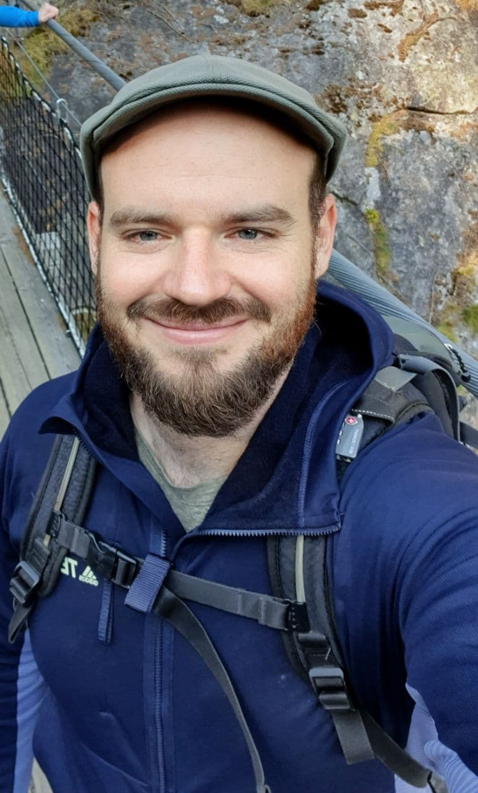

# Johannes Müller

Hi! My name is Johannes and I originally studied physics. No coding, no biology, just classic physics: lasers, calculations, stuff like that.
As I started to progress through the academic cycle, I began to be more and more interested into the life sciences: I worked on thermographic imaging of breast
cancer lesions in my Master thesis and micro-environmental features of head-and neck tumors in mice during my PhD thesis.
The more I got to learn about such biological systems, the more I got fascinated by the overwhelming complexity of biological systems - and the variance of approaches we have to address this!
In particular, my recently finished thesis included analyzing large-scale microscopic image data (~20000 x 20000 pixels) of tumor samples in a way that
would be reproducible and time-wise feasible - enter bio-image analysis.

In 2021, I became part of the bio-image analysis group of Robert Haase at Physics of Life (POL) in Dresden. My task will be to develop tailored bio-image workflows for my fellow researchers,
educate others to empower them to develop their own workflows and develop new methods such that they can be deployed by as many researchers as possible.

## Blog posts
* [GUIs in Python - getting started](entry_user_inter/Readme)
* [Advanced GUIs with Qt designer](entry_user_interf2/Readme)
* [Automated package documentation with Sphinx](entry_sphinx/Readme)
* [Getting started with Python and Anaconda](anaconda_getting_started/Readme)

## Links
* [BiA-PoL group website](https://physics-of-life.tu-dresden.de/en/research/technology-development-groups/bio-image-analysis)
* [Johannes on twitter](https://twitter.com/jm_mightypirate)
* [Johannes on github](https://github.com/jo-mueller)

[Imprint](../imprint)
