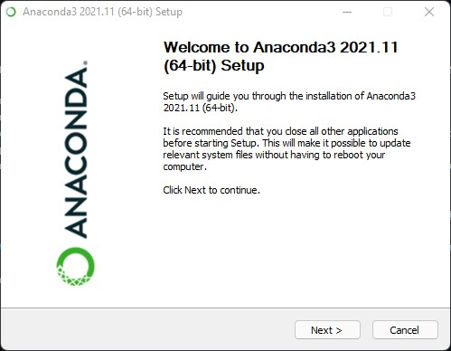
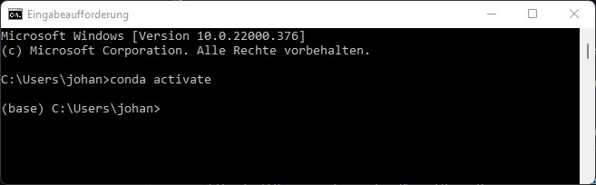
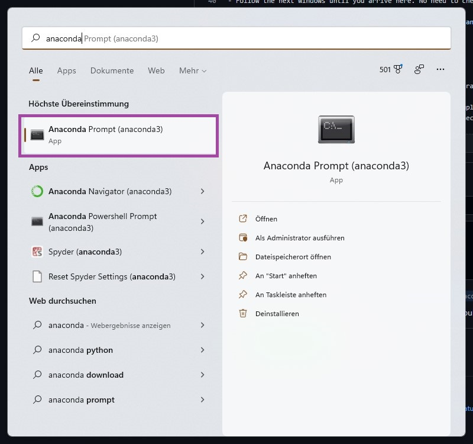
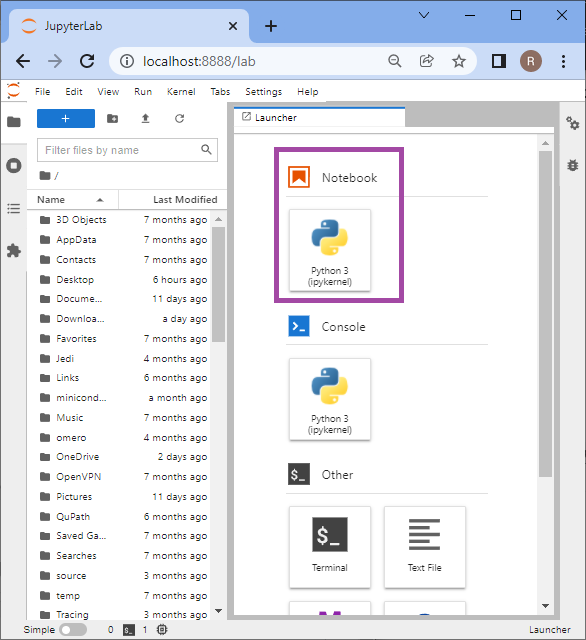
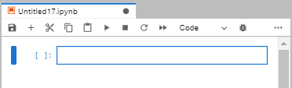

# Getting started with Anaconda and Python
[Johannes Müller](../Readme), January 26th, 2022

## Table of contents
- [Introduction](#introduction)
- [Installation](#installation)
- [Using conda](#using-conda)
- [Creating new environments](#creating-a-new-environment)
- [Installing new packages](#installing-packages)
- [Working with Jupyter lab](#working-with-jupyter-lab)

## Introduction
This blog post will cover all necessary steps to download and setup Anaconda and Python on your machine and guide you through some steps to have it ready for some Bio-image analysis.

Before we start, why do we need Anaconda in the first place to use Python? Robert Haase explains it in a bit more detail [here](https://youtu.be/MOEPe9TGBK0?t=1806). A few key features are:
- Python is a programming language simplifying collaboration and exchange between scientists from different disciplines. Everyone can write their own scripts and modules, and share them with everybody else. While this exchange enables collaborative data science projects on an entire new level, it is sometimes tricky to install the right versions of the right modules to make scripts run on each other's computer. Anaconda helps you to manage the modules and ensures compatibility.
- Anaconda allows you to create so-called "conda" environments. It is recommended to create one conda environment for every project, just like you have one text document for one publication. This makes it much easier to maintain python code and modules that are relevant for the given project. 

## Installation
This tutorial is done on Windows, but should work equally on Mac OS. In order to download Anaconda, go to [https://www.anaconda.com/products/individual](https://www.anaconda.com/products/individual) and click on `Download`:


When Anaconda has finished downloading, follow these steps during the installation:

- Click `Next`:



- Click `I Agree`:


- Now you have to make the choice whether conda should be installed for `All users` or not. We suggest to click `Just me`, as installing Anaconda for all users requires Administrator privileges and can cause trouble if other users on the same machine install  Anaconda, too.


- Install Anaconda into the default location:


- The installer now asks you to "*Add Anaconda3 to my PATH environment variable*. We suggest to do this and explain it below.


- Follow the next windows until you arrive here. No need to check these boxes - that's what you are here for, anyways :) Click `Finish` to exit the setup.


Great! You have finished the setup 👍

## Using conda

Although Anaconda provides a graphical user interface, it is rather common to use Anaconda from the command line. Hence, we will stick to using it for the rest of this tutorial. If you are not used to using the command line, Robert explains a few concepts [here](https://youtu.be/MOEPe9TGBK0?t=1146). 

First, we open a command line prompt. In Windows, you can simply hit the Windows-button, type `cmd` and hit `Enter` to spawn a command line prompt. In [Mac OS](https://support.apple.com/guide/terminal/open-or-quit-terminal-apd5265185d-f365-44cb-8b09-71a064a42125/mac), click the Launchpad icon in the Dock, type `Terminal` in the search field, then click `Terminal`. In Linux, you typically find the Terminal application listed on the left-hand side application panel.

You can now start Anaconda by typing `conda activate`, which should add the prefix `(base)` at the start of the line:



*Note*: If, for any reason, you did not check the "Add to PATH" option above, you will need to open your command line differently. In Windows, hit the Windows button, type `anaconda` and select the application `Anaconda Prompt (anaconda3)`. Similarly, this application should exist on other platforms (Mac, Linux) in the list of installed applications.



This will also open a command line which will directly activate the `base` environment and you can continue normally from here.

## Creating a new environment

**Important note**: You are now in the so-called `base` environment. It is **strongly recommended** to never install any packages into the base environment! The reason for this is the following: It can happen that incompatibilities between packages occur. If that happens in an environment other than the `base` environment - no problem. You can simply delete the environment, recreate it and start over. If, however, this happens in your `base` environment you have to delete and reinstall Anaconda which takes a bit more time ;)

With this out of the way, you can create a new environment with the following command:
```
conda create --name my_first_env Python=3.9
```
This will create a new environment with the name `my_first_env` and with Python version 3.9. Conda will then download a few basic packages that are shipped along with the environment and ask you to `Proceed ([y]/n)` which you have to confirm with typing `y` and hitting `Enter`. Conda will now proceed to download and install some necessary packages.

To activate this environment, type:

```
conda activate my_first_env
```

This should lead to the prefix `my_first_env` to appear at the beginning of your command line:


That's it - you have created and activated your environment 👍

## Installing packages

In order to do some actual coding and image processing we still need a programm that allows us to actual write, edit and execute some code. For this we will be using [Jupyter lab](https://jupyter.org/), which you can convieniently install through conda. We will also need a few other packages for proper image processing, namely [Napari](https://napari.org/) and [Pyopencl](https://pypi.org/project/pyopencl/). To install these type the following command:

```
conda install -c conda-forge napari pyopencl jupyterlab
```

Conda will again ask you for your confirmation (`y` and `Enter`) to proceed with the installation. Other than that, you are now ready for some basic coding! 👍

*Note*: When installing packages from behind a proxy server (e.g., from within the networks of university hospitals or companies), you have to specify these proxy settings to conda. To do so, locate the file `.condarc` on your computer. On Windows, it is typically located at `C:\Users\YourUserName\.condarc`. Open it with a text editor of your choice and add the following lines to the file:

```
proxy_servers:
    http: NameOfProxy:8080
    https: NameOfProxy:8080
```

Ask your local IT admin to get the name of your institution's proxy server.

## Working with Jupyter Lab:

As programming environment, we will use [Jupyer lab](https://jupyter.org/), a convenient environment for python programming in the browser. If you were able to complete the above installation instructions, you can now launch Jupyter lab from your console by simply typing
```
jupyter-lab
```

Jupyter will then start in your browser. If you are wondering why this is opening in your browser - this is exactly how it is intented to be. Now we can start a new notebook by clicking on the highlighted icon:



The newly created notebook will look like this:



A few notes at what can be done here.

- Jupyter notebooks are organized in so-called *cells*. Each cell can be populated either by Python code or Markdown text. Markdown is a lightweight text formatting language - the same one is actually used for this blog - see [this page](https://github.com/adam-p/markdown-here/wiki/Markdown-Cheatsheet) for an overview over availablw formatting You can use the cells to write a workflow in Python code and annotate it with formatted text of your own.
- Use the `+` icon in the top bar to add new cells
- Use the `scissor-icon` in the top bar to delete the currently selected cell
- Use the `run` (triangle) button to run the currently selected cell. You can also do this by hitting `Shift + Enter` on your keyboard
- Use the `stop` (rectangle) icon to interrupt the execution of a currently executed notebook.
- Use the dropdown menu titled `Code` to change a cell's function from Python script to markdown or vice versa.

Finally, test your notebook by typing the obligatory 
```Python
print('Hello World!')
```


Happy coding!
