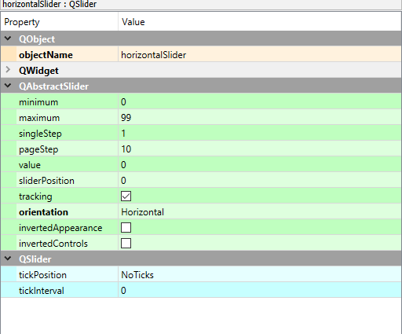

# Best of both worlds: Combining Qt Designer and magicgui

This blog post will give you a quick introduction on how to combine two great tools for the creation of graphical user interfaces in napari: The [Qt Designer](https://doc.qt.io/qt-6/qtdesigner-manual.html) and [magicgui](https://pyapp-kit.github.io/magicgui/). A good place to get started with each are the following blog posts by [myself](../Readme.md) and [Marcelo Zoccoler](../../marcelo_zoccoler/readme.md):

* [Basic GUIs for napari](../entry_user_inter/Readme.md)
* [Using the Qt designer](../entry_user_interf2/Readme.md)
* [Using Qt from Python](../../marcelo_zoccoler/entry_user_interf3/Readme.md)
* [Creating plugins from widgets](../../marcelo_zoccoler/entry_user_interf4/Readme.md)

## Why use Qt Designer and magicgui?

While both tools are great to work with by themselves, each has functionality which the other can not cover. The Qt Designer is a great tool to design and customize complex graphical user interfaces (GUIs) without having to write any actual code. Magicgui on the other hand is a great tool to create widgets that interact very natively with [napari](https://napari.org/stable/) - without going through the effort of actualy designing the GUI by code: Magicgui will do so by itself.

A case you may find yourself unable to do with both tools by themselves is the following - which we will demonstrate how to solve in this tutorial. You want to design a complex user interface for a napari plugin, that requires a large number of input parameters. In particular, one of these parameters should be an input image. The latter is quite easy in magicgui:

```python
@magicgui()
def my_complext_function(image: 'napari.types.ImageData') -> 'napari.types.ImageData':
    # some complex code
    return output_image
```

... and that's it - the `magicgui` decorator will turn this piece of code into a plugin and automatically finds all eligible input image layers in the napari viewer which can be processed by this function. Designing a widget for this function in the Qt Designer can be a bit tricky.

On the other hand, consider the following case: You have two functions, that require access to a single parameter, such as the follows:

```python
def first_function(image: 'napari.types.ImageData') -> 'napari.types.ImageData':
    
    some_global_parameter = 5
    return output_image

def second_function(image: 'napari.types.ImageData') -> 'napari.types.ImageData':
        
    some_new_parameter = some_global_parameter + 5
    return output_image
```

Doing this *without* a Qt plugin is hard to do, as you would have to pass the parameter `some_global_parameter` to the second function. Hence, you'd have to create a Qt Widget (which can keep some internal variables) - but you cannot easily use magicgui to create dropdowns in that widget and select input images. Hence, let's combine the two!

## How to combine Qt Designer and magicgui

As a starting point, we create a custom widget in the Qt Designer. If you use [Anaconda](https://www.anaconda.com/download), it comes along with the software and can simply be opened in any environment by typing `designer` in the command terminal. If you use a different Python distribution, you can download the Qt Designer [here](https://build-system.fman.io/qt-designer-download).

### Designing the widget in the designer

When you start the designer, start by creating a new blank widget and click `Create`:

 

we can now start to fill the blank widget with content: The bar on the left shows all available widgets at your disposal. In our case, let's add a few elements such as a slider, a label and a button. To highlight the level of complexity we can achieve, we embed both in a Tab widget. The result could look like this:


This directly introduces a key strength of the Qt designer: Arranging widgets in layouts is very easy here. Doing so allows widgets to be automatically scaled in size as the window is resized. This is a very useful feature, as it allows to create GUIs that are usable on different screen sizes. In our case, we have created a layout that will scale the slider and the label with the window size, and also keep the button at the same size as the two widget elements above. To add a layout, we simply click into the tab widget and select a Box layout from the available layouts:


The result is a layout that will automatically scale the slider, the button and the label with the window size.


Another cool thing you can *just do* in the Qt designer, is the use of Spacers: Image your widget being stretched very far in the vertical direction, but remaining small in the horizontal direction - you may want your widget elements to stay on the top of the widget in this case. Spacers can do that - find them on the Qt Designers's left sidebar under the `Spacers` tab:


To use them, simply drag and drop the vertical spacer into the layout. You'll find that by default, the spacer expands and thus moves all other widgets in the respective direction above or below itself. The same works for horizontal spacers. The result could look like this:

 

Last but not least, we need to add a layout to the widget itself (not just to the area inside the tab widget). To do so, click on the widget background and select a layout from the available layouts as before. This time, we chose the vertical layout. We then add another vertical spacer at the bottom of the widget.


The final result should look like this:


Before we can use the widget from python, we need to make some final choices in the Qt Designer. For instance, we need to know how we can find each of the widgets later from Python code. To do this for every widget, select it and have a look on the right sidebar. If we select the slider, we can see the following:



The widget's **objectName** is currently set to be `horizontalSlider`. We can change this to whatever we want, but we need to remember this name later. In our case, we will change it to `horizontal_slider_widget`.

The menu furthermore allows you to set default, minimum and maximum values for the slider widget - each of which would be accessible from Python later with another line of code, which can become very tedious for many widgets. The `pageStep` is a cool feature that indicates the order by which widgets will be selected if the `tab` key is pressed - the cursor will then jump from widget to widget in the order indicated by the `pageStep`. Additional settings regarding the layout of the respective selected widget can be done under the `QWidget` tab, such as a minimum height and width of the widget, tooltip messages and more.

After making your changes, we can then save the widget as a `.ui` file by clicking `File` -> `Save As...` and selecting the `.ui` file format. Let's call it `complex_widget.ui`. 

### Using the widget from Python

To use the created widget in python and napari, create a Python file -- let's call it `my_custom_widget.py` in the same folder as the `.ui` file and add the following code:

```python
from qtpy.QtWidgets import QWidget
from qtpy import uic
from pathlib import Path


class my_custom_widget(QWidget):
    def __init__(self, napari_viewer):
        super().__init__()

        # load the .ui file from the same folder as this python file
        uic.loadUi(Path(__file__).parent / "./complex_widget.ui", self)
```

... and that's already all you need to know to create the widget! In order to show the widget in the napari viewer, create a Jupyter notebook in the same location and run the following code:

```python
import napari
from my_custom_widget import my_custom_widget

viewer = napari.Viewer()
widget = my_custom_widget(viewer)
viewer.window.add_dock_widget(widget, area="right")
```

which will display the designed widget in napari:


Note that you can access *all previously added widgets* from Python by `widget.name_given_to_widget_in_desginer`. For instance, we can access the slider widget we created earlier by `widget.horizontal_slider_widget` ( or `self.horizontal_slider_widget` from inside the widget class). Let's see all of this in action:

### Adding a magicgui widget to a custom widget

We now want to add a magicgui widget to the widget we just created. We can create magicgui widgets with this simple code snippet:

```python
from magicgui.widgets import create_widget
from napari.layers import Image

image_layer_select = create_widget(annotation=Image, label="Image_layer")
```

`image_layer_select` now contains a ready-to-use magicgui widget. We now want to insert the newly created `image_layer_select` into the widget created in the designer. We can do so by amending the `__init__` function of our custom widget and add another function - the `eventFilter` - to make sure that the magic of magicgui still works. For more details, see [this discussion](https://forum.image.sc/t/composing-workflows-in-napari/61222/3) on image.sc and [this github issue](https://github.com/napari/napari/issues/3659#issuecomment-973653290).

```python
from qtpy.QtWidgets import QWidget
from qtpy.QtCore import QEvent, QObject
from qtpy import uic
from pathlib import Path


class my_custom_widget(QWidget):
    def __init__(self, napari_viewer):
        super().__init__()

        self.viewer = napari_viewer
        uic.loadUi(Path(__file__).parent / "./complex_widget.ui", self)

        # add magicgui widget to widget layout
        self.image_layer_select = create_widget(annotation=Image,
                                                label="Image_layer")
        self.layout().insertWidget(0, self.image_layer_select.native)
        self.installEventFilter(self)

    def eventFilter(self, obj: QObject, event: QEvent):
        if event.type() == QEvent.ParentChange:
            self.image_layer_select.parent_changed.emit(self.parent())

        return super().eventFilter(obj, event)
```

Let's change our notebook code from above slightly to use the new widget. The result is a new magicgui widget showing up at the top of our widget - and as we specified, it allows us to select an image layer from the napari viewer, in this case the `camera` image layer.

```python
import napari
from my_custom_widget import my_custom_widget
from skimage import data

viewer = napari.Viewer()
viewer.add_image(data.camera(), name="camera")

widget = my_custom_widget(viewer)
viewer.window.add_dock_widget(widget, area="right")
```


### Adding functionality to the widget

To round this blog post off, we would like to 

- add some functionality to the widget, e.g., use the widgets from the qtdesigner for something. This has been already been adressed in [this blog post](../../marcelo_zoccoler/entry_user_interf4/Readme.md), so we will not go into too much detail here.
- access the image data inside the widget, which works in a bit peculiar way.

To add functionality, the main idea is to add a function to the widget that is called when a widget emits a signal that something has been done. For instance, for the slider widget, we can add a line in the `__init__` function of the widget that connects the slider's `valueChanged` signal to a function `on_slider_change`:

```python
from qtpy.QtWidgets import QWidget
from qtpy.QtCore import QEvent, QObject
from qtpy import uic
from pathlib import Path


class my_custom_widget(QWidget):
    def __init__(self, napari_viewer):
        super().__init__()

        self.viewer = napari_viewer
        uic.loadUi(Path(__file__).parent / "./complex_widget.ui", self)

        # add magicgui widget to widget layout
        self.image_layer_select = create_widget(annotation=Image,
                                                label="Image_layer")
        self.layout().insertWidget(0, self.image_layer_select.native)
        self.installEventFilter(self)

        # connect slider to function
        self.horizontal_slider_widget.valueChanged.connect(self.on_slider_change)

    def eventFilter(self, obj: QObject, event: QEvent):
        if event.type() == QEvent.ParentChange:
            self.image_layer_select.parent_changed.emit(self.parent())

        return super().eventFilter(obj, event)
    
    def on_slider_change(self):
        print(self.horizontal_slider_widget.value())
```

To be able to access the image layer selected by the magicgui widget, we can do so by accessing the `value` attribute of the magicgui widget. This attribute will contain the selected layer - in order to access attributes of the layer itself (such as the actual image data), we can access this through `self.image_layer_select.value.data`. Similarly, we can access `features`, `metadata`, etc. We can then use this image data in the `on_slider_change` function to threshold the image layer:

```python
from qtpy.QtWidgets import QWidget
from qtpy.QtCore import QEvent, QObject
from qtpy import uic
from pathlib import Path

class my_custom_widget(QWidget):
    def __init__(self, napari_viewer):
        super().__init__()

        self.viewer = napari_viewer
        uic.loadUi(Path(__file__).parent / "./complex_widget.ui", self)

        # add magicgui widget to widget layout
        self.image_layer_select = create_widget(annotation=Image,
                                                label="Image_layer")
        self.layout().insertWidget(0, self.image_layer_select.native)
        self.installEventFilter(self)

        # connect slider to function
        self.horizontal_slider_widget.valueChanged.connect(self.on_slider_change)

    def eventFilter(self, obj: QObject, event: QEvent):
        if event.type() == QEvent.ParentChange:
            self.image_layer_select.parent_changed.emit(self.parent())

        return super().eventFilter(obj, event)

    def on_slider_change(self):
        image_layer = self.image_layer_select.value
        binary_image = image_layer.data > self.horizontal_slider_widget.value()

        if 'result of threshold' not in self.viewer.layers:
            self.viewer.add_image(binary_image,
                                  name='result of threshold',
                                  opacity=0.5)
        else: 
            self.viewer.layers['result of threshold'].data = binary_image
```

The result is a widget that will threshold the selected image layer when the slider is moved. You can find the entire code for this example [here](https://github.com/BiAPoL/blog/tree/master/docs/johannes_mueller/qtdesigner_and_magicgui/example).


* Note: While data attributes of the magicgui widget can can be accessed by `self.image_layer_select.value`, the value of many Qt widgets (e.g., sliders, checkboxes, spinboxes, etc) are typically accessed by `self.widget_name.value()`. This is a bit confusing, but it is what it is.

## Conclusion

What we did in the previous example was, in essence, an implementation of a simple thresholding widget. It is obvious that such simple tasks are much better done by simply using [magicgui](https://pyapp-kit.github.io/magicgui/) to save ourselves working with Qt code to begin with. Using the combination of the Qt Designer and magicgui becomes a lot more useful when we want to create more complex widgets with many buttons. The following two criteria are indications that you may want to use the combination of the Qt Designer and magicgui:

- There should be feedback to the GUI; e.g., the GUI should change when a button is pressed. This could be the case when a result is calculated and the GUI should display the result.
- You need access to the same Python object from different functions. This could be the case when you control a remote device - let's call it `Microscope` - through a Qt widget. In this case, the `Microscope` class can be part of the the Qt object's namespace (e.g., `self.microscope = Microscope()`). You can then access the `Microscope` object from any function in the widget, e.g., when a button is pressed.