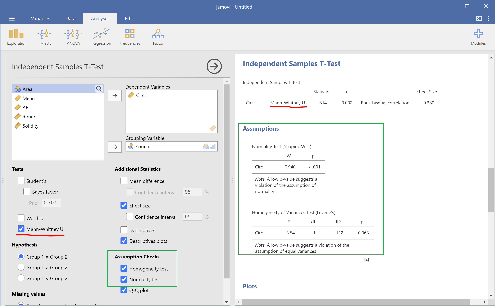
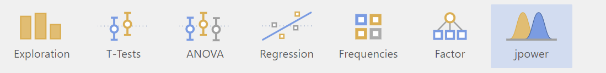

# Jamovi: statistical analysis made visual and easy (powered with R)
[Marcelo Zoccoler](../readme), October 7th 2021

Statistical analysis software exist for decades. So why care about "just another one". Well, for one main reason: simplicity. And I mean simplicity by a clean interface and an easy usage. Besides that, [Jamovi](https://www.jamovi.org/) is open-source and developed in R, a powerful programming language to perform statistical tests.

Almost every field in science uses statistical analysis as a tool to validate or refuse a hypothesis. Thus, popular commercial software, like [SPSS](https://www.ibm.com/analytics/spss-statistics-software), [SAS](https://www.sas.com/en_us/home.html), [Origin](https://www.originlab.com/), [Stata](https://www.stata.com/), [Prism](https://www.graphpad.com/scientific-software/prism/), as well as Excel itself, have been and are used. They are all very powerful platforms, but their initial interface with too many menus and buttons may intimidate new users (besides the price). There is a free similar option to SPSS called [PSPP](https://www.gnu.org/software/pspp/), but since it mimics the latter, their interfaces are similar.
Another options would be using programming languages like [Python](https://www.python.org/) and [R](https://www.r-project.org/), but that still wards off all non-programmers. 

Recently, two options free and open-source emerged as a solution to this: [JASP](https://jasp-stats.org/) and [Jamovi](https://www.jamovi.org/). They are very much alike, but here I will focus on this last one for no particular reason.

Since I work with image analysis, I will use Jamovi to compare features of different elements in the following image (a sample from [imageJ](https://imagej.net/software/fiji/) called "TEM_filter_sample"). Let's suppose I did 2 distinct segmentations and I want to compare the shapes of the black elements (yellow contour) against the white elements (red contour):

Then I saved 2 [tables](https://github.com/BiAPoL/blog/raw/master/marcelo_zoccoler/jamovi/data) (as .csv files) containing data about shape descriptors.

## Installing Jamovi

Just download it from the [website](https://www.jamovi.org/) and follow standard installation steps.
There are also a [user guide](https://www.jamovi.org/user-manual.html) and [other tutorials](https://www.jamovi.org/community.html) there!

## Using Jamovi

Open Jamovi and you will see a screen like the one shown below:

It is hardly possible to have a starting screen simpler than that. You have 4 tabs: Variables, Data, Analysis and Edit. And a split screen: left, where your data will live, and right, where the results will show up.

## Importing your data

You could type your data yourself in the left side, but since we already have our data from elsewhere, let's import it. On the top left, click on the 3 dashes symbol and then click on "Import". You should get a screen like this one:

Browse your data folder. Now, if you want to import data from 2 or more files, like in this case, it is important to press CTRL/CMD and click on every file before clicking on the "Import" button at the bottom. 

If you used the tables I provided in this example, you may notice some empty columns A, B and C, which were already there before importing the files. Let's delete those variables by clicking on "Variables", selecting them and clicking on "Delete".

## Descriptive analysis

Now we are ready for analysis! It is always a good idea to take a look at the data before performing statistical tests. So, let's go to "Analysis -> Exploration" and observe descriptors about a certain feature. In our case, we are interested in Circularity, so click on the variable "Circ." and then click on the arrow at the top to put this feature in the "Variables" box. We also want to see this feature separated by our black/white elements, so click on the variable "source" and then click on the second arrow to put it in the "Split by" box. You will already see a table on the right side showing some statistics like mean, median, etc.

You can also add plots!

## Hypothesis testing: T-tests

Then let's do a t-test. Go to "Analyses ->  T-tests -> Independent Samples T-Test". 

Since our data seems to be not normally distributed, we will perform a [Mann-Whitney U test](https://en.wikipedia.org/wiki/Mann%E2%80%93Whitney_U_test) (shown below in red). We can also perform [normality](https://en.wikipedia.org/wiki/Normal_distribution) and [homoscedasticity](https://en.wikipedia.org/wiki/Homoscedasticity) tests to check our assumptions (shown in green).

And generate plots related to the [t-test](https://en.wikipedia.org/wiki/Student%27s_t-test) (check "Descriptive plots" below in red) and a [Q-Q plot](https://en.wikipedia.org/wiki/Q%E2%80%93Q_plot) (shown in green).

## Correlation analysis

Another analysis we could run is [correlation](https://en.wikipedia.org/wiki/Correlation). Let's check if roundness and aspect ratio are correlated.
In the Analyses tab, click "Regression -> Correlation Matrix". Then just assign the variables "Round" and "AR" to right box, choose the correlations you want, like Pearson and Spearman, and activate some plot by checking checkboxes.

We can see that they are negatively correlated, as one would expect by examining their [documentation](https://imagej.nih.gov/ij/docs/menus/analyze.html).

## Editing

All figures and tables produced can be exported or removed by right-clicking on them. Jamovi allows just a small amount of layout editing. If you click on the three dots at the upper right corner, you can change zoom, color palette and also enable "Syntax mode", which then display the R code responsible for executing the tests and generating the plots.

## Extra features

Finally, extra functionality and tests that might be missing with the standard installation can be added as plugins. For instance, if one wants to perform power analysis, this can be done by clicking on the "+ Modules" button at the top right. Then, a list of plugins is displayed for installation. 

If you install "jpower" for example, the new module appears as an extra button right next to the other analyses.

You can find more information in their [documentation](https://jamovi.readthedocs.io/en/latest/index.html).
