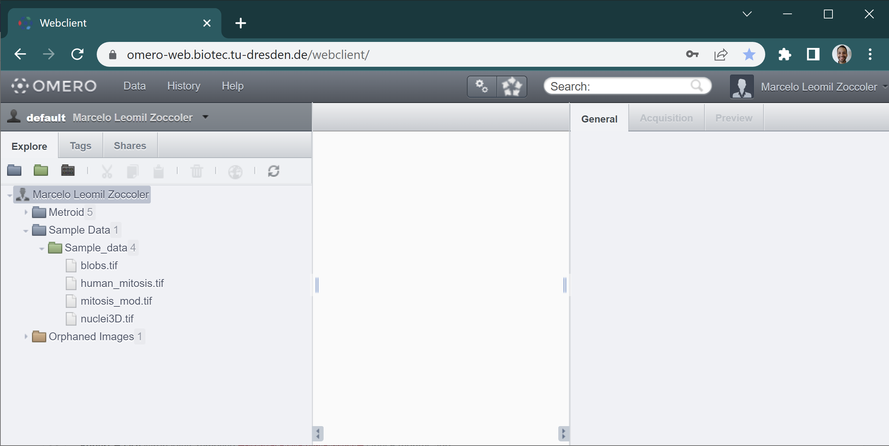
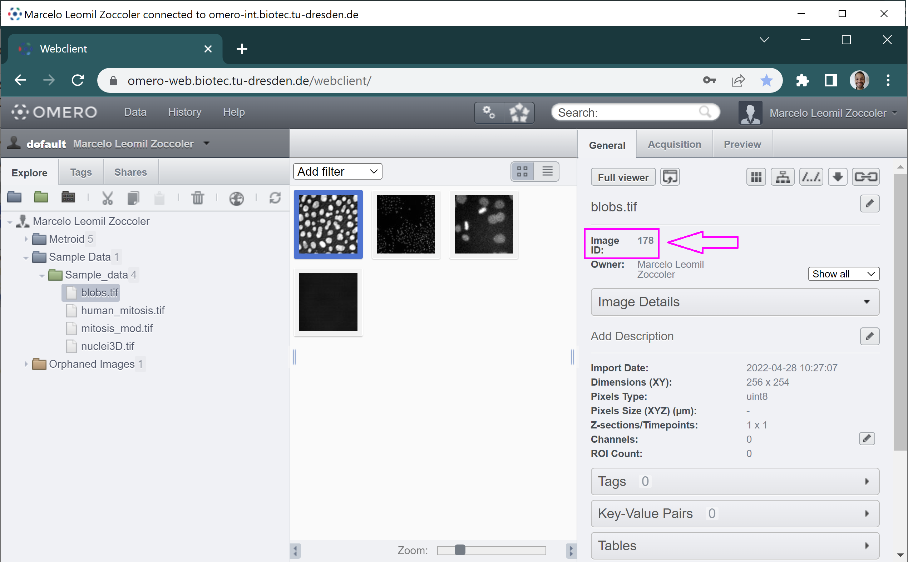
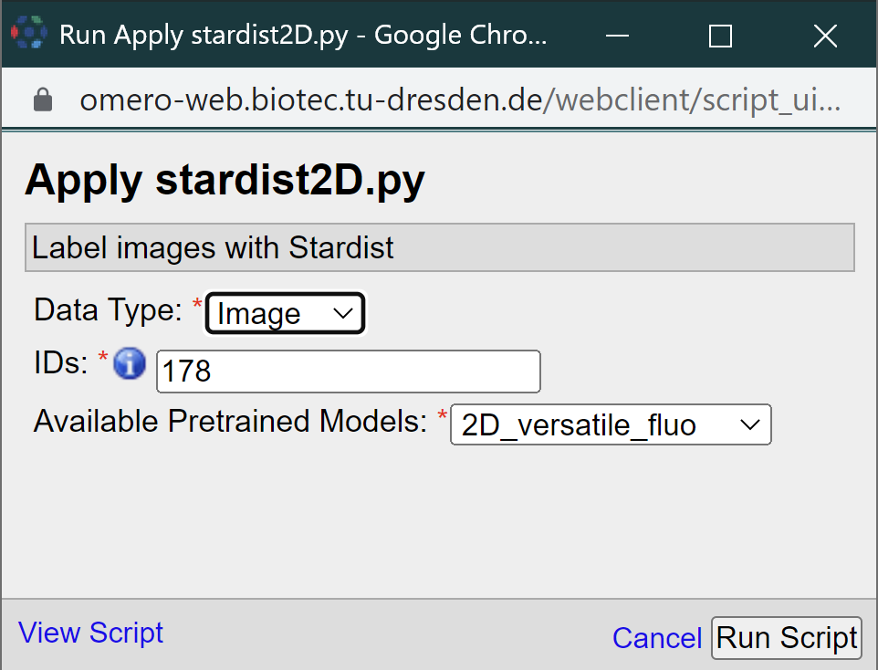
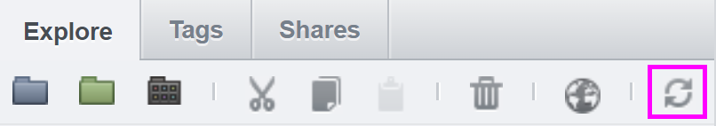
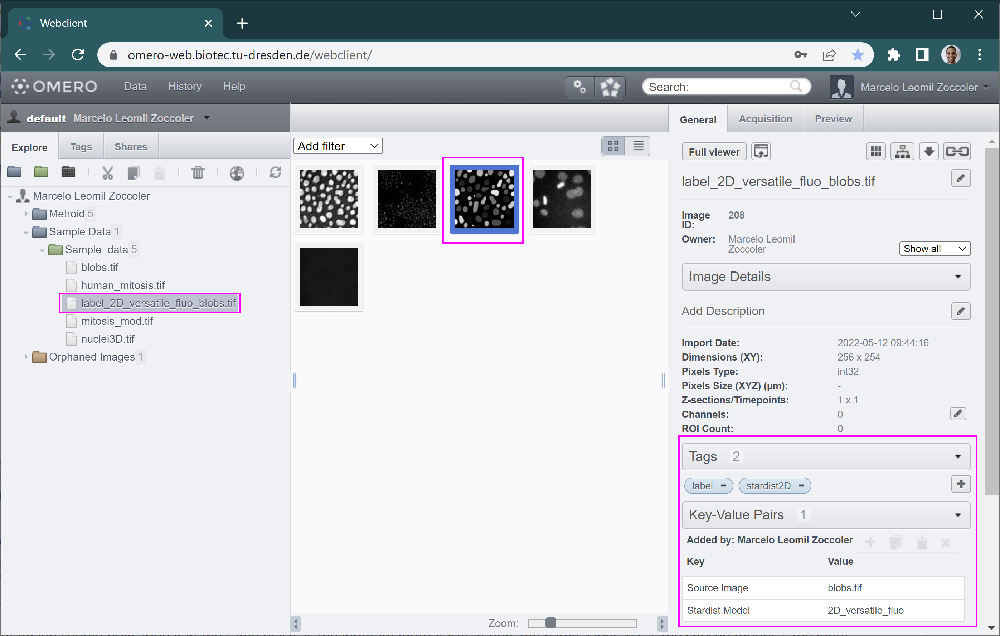

# Running Deep-Learning Scripts in the BiA-PoL Omero Server
[Marcelo Zoccoler](../readme), May 2nd 2022

## Omero Server

OMERO is client-server software for managing, visualizing and analyzing microscopy images and associated metadata. Once configured, it can be accessed from a few different interfaces, which are:
  - A command line;
  - A web browser;
  - A Desktop application.

Viewing images and running scripts can be done from any of these interfaces, but importing images to the server can only be done via command line or the desktop application. Thus, in this tutorial, we show 
  1. how to load data using the desktop application, called Omero Insight;
  2. how to run a script for deep-learning (Stardist 2D) through the browser. 

## Getting access to the BiA-PoL Omero Server

The Bio-Image Analysis group from the Physics of Life Cluster of Excellence has an Omero server. If you have access to your own omero server, you may skip to the next section.

Access to the BiA-PoL Omero server may be provided to local users through the following steps:

1. Contact BiA-PoL members to check if you are allowed to get access to the server by email.
2. One of the BiA-PoL members will ask the IT department to create an account for you. You need a ZIH account for that.
3. Configure a VPN access by following [these instructions](https://intranet.crt-dresden.de/it-department/external-access.html).
4. Connect to the "Biotec Crtd Journal Access" VPN.

## Importing data to the Omero Server

As mentioned before, you can import data to the server either via command line or via the Desktop Client. Here, we will explain the second option (Omero Insight application).
The Omero webpage has a good step-by-step tutorial of how to import images to the server using the Desktop client application `Omero.insight`. When asked (step 2 of the link below), provide your omero server address. For the BiA-PoL server, the address is https://omero-int.biotec.tu-dresden.de .

- [Import data using the Desktop Client](https://omero-guides.readthedocs.io/projects/upload/en/latest/import-desktop-client.html#setup)

After installing Omero Insight and loading some images, you can access the server from Omero Insight, from command line or from the browser. From this point forward, we will only be accessing it from the browser. The server address from the browser is slightly different: https://omero-web.biotec.tu-dresden.de . There, provide the same ZIH username and password to connect to the server. Remember to be connected to the VPN!

## Running Omero Scripts

After logging in, you should get to the following screen:



Images in Omero are usually organized as:
```
User/Client
└──Project
|    └──Dataset
|        └──Images
└──Orphaned Images
```

The Orphaned Images is the place where images are stored if they have no Project associated to them. You can browse through this file structure by clicking on the `+` buttons to open these directories. Once you reach the Dataset level, you can see image thumbnails in the main panel. If you click on them, you can get the corresponding information on the right side. One of the most important properties is the Project/Dataset/Image ID (magenta arrow in the figure below), which you will usually need to provide to scripts.



Omero scripts can be run by clicking on the small button with two gears on top of the screen (magenta square). A pop-up menu should open where you can select the origin of your scripts (`omero` or `CMCB`). 


In `omero`, you can run the standard omero scripts. If you are logged to BiA-PoL omero server, you also have access to run one of the plugins we are developing in `CMCB`. Most of them are work in progress, that is why you may find names starting with 'testing'. In this tutorial, we will use "apply_stardist2D". Clicking on it open a new small window:



There you should provide 3 parameters: the "Data Type" (Dataset or Image), the corresponding ID and one of the pretrained Stardist2D models. Then, click on the "Run Script" button. The Activities window (magenta square below) should pop-up on the top, indicating the status of execution. After the script finish running, it should look like this:


You can download the "Info" (green arrow above) and "Error" (cyan arrow above) as text files. "Error" may contain errors or, in this case, just some warnings that can be ignored. "Info" contains information returned from print statements within the script.

The resulting labeled image may not be visible after that. If that is the case, refresh the files by clicking on the refresh button:





The output image should now appear in the same place as the input image/dataset. It gets the name 'label_2D' + the chosen model + the input image name. It also gets some tags and key/pair values assigned to it to indicate how it was produced (right side panel).

That's it! You ran a server-side custom script and got its outputs.
