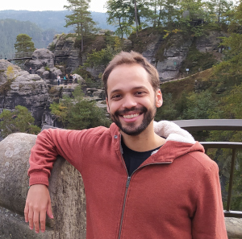

# Marcelo Zoccoler

Hi! My name is Marcelo and I am an Electrical Engineer who has specialized in Life Sciences and Image Analysis!
Most of my work has been done on tools and software for image analysis focused on microscopy data.

During my Masters and PhD in Biomedical Engineering, I have worked with measuring microtubules stiffness by image analysis and modeling at UJF (now Université Grenoble Alpes) in France. After that, I have performed experiments with single cardiomyocytes under electrical fields in a [fluorescence microscope that was assembled by our group](https://doi.org/10.1007/978-3-319-19387-8_318) at UNICAMP in Brazil. There, I started developing algorithms and software for bio-image analysis in MATLAB and Python. I also used a lot of Fiji as well! The goals were to quantify calcium concentration and membrane potential in these cells. Since some of these signals are very weak, I developed a software to extract these signals from noisy images called [METROID](https://doi.org/10.1186/s12859-020-03661-9). Most recently, I have contributed to develop a software called [PoET](https://doi.org/10.1093/bioadv/vbab037) that automatically measures Giant Unilamellar Vesicles (GUV) pores and I have designed an online simulator as a tool to teach students about electrochemical balance across a semipermeable membrane.

Since 2021, as a researcher for the Bio-image Analysis Technology Development group (BiA-PoL) at the DFG Cluster of Excellence “Physics of Life” at TU Dresden, I am developing courses and tools, mostly in Python and Fiji, that are intended to break down the barriers that biologists and biophysicists might experience when delving into the data science jungle. Below you will find some links to content related to my studies and how to find me.

# Blog posts

  * [Jamovi: statistical analysis made visual and easy (powered with R)](jamovi/jamovi)
  * [Creating advanced GUIs for napari](entry_user_interf3/Readme)
  * [Turning napari GUI into plugins](entry_user_interf4/Readme)

# Links
  *  [BiA-PoL website](https://physics-of-life.tu-dresden.de/en/research/core-groups/bio-image-analysis)
  *  [Twitter](https://twitter.com/zoccolermarcelo)
  *  [Github](https://github.com/zoccoler)
  *   [ResearchGate](https://www.researchgate.net/profile/Marcelo-Zoccoler)
