# GPU-accelerated image processing in the cloud using Google Colab and clEsperanto
[Robert Haase](../readme), June 5th 2021

Not every computer has a powerful graphics processing unit (GPU) and thus, 
it might make sense to use cloud computing, e.g. provided by Google. In this
blog post I give a short intro into Google Colab and how to enable
GPU-accelerated image processing in the cloud using [clEsperanto](https://clesperanto.net).

See also
* [Getting Started With Google Colab by Anne Bonner](https://towardsdatascience.com/getting-started-with-google-colab-f2fff97f594c)
* [clEsperanto count blobs tutorial](https://nbviewer.jupyter.org/github/clEsperanto/pyclesperanto_prototype/blob/master/demo/basics/count_blobs.ipynb)

## Step 1: Create a new notebook
Go to [https://colab.research.google.com/](https://colab.research.google.com/)
and click on `New Notebook`
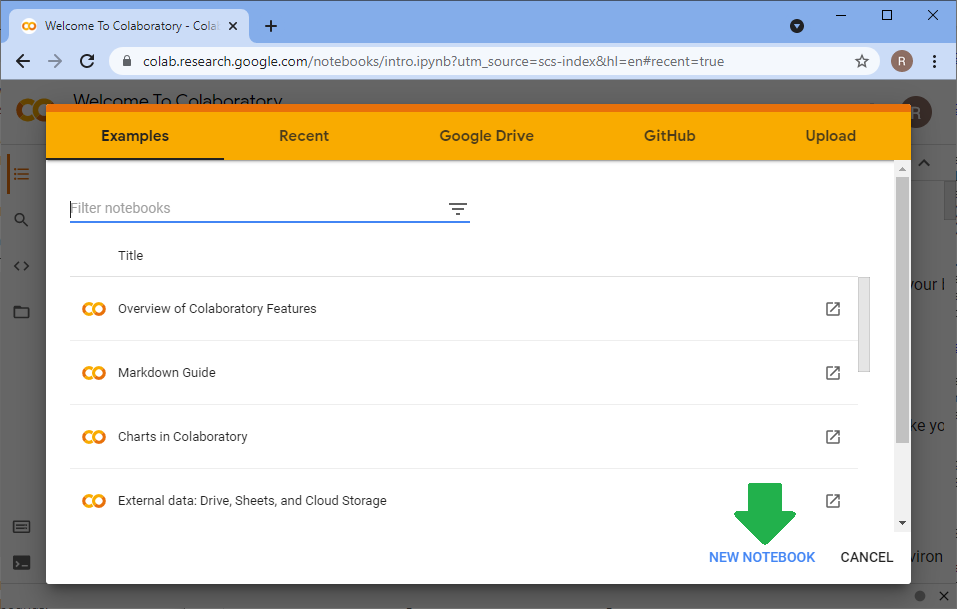

## Step 2: Activate access to a GPU
In the `Runtime` menu, click on `Change runtime type`
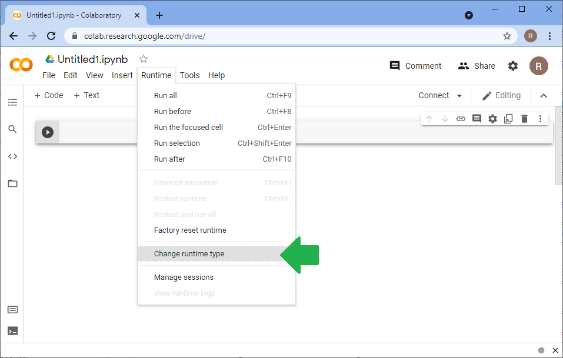

The dialog allows you to select hardware accelerators. Select `GPU` and click on `Save`.
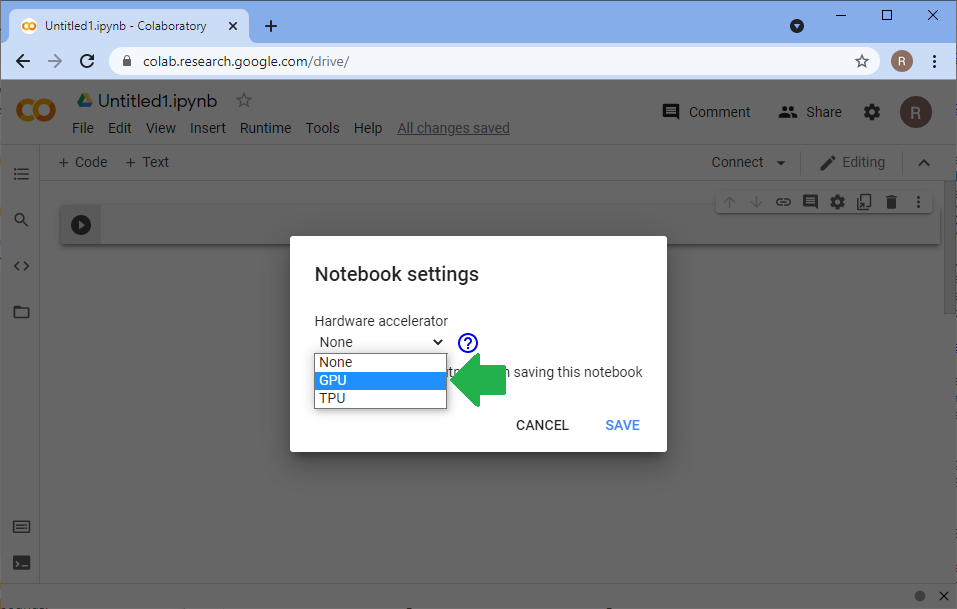

## Step 4: Install pyclesperanto
For installing pyclesperanto, enter this code in a cell and hit SHIFT-ENTER.
```
!pip install pyclesperanto_prototype
```
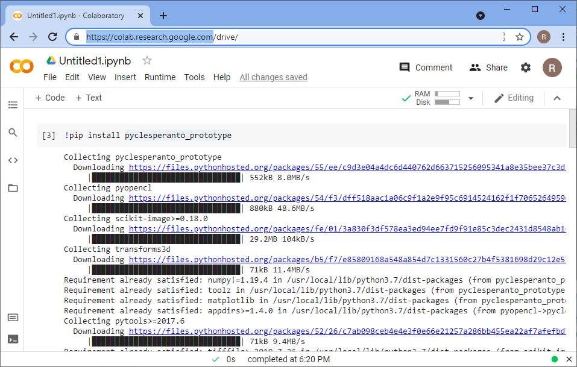

After installation, you may read a message asking you to restart your kernel. If so, click on 'Restart Runtime'.
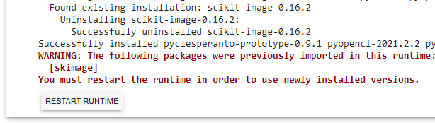

Afterwards, test the installation by printing out which GPU-device is selected:
```
import pyclesperanto_prototype as cle

cle.get_device()
```
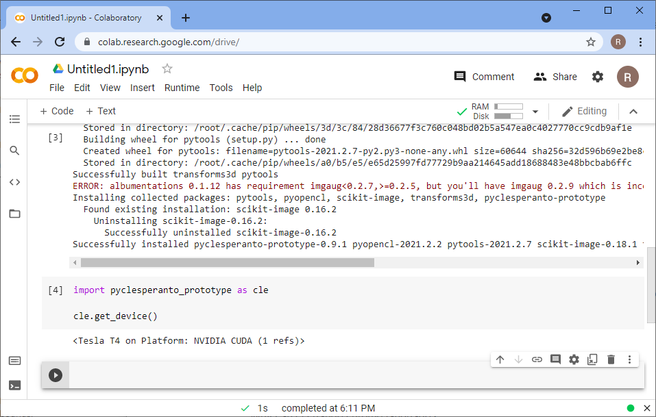

## Step 4: Testing image processing
For processing an image, we use scikit-image to load it from the cloud first
```
from skimage.io import imread

image = cle.push(imread('https://samples.fiji.sc/blobs.png'))
image.shape
```
and clesperantos' `imshow` function to visualize it:
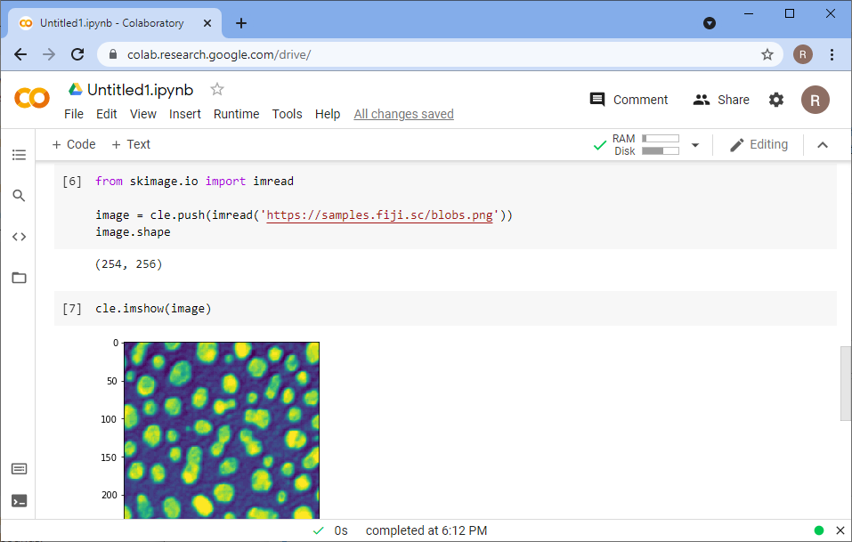

An image processing workflow using the GPU looks for example like this:
```
blurred = cle.gaussian_blur(image, sigma_x=2, sigma_y=2)
binary = cle.threshold_otsu(blurred)
labels = cle.connected_components_labeling_box(binary)
```
Label images can be visualized with `cle.imshow` as well by providing the parameter `labels=True`.
```
cle.imshow(labels, labels=True)
```
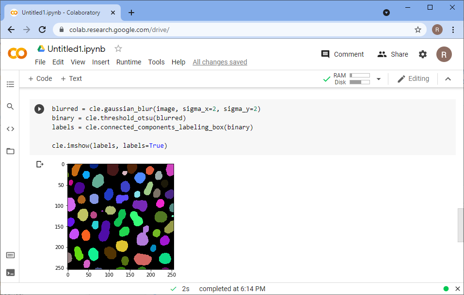

## Step 5: Connecting google drive
For saving image processing results to our google drive, we need to connect to it:
```
from google.colab import drive
drive.mount('/content/gdrive')
```
The procedure involves creating an authorization code. 
In order to generate it, click on the provided link and follow the instructions.
Give access to your Google drive to Google Colab:
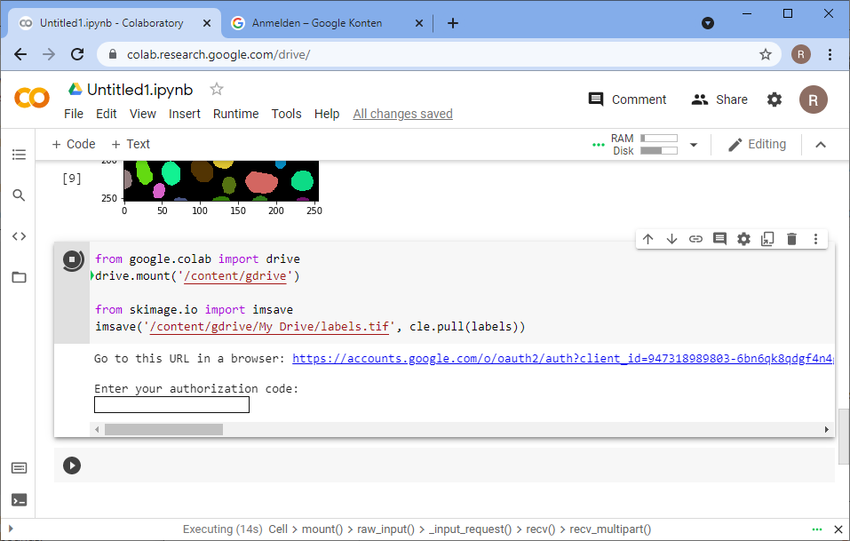
Afterwards, copy the authorization code by clicking the `copy to clipboard` button

and paste the code in the respective field in your notebook:
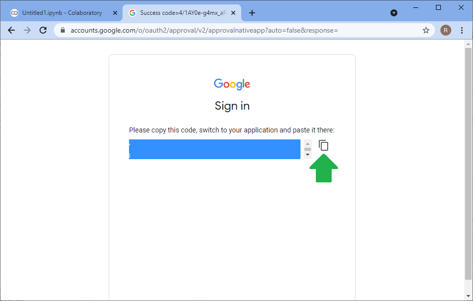
After the connection was established successfully, you can save to your google drive like this:

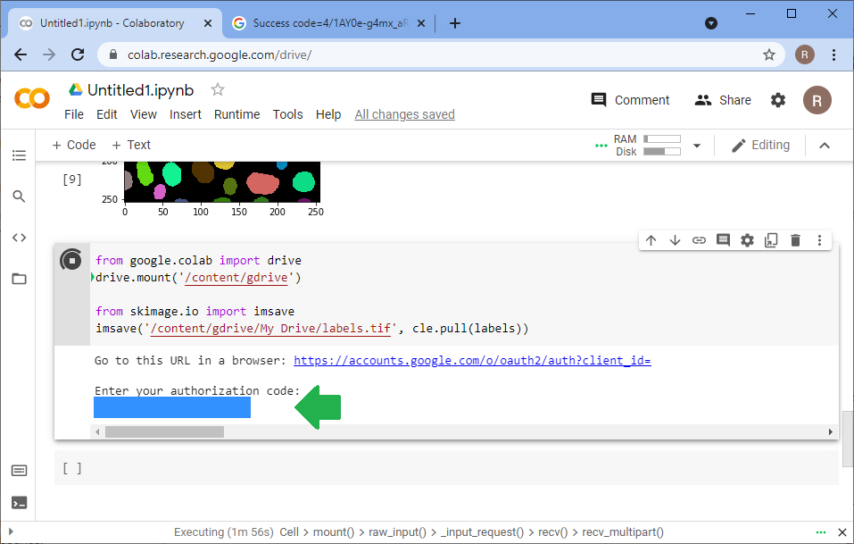
```
from skimage.io import imsave
imsave('/content/gdrive/My Drive/labels.tif', cle.pull(labels))
```
You will then see the saved file in your google drive:
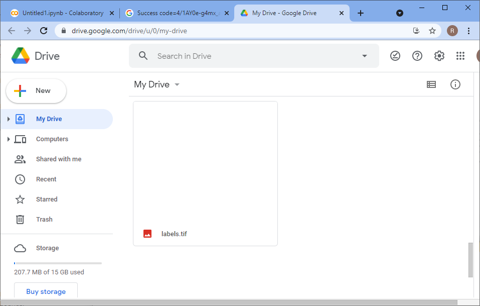

## Hints

### Sharing notebooks via github.com
If you have a [github](https://github.com) account, you can upload a notebook also to a github repository.
Afterwards, you can enter the location of the repository into a google colab link to share it with collaborators:

For example, a notebook on github.com can have this URL:
```
                      https://github.com/clEsperanto/pyclesperanto_google_colab/blob/main/interactive_example.ipynb
```
and the corresponding Google Colab address looks like this:
```
https://colab.research.google.com/github/clEsperanto/pyclesperanto_google_colab/blob/main/interactive_example.ipynb
```
[Try it out!](https://colab.research.google.com/github/clEsperanto/pyclesperanto_google_colab/blob/main/interactive_example.ipynb)

### How much memory does my GPU have?
You can read how much memory is available from the device object. 
Divide the value three times by 1024 to get the amount of memory in giga bytes.
```
dev = cle.get_device()
dev.device.global_mem_size / 1024 / 1024 / 1024
```

### How much memory is currently in use?
If you are using an NVidia GPU, you can the [NVidia System Management Interface](https://developer.nvidia.com/nvidia-system-management-interface):
```
!nvidia-smi
```
It will give an overview about what's currently going on on your GPU:
```
+-----------------------------------------------------------------------------+
| NVIDIA-SMI 465.27       Driver Version: 460.32.03    CUDA Version: 11.2     |
|-------------------------------+----------------------+----------------------+
| GPU  Name        Persistence-M| Bus-Id        Disp.A | Volatile Uncorr. ECC |
| Fan  Temp  Perf  Pwr:Usage/Cap|         Memory-Usage | GPU-Util  Compute M. |
|                               |                      |               MIG M. |
|===============================+======================+======================|
|   0  Tesla T4            Off  | 00000000:00:04.0 Off |                    0 |
| N/A   63C    P0    30W /  70W |    106MiB / 15109MiB |      0%      Default |
|                               |                      |                  N/A |
+-------------------------------+----------------------+----------------------+
                                                                               
+-----------------------------------------------------------------------------+
| Processes:                                                                  |
|  GPU   GI   CI        PID   Type   Process name                  GPU Memory |
|        ID   ID                                                   Usage      |
|=============================================================================|
+-----------------------------------------------------------------------------+
```

# Disclosure
When reading this blog post, please have in mind that I'm one of the core developers of [clesperanto](https://clesperanto.net). I may be biased on the one side and even more interested on feedback on the other side.

# Acknowledgements
I would like to thank Florian Jug and Wei Ouyang for introducing me to Google Colab and showing me tips and tricks.