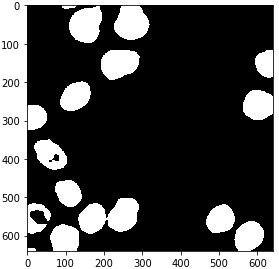

# GPU-accelerated image processing using cupy and cucim
[Robert Haase](../readme), June 6th 2021

Processing large images with python can take time. In order to accelerate processing, graphics processing units (GPUs) can be exploited, for example using [NVidia CUDA](https://en.wikipedia.org/wiki/CUDA). For processing images with CUDA, there are a couple of libraries available. We will take a closer look at [cupy](https://cupy.dev/), which brings more general computing capabilities for CUDA compatible GPUs, and [cucim](https://github.com/rapidsai/cucim), a library of image processing specific operations using CUDA. Both together can serve as GPU-surrogate for [scikit-image](https://scikit-image.org/).

See also
* [StackOverflow: Is it possible to install cupy on google colab?](https://stackoverflow.com/questions/49135065/is-it-possible-to-install-cupy-on-google-colab)
* [cupy basics tutorial](https://docs.cupy.dev/en/stable/user_guide/basic.html)
* [cucim example notebooks](https://github.com/rapidsai/cucim/blob/branch-0.20/notebooks/Welcome.ipynb)

Before we start, we need to install CUDA and CUCIM it properly. The following commands make this notebook run in Google Colab. Installation instructions for linux can be found [here](https://github.com/rapidsai/cucim) and [other operating systems are not supported](https://github.com/rapidsai/cucim/issues/60) at the time of writing this.

```shell
!curl https://colab.chainer.org/install | sh -

!pip install cucim
!pip install scipy scikit-image cupy-cuda100
```

You can also go through this blog post as a [google colab notebook](https://colab.research.google.com/github/biapol/blog/blob/master/robert_haase/cupy_cucim/cupy_cucim.ipynb)

We can check the installation by importing all libraries we need.
```
import numpy as np
import cupy as cp
import cucim
from skimage.io import imread, imshow
import pandas as pd
```

In the following, we are using image data from Paci et al shared under  the [CC BY 4.0](https://creativecommons.org/licenses/by/4.0/) license. See also: https://doi.org/10.17867/10000140 

```python
image = imread('https://idr.openmicroscopy.org/webclient/render_image_download/9844418/?format=tif')

imshow(image)
```


In order to process an image using CUDA on the GPU, we need to convert it. Under the hood of this conversion, the image data is sent from computer random access memory (RAM) to the GPUs memory.
```python
image_gpu = cp.asarray(image)

image_gpu.shape
```
```
(640, 640, 3)
```

Extracting a single channel out of the three-channel image works like if we were working with 
[numpy](https://numpy.org/). 
Showing the image using scikit-image `imshow` does not work, because the CUDA image is not available in memory.
In order to get it back from GPU memory, we need to convert it to a numpy array.
```python
single_channel_gpu = image_gpu[:,:,1]

# the following line would fail
# imshow(single_channel_gpu)

# get single channel image back from GPU memory and show it
single_channel = np.asarray(single_channel_gpu)
imshow(single_channel)
```


We can also do this within a convenience function, making our following code shorter and easier to read.
```python
def gpu_imshow(image_gpu):
    image = np.asarray(image_gpu)
    imshow(image)
```

## Image filtering and segmentation

The [cucim developers](https://github.com/rapidsai/cucim/graphs/contributors) have re-implemented many functions from scikit image,
e.g. the [Gaussian blur filter](https://docs.rapids.ai/api/cucim/stable/api.html#cucim.skimage.filters.gaussian), 
[Otsu Thresholding](https://docs.rapids.ai/api/cucim/stable/api.html#cucim.skimage.filters.threshold_otsu) 
after [Otsu et al. 1979](https://ieeexplore.ieee.org/document/4310076), 
[binary erosion](https://docs.rapids.ai/api/cucim/stable/api.html#cucim.skimage.morphology.binary_erosion) 
and [connected component labeling](https://docs.rapids.ai/api/cucim/stable/api.html#cucim.skimage.measure.label).

```python
from cucim.skimage.filters import gaussian

blurred_gpu = gaussian(single_channel_gpu, sigma=5)

gpu_imshow(blurred_gpu)
```


```python
from cucim.skimage.filters import threshold_otsu

# determine threshold
threshold = threshold_otsu(blurred_gpu)

# binarize image by apply the threshold
binary_gpu = blurred_gpu > threshold

gpu_imshow(binary_gpu)
```



```python
from cucim.skimage.morphology import binary_erosion, disk

eroded_gpu = binary_erosion(binary_gpu, selem=disk(2))

gpu_imshow(eroded_gpu)
```


```python
from cucim.skimage.measure import label

labels_gpu = label(eroded_gpu)

gpu_imshow(labels_gpu)
```


For visualization purposes, it is recommended to turn the label image into an 
[RGB](https://en.wikipedia.org/wiki/RGB_color_model) image, especially if you want to save it to disk.
```python
from cucim.skimage.color import label2rgb

labels_rgb_gpu = label2rgb(labels_gpu)

gpu_imshow(labels_rgb_gpu)
```


## Quantitative measurements

Also quantitative measurements using [regionprops_table](https://docs.rapids.ai/api/cucim/stable/api.html#cucim.skimage.measure.regionprops_table) have been implemented in cucim. A major difference is that you need to convert its result back to numpy if you want to continue processing on the CPU, e.g. using [pandas](https://pandas.pydata.org/).

```python
from cucim.skimage.measure import regionprops_table 

table_gpu = regionprops_table(labels_gpu, intensity_image=single_channel_gpu, properties=('mean_intensity', 'area', 'solidity'))

table_gpu
```

```
{'area': array([ 238, 5833, 6006, 5679, 2534, 4200, 4655, 2662, 3846, 3350, 5005,
        2200, 3952, 3837, 4298, 4111,  139]),
 'mean_intensity': array([68.93277311, 54.14537974, 68.23676324, 59.95175207, 87.22178374,
        71.32666667, 74.37529538, 64.63561232, 58.93213729, 66.88656716,
        62.15684316, 50.51363636, 62.50177126, 92.24863174, 71.68776175,
        51.80345415, 72.3381295 ]),
 'solidity': array([0.97942387, 0.95842918, 0.97785738, 0.97964464, 0.98868513,
        0.98522167, 0.98727466, 0.99143389, 0.87171351, 0.98355843,
        0.96864718, 0.59945504, 0.98676654, 0.98510911, 0.98397436,
        0.97997616, 0.97887324])}
```

```python
# The following line would fail.
# pd.DataFrame(table_gpu)

# We need to convert that table to numpy before we can pass it to pandas.
table = {item[0] : cp.asnumpy(item[1]) for item in table_gpu.items()}
pd.DataFrame(table)
```


Note: As alternative, one may want to dive into [cuDF](https://github.com/rapidsai/cudf) the CUDA-based counterpart for pandas DataFrames.


