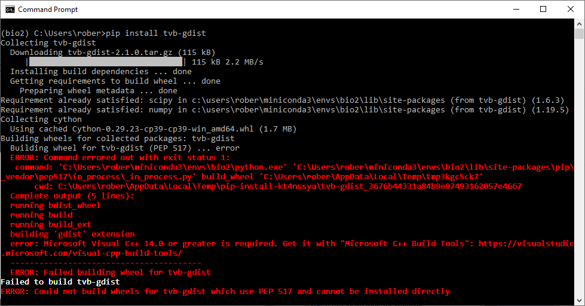
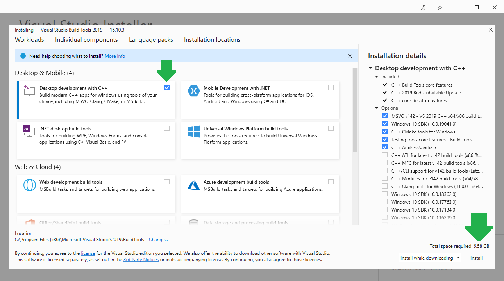
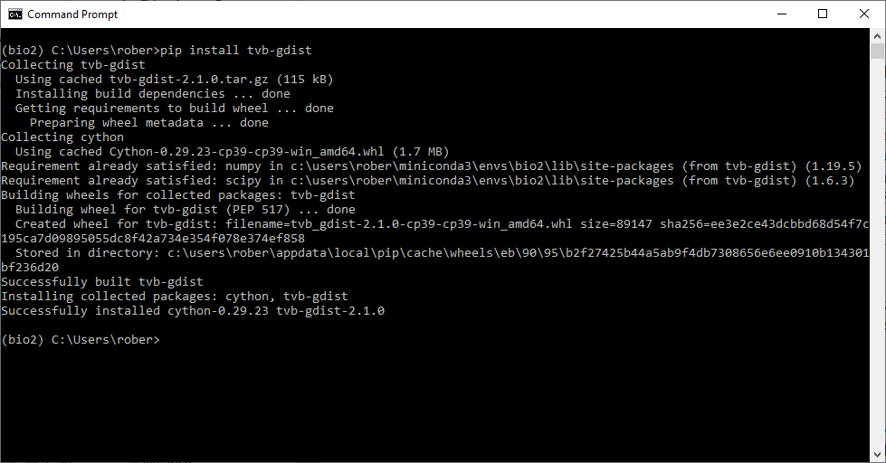

# Installing Microsoft buildtools on Windows
[Robert Haase](../readme), July 9th 2021

Installing python libraries on Windows can be tricky. When using `pip install` on a Windows computer that is not regularly visited by a hardcore programmer, a typical error message is "error: Microsoft Visual C++ 14.0 or greater is required.".
This blog post shows how to deal with it and also hints how to avoid installing software that is not necessary.

## Symptoms: Installations fail
I hit that issue today on a freshly installed Windows computer when installing `tvb-gdist`. This command failed unfortunately:

```
pip install tvb-gdist
```

It showed this error message:


Note: This screenshot has been contrast enhanced. Normally, you can't read such errors on Windows so clearly.

## Downloading build tools
The error message provides a URL and we can visit that website.
[https://visualstudio.microsoft.com/visual-cpp-build-tools/](https://visualstudio.microsoft.com/visual-cpp-build-tools/)


The "Download Build Tools" link is pretty obvious and clicking it leads us to another website:


The second website is a bit misleading as it appears we downloaded "Visual Studio" and are going to install it. 
We didn't. And we don't need to.
This website appears to me as an advertisement for Microsoft's Integrated Development Environment, which we don't need this time.
The download of the buildtools will start a couple of seconds later and we just need to execute "vs_buildtools__1234567.8901234.exe" that appears, e.g. on the bottom of the screen in the Chrome Browser. 

No need to download or install anything else.

## Installing buildtools
After starting the installer, the following form shows up. 
One only needs to activate a single checkbox, "Desktop Development with C++", and click on "Install" in the bottom right.



Installation will then look like this for a while:


Afterwards, it might be necessary to restart your computer. Do this.

## Checking if installation succeeded
If we try to install `tvb-gdist` again, it will succeed:
```
pip install tvb-gdist
```



In the future, on this particular computer, installation of python packages might be easier.
