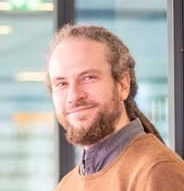

# Robert Haase

My name is Robert and I am computer scientist by training. 
Over the years I turned into an image data scientist working in the life sciences. 
Thus, I don't feel like a computer scientist anymore and not yet as biologist neither.
In the past decade, I worked registering microscopy images of histological stainings of tumor tissue with magnetic resonance imaging, 
swarm intelligence based algorithms for medical image segmentation for positron emission tomography in the cancer research context and
analysing manifold images from mostly fluorescence microscopy.
I have job titles such as bio-image analyst, scientific software engineer and image data science consultant. 
I give lectures about bio-image analysis, bio-statistics, programming and machine learning at the Biotechnology Center of the TU Dresden and world-wide via youtube. 

Since 2020 I'm heading the Bio-image Analysis Technology Development group (BiA-PoL) at the DFG Cluster of Excellence "Physics of Life" at the TU Dresden where I also started this blog. 
I serve here as editor and I'm supporting students, employees and collaborators of the BiA-PoL in communicating their science and technology with the world.

## Blog posts
* [GPU-accelerated image processing in the cloud using Google Colab and clEsperanto](clesperanto_google_colab/readme)
* [Browsing the Open Microscopy Image Data Resource with Python](browsing_idr/readme)
* [GPU-accelerated image processing using cupy and cucim](cupy_cucim/readme)
* [Using StarDist in napari with GPU-support in Windows](stardist_gpu/readme)
* [Installing Microsoft buildtools on Windows](ms_build_tools/readme)

## Links
* [BiA-PoL group website](https://physics-of-life.tu-dresden.de/en/research/core-groups/bio-image-analysis)
* [Robert on twitter](https://twitter.com/haesleinhuepf)
* [Robert on github](https://github.com/haesleinhuepf)
* [Robert on youtube](https://youtube.com/haesleinhuepf)

[Imprint](../imprint)
