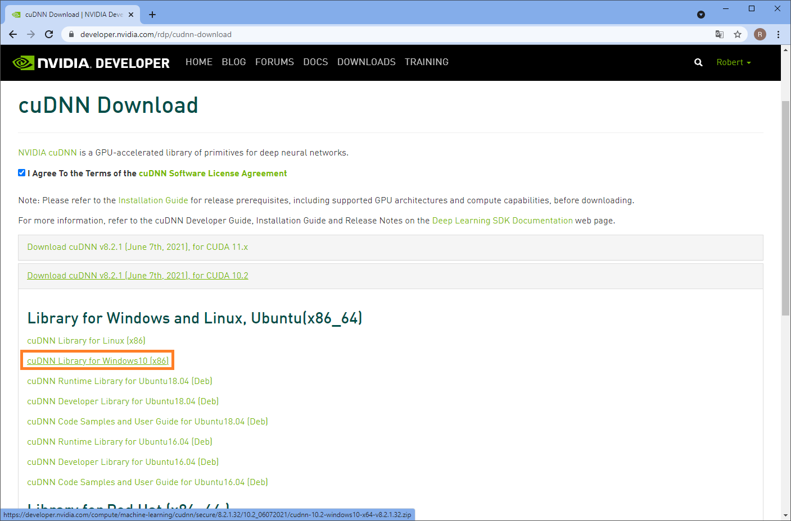
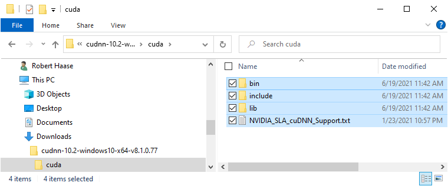
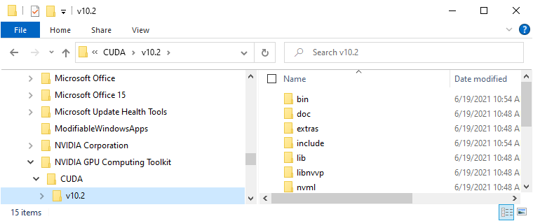
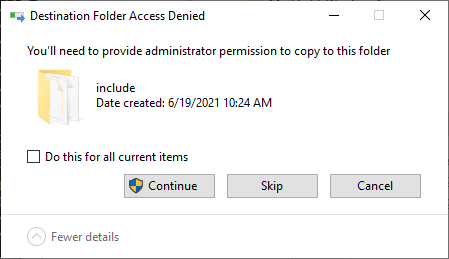
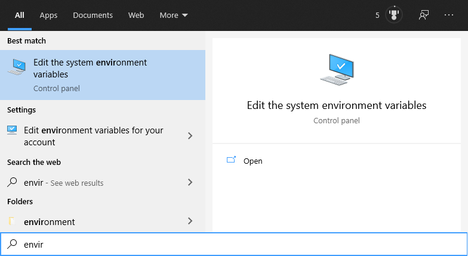
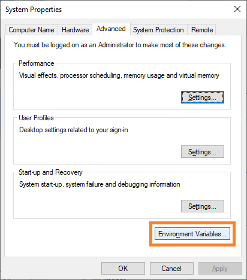
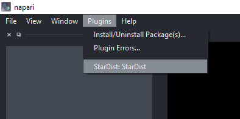
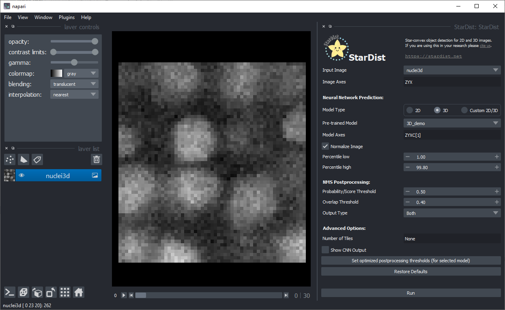
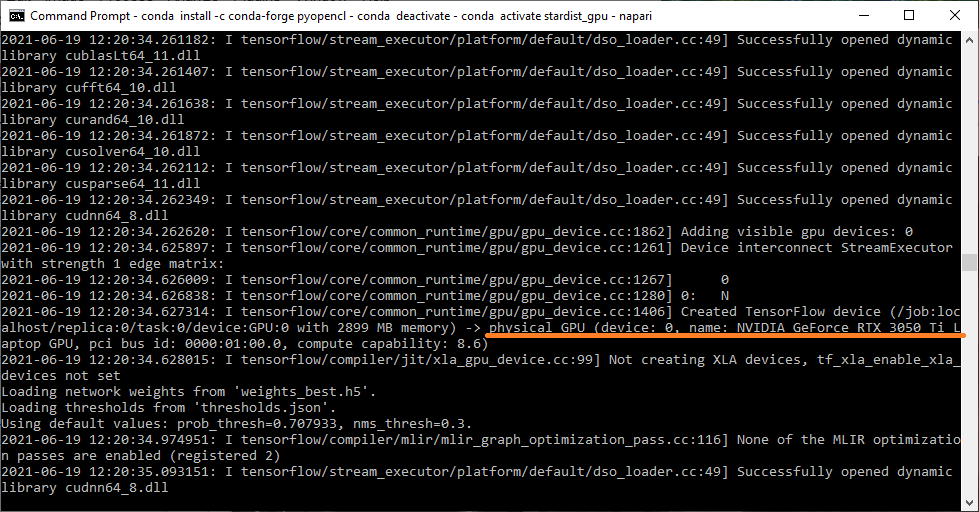
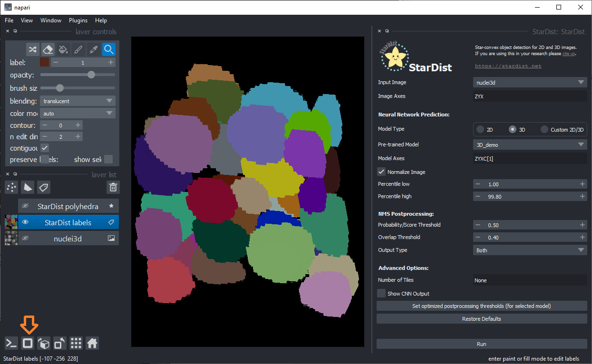

# Using StarDist in napari with GPU-support in Windows
[Robert Haase](../readme), June 19th 2021

3D segmentation using deep learning is computationally costly, it might be necessary from a practical perspective to do it on computers
with powerful graphics processing units (GPUs). One option is to do this in the cloud via Google Colab and for that it is recommended to take a look at [ZeroCostDeepLearning4Microscopy](https://github.com/HenriquesLab/ZeroCostDL4Mic/wiki).
If you are greedy, as I am, and want to run everything on your own Windows computer, you can follow the instructions provided here.

The [StarDist](https://github.com/stardist/stardist/) developers Uwe Schmidt and Martin Weigert recently released a 
[napari plugin](https://github.com/napari/napari) named [stardist-napari](https://github.com/stardist/stardist-napari).
This finally puts 3D nuclei segmentation using StarDist into the hands of end-users. 
You can see it in action in this [Youtube video](https://www.youtube.com/watch?v=Km1_TnUQ4FM&list=PLilvrWT8aLuZCaOkjucLjvDu2YRtCS-JT&index=5).

Under the hood StarDist uses 
[Tensorflow](https://www.tensorflow.org/), 
[CUDA](https://developer.nvidia.com/cuda-toolkit) 
and [CUDNN](https://developer.nvidia.com/cudnn). As installation of these is not trivial, I took some notes while setting up a Windows computer recently and share the steps here.
If you know tricks or short-cuts, please [get in touch](https://github.com/BiAPoL/blog/issues) and share them!

See also
* [DeepImageJ GPU Installation](https://github.com/deepimagej/deepimagej-plugin/wiki/GPU-connection)
* [Stackoverflow: How to tell if tensorflow is using gpu acceleration from inside python shell?](https://stackoverflow.com/questions/38009682/how-to-tell-if-tensorflow-is-using-gpu-acceleration-from-inside-python-shell)

## Overview
Before you start, you will need administrative privileges on your computer.
If you don't have them, please contact your IT department.

In the following procedure, we will install 
* CUDA 10.2 (with two patches)
* CUDNN 8.1.0.77 for CUDA 10.2
* tensorflow-gpu 2.4.2
* napari 0.4.10
* stardist-napari 2021.6.1

## CUDA installation
To install CUDA, download these files from [the website](https://developer.nvidia.com/cuda-10.2-download-archive?target_os=Windows&target_arch=x86_64&target_version=10&target_type=exenetwork) and install them in this order.
Follow the instructions. This may take a while.

* `cuda_10.2.89_win10_network.exe`
* `cuda_10.2.1_win10.exe`
* `cuda_10.2.2_win10.exe`

## CUDNN installation

For downloading CUDNN you need an NVidia developer account. 
[Sign up](https://developer.nvidia.com/login) and [download CUDNN from this page](https://developer.nvidia.com/cudnn-download-survey):



Installation of CUDNN basically means unzipping the archive you downloaded and navigating into it. You can then copy these files:



Into the installation directory of CUDA, e.g. `C:\Program Files\NVIDIA GPU Computing Toolkit\CUDA\v10.2`:



At that point, you may need administrator privileges to click on `Continue` in this dialog:



After CUDA and CUDNN have been installed, it may make sense to restart the computer.

### Checking CUDA and CUDNN installation

If the installation worked correctly, you will find some entries in the Environment Variables of your computer. 
To read them, click the Start Menu and enter "enviro". When the Windows Search suggests "Edit Environment Variables" hit enter:



A dialog will open, click on "Edit Environment Variables":



In the upcoming dialog, two entries should exist and point to the path were you just installed CUDNN:


If these entries don't exist, you can enter them by hand. However, it is recommended to go back and install CUDA and CUDNN again.

## Installing Conda, Python and Tensorflow

In order to make Tensorflow use the GPU, we need to install it. 
As there are some conflicts between different versions of CUDA, Tensorflow, Python and others, I recommend installing specifically the versions, I'm using here:
If you don't have conda installed yet, I recommend installing [miniconda](https://docs.conda.io/en/latest/miniconda.html#windows-installers). 
There is an [installation instruction part of our Python Bio-ImageAnalysis course](https://github.com/BiAPoL/Bio-image_Analysis_with_Python/blob/main/conda_basics/01_conda_environments).

Assuming conda is set up, we start by creating a new environment and specifically installing python 3.8:
```shell
conda create --name stardist_gpu python==3.8
```

Afterwards, you can activate this environment:
```shell
conda activate stardist_gpu
```

We install tensorflow and more precisely, its GPU version:
```shell
pip install tensorflow-gpu=2.4.2
```

To check if tensorflow is installed correctly and uses the GPU, we start a python console
```shell
python
```
and enter:
```python
import tensorflow as tf
print("Num GPUs Available: ", len(tf.config.list_physical_devices('GPU')))
```

The output should be some technical details ending with something like:
```
Num GPUs Available:  1
```

You can also ask for more details, by entering:
```python
from tensorflow.python.client import device_lib 
print(device_lib.list_local_devices())
```
This will tell you which GPU is available and also some details about your CPU, which could also run tensorflow:
```
[name: "/device:CPU:0"
device_type: "CPU"
memory_limit: 268435456
locality {
}
incarnation: 6777841064378058334
, name: "/device:GPU:0"
device_type: "GPU"
memory_limit: 3040739328
locality {
  bus_id: 1
  links {
  }
}
incarnation: 317304344239135289
physical_device_desc: "device: 0, name: NVIDIA GeForce RTX 3050 Ti Laptop GPU, pci bus id: 0000:01:00.0, compute capability: 8.6"
]
```

You can leave the python console by entering `quit()`.

## Napari + StarDist plugin installation
Napari can be installed using pip using this command:

```shell
pip install napari[all]
```

You can then start napari from the command line:
```shell
napari
```

For installing the StarDist plugin, click on the menu `Plugins > Install/Uninstall packages...`. 
This dialog will open, where you can just search for the plugin and click the `Install` button next to it:


You then need to restart napari. Afterwards, a new menu entry will show up under `Plugins`:



## Testing the StarDist napari plugin

For testing the plugin, you can use example data StarDist provides. You can find it in the menu `File > Open Samples... > StarDist > Nuclei (3D)`.


Then you should be able to activate the plugin from the menu `Plugins > StarDist : StarDist`. 
As the default-values fit to the example data, you can just click on `Run` in the bottom right:



To make sure that the installation of the GPU-related software worked, you can check if the GPU is indeed used, by looking at the command line window in the background :



Furthermore, after a moment of waiting the segmented nuclei should show up:


Also use the 3D view on the bottom left:



Last but not least, please keep in mind that training your own model for your own data can be beneficial for segmentation quality.
Check out the [StarDist website](https://github.com/stardist/stardist) and [example notebooks](https://github.com/stardist/stardist/tree/master/examples) to learn more.
