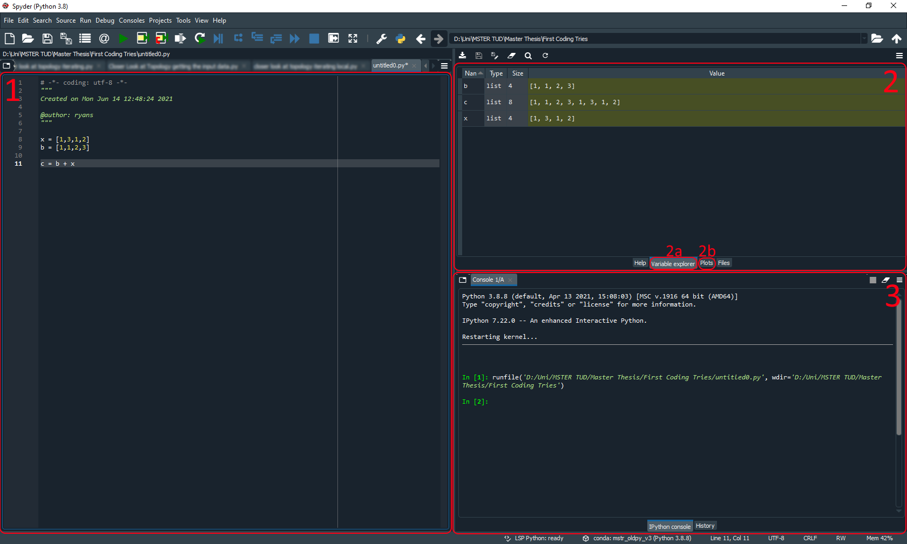

# Introduction to Using Python for Image Analysis
[Ryan Savill](../readme.md), June 17th 2021

## Setting up your Environment
To get started using python the first step is the installation and there are several ways you can do it. To make it easier for your future self it's a good idea to set up a virtual environment. You can think of this as a virtual installation folder where you install all your python libraries (basically just functions that other people have written).
One way to manage these environments is [anaconda](https://www.anaconda.com/products/individual)
This will not only install anaconda, the software to manage your environments but also a lot of libraries commonly needed for scientific python programs. 

Once installed you can manage your environments via the command line. Every operating system has one and they differ slightly.
I'm using Windows and to open it you just need to search for 'cmd' using the Windows search close to the Start menu and will find it.
The basic functionality and use of conda in it can be found in this [great explanation of command line and conda](https://youtu.be/MOEPe9TGBK0?t=1161), created by Robert Haase, my supervisor.
Another nice explanation of the command line can be found by Sreeni [here](https://www.youtube.com/watch?v=AzuajQnRuGI&list=PLZsOBAyNTZwbIjGnolFydAN33gyyGP7lT&index=5&ab_channel=DigitalSreeni) 

You will also need an integrated development environment (in short IDE), which makes organizing code, files and projects easier. You can watch more details and explanations on why IDEs make sense [here](https://www.youtube.com/watch?v=BxebisJKWBg&list=PLZsOBAyNTZwbIjGnolFydAN33gyyGP7lT&index=7&ab_channel=DigitalSreeniDigitalSreeni). If you go with anaconda, like I did, one IDE will be preinstalled in your environment: [spyder](https://www.spyder-ide.org/) (it's the same as the one used by Sreeni). Once you open spyder it can be a bit intimidating but I'll break it down for you:

 

1. This is the area where you write your code. You will see that some code will be coloured like when you import libraries or define functions and this makes the code easier to read and write.
2. This is a window for looking at your variables (the small tab marked 2a) or to look at generated plots or images (the small tab marked 2b).  I love the variable explorer as I don't have to print anything if I want to see what a variable contains and I can just check if my functions are all doing what they should be doing. This section really helps with debugging code and I know you will find it helpful too.
3. This is the console. It is similar to the command line and you can manually define variables in here, but most importantly this is where any errors in the code will be displayed. Also if you run the code (either by pressing shift + enter or with the green play button at the top) a message will be displayed here.

To get started with your first programs in python, I would suggest you follow the tutorial on setting up an environment after installing anaconda. I can offer a bonus tip for creating conda environments and that is to install a specific python version, as some libraries won't work with the newest python version but you may find that out yourself. Furthermore, install all the essential scientific libraries included in anaconda. To do this you need to initialise a conda environment as follows:

```sh
C:\Users\yourusername> conda activate
C:\Users\yourusername> conda create -n your_environment_name python=3.8 anaconda 
```

You have to replace `your_environment_name` with a name of your choice. For now you can omit the line `python=3.8` but if you run into problems you can use this line to install any python version you wish to. The command `anaconda` at the end will install all the libraries that come preinstalled with anaconda to your new environment. It can happen that your environment breaks because you mess up an installation or a library is not compatible with another or incompatible with the installed python version. Don't panic that is normal and happens. Just go ahead and create a new environment and reinstall the libraries you need. 
To activate your created environment you can just call the command below, again replacing `your_environment_name` with your chosen environment name:

```sh
C:\Users\yourusername> conda activate your_environment_name
```
Now you are in the environment you created and can install libraries or open your IDE (if you have chosen spyder) by calling:

```sh
C:\Users\yourusername> spyder
```


## The Basics
To be frank I cannot teach all the basics of python anywhere near as well as the plethora of people on youtube and various blogs and sites across the internet. What I can do is give you some of the resources I have used to get into python, which you might also like. If you are starting completely from scratch I would advise you to watch [this](https://www.youtube.com/watch?v=rfscVS0vtbw&ab_channel=freeCodeCamp.org) video.

If you have some basic understanding of coding the introduction to pythonic programming by [Sreeni](https://www.youtube.com/watch?v=qgJLeDPT8UM&list=PLZsOBAyNTZwbIjGnolFydAN33gyyGP7lT&index=6&ab_channel=DigitalSreeniDigitalSreeni) might be more suited. The video series by Sreeni covers a large part of image analysis and python programming and is a resource I often like to come back to myself. 

The third option is to watch the lectures I had [introducing python programming](https://www.youtube.com/watch?v=MOEPe9TGBK0). This is also a series that I would advise on watching to get an understanding of image analysis (after all it's what got me into image analysis) but it's focussed on another program used for image analysis called [ImageJ](https://imagej.net/Welcome). This years lecture can be found [on github](https://github.com/BiAPoL/Bio-image_Analysis_with_Python). It revolves around python and is another great resource to get started with programming and image analysis in python.

## Some Tricks for Beginners
### Enumerate
Something that you will likely come across a lot is iteration. Usually you iterate over timepoints, objects or results by using loops. The for-loop is the most common and there are a few tips and tricks that can make your life easier when using loops. I learnt about it [here](https://realpython.com/python-enumerate/) if you are interested in my resources.
The first one I want to show you is the enumerate function, as I use this quite frequently. It allows you to have an additional index to what you are looping through in the loop:


```python
# This is our list that we will loop through and at the moment it 
# contains strings
loop_list = ['gaussian blur','background subtraction', 
             'thresholding', 'analysis']

# we can loop through it with a for loop and see what is printed
for method in loop_list:
    print(method)
```

    gaussian blur
    background subtraction
    thresholding
    analysis
    

If we want to know what index each element has we can use enumerate to get this information:


```python
# The enumerate function returns the index of the element of the 
# list and the actual element as a tuple and we can access
# both at the same time through this way of for looping
for index, method in enumerate(loop_list):
    
    # The curly brackets below are a placeholder in the string. 
    # Whatever is in the brackets after .format() will be inserted
    # as a string. This is extremely useful when you want to 
    # include indices in a  string, for example when you are saving
    # files! 
    print(method + ' is at index {}'.format(index))
```

    gaussian blur is at index 0
    background subtraction is at index 1
    thresholding is at index 2
    analysis is at index 3
    
### Zip
The [zip-operator](https://www.w3schools.com/python/ref_func_zip.asp) allows you to similarly loop with two variables but you are free to chose what they are. I use it mainly to loop through two lists at the same time for example if i need to work with two images at the same time. If the two lists are not of the same length you need to be cautious as it will only loop through the shorter list and leave out variables of the longer list. Here I will show the simplest case of printing two words together from two lists:


```python
# This is the list of methods we used before
loop_list = ['gaussian blur','background subtraction', 
             'thresholding', 'analysis']

# These are our processingtimes, notice it has one element 
# more than our methods
processingtimes = [12,45,67,120,78]

# with the zip operator we can loop through both
for method, time in zip(loop_list, processingtimes):
    print(method + ' took {} seconds'.format(time))
```

    gaussian blur took 12 seconds
    background subtraction took 45 seconds
    thresholding took 67 seconds
    analysis took 120 seconds
    

What zip actually does is create a list of tuples of the two input arrays. We can then access both of these elements at once when using a for-loop. If one list is shorter then it will only loop through the indices of the shorter list as we can see that the last element in processingtimes is not printed.

### List Comprehension
The last trick I want to show you is list comprehension. I love it because it gets rid of a lot of lines of code that you have to write manually otherwise. I will show you the long version and how list comprehension can replace these lines. In this basic example we will do some basic math with two lists  and save the results in a third:


```python
# These are the numbers we will subtract from each other
numbers1 = [5, 7, 10, 4]
numbers2 = [1, 3, 1, 2]

# This is the empty list we will save the results in
results = []

# To subtract numbers2 from numbers1 we have to iterate 
# over both which we can do with the zip function
for numb1, numb2 in zip(numbers1, numbers2):
    # doing the math
    result = numb1 - numb2
    
    # adding the result to the list of results
    results.append(result)
    
print(results)
```

    [4, 4, 9, 2]
    

With list comprehension we can write the above code in only one line:


```python
# Writing the for loop as a list comprehension
results_comprehension = [numb1-numb2 for numb1, numb2 in zip(numbers1, numbers2)]

print (results_comprehension)
```

    [4, 4, 9, 2]
    

What we are doing is writing the contents of the for loop inside array brackets. This makes creating new lists much more short  and I find the code to be a lot cleaner. This method also works for dictionaries and if you want to find out more some links are [here](https://www.w3schools.com/python/python_lists_comprehension.asp) and [here](https://stackoverflow.com/questions/5352546/extract-subset-of-key-value-pairs-from-python-dictionary-object).

#### And those are the basics you'll need to get started with image analysis in python. Next time we'll get straight into analysing some data and learning further tips and tricks!
If you want to try out the code in this post just look through the [github repository](https://biapol.github.io/blog/ryan_savill/01_intro_to_python), where all code is available for you to download and try!

## [Home](https://biapol.github.io/blog/ryan_savill/)

[Imprint](https://biapol.github.io/blog/imprint)
