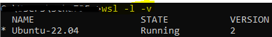
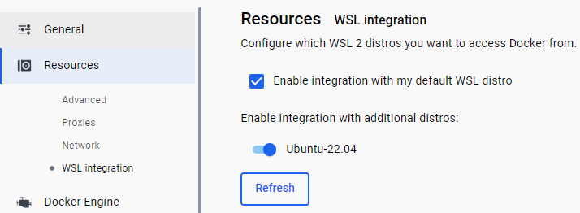
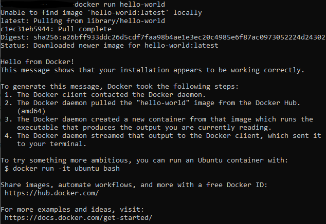
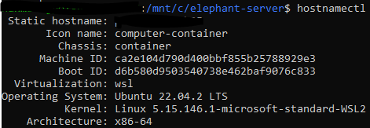
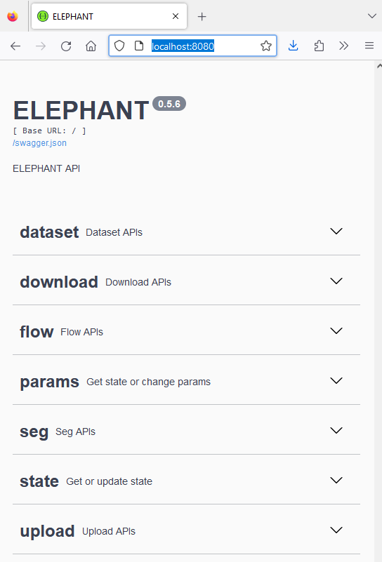
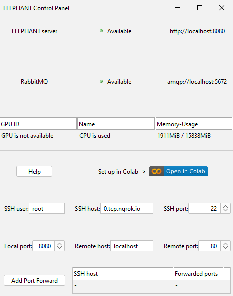

# Installation of Elephant Server on Windows

[Stefan Hahmann](../readme.md), April 24th 2024
[Johannes Soltwedel](../../johannes_mueller/Readme.md), April 24th 2024

## Introduction


[ELEPHANT](https://elephant-track.github.io/#/v0.5/) is a platform for 3D cell tracking, based on incremental and interactive deep learning.
It implements a client-server architecture. The client application is implemented by extending [Fiji](https://imagej.net/software/fiji/downloads)/[Mastodon](https://mastodon.readthedocs.io/en/latest/), providing a user interface for annotation, proofreading and visualization.
The server is built as a web application that serves deep learning-based algorithms.

Before installing Elephant on a powerful workstation or server, you may wish to try it out locally on your machine. This blog post will show you how you can do so, if you are using a Windows machine.

## Prerequisites

### Docker Desktop


[Docker Desktop](https://www.docker.com/products/docker-desktop) is a tool that allows you to run Docker containers on your local machine. 
Docker containers are lightweight, standalone, executable packages of software that include everything needed to run an application: code, runtime, system tools, system libraries and settings. 
Docker Desktop is available for Windows and Mac. You can download it [here](https://www.docker.com/products/docker-desktop).
Please make sure that you have installed and started Docker Desktop before proceeding. You will need to sign in to Docker Desktop with your Docker account.

### Windows Subsystem for Linux (WSL)


[Windows Subsystem for Linux (WSL)](https://docs.microsoft.com/en-us/windows/wsl/) is a compatibility layer for running Linux binary executables natively on Windows machines.
It allows you to run a Linux distribution on your Windows machine.
You can install WSL by following the instructions [here](https://docs.microsoft.com/en-us/windows/wsl/install).

Open a console (press `Windows button`, type `cmd` and press `Enter`) and run the following command to install WSL:

```console
wsl --install
```

This will install the latest version of WSL and Ubuntu as the current default WSL distribution on your machine. By the time of writing this blog post, the default distribution is Ubuntu 22.04 LTS.
You can check the installation success, if you open a Linux terminal by pressing `Windows button`, typing `wsl` and pressing `Enter`.

You should also check, if the version number of WSL is 2. You can do this by running the following command in the console:

```console
wsl -l -v
```
Expected output:


If the version number of the Ubuntu distribution is not 2, you can upgrade it by running the following command in the Linux terminal:

```console
wsl --set-version Ubuntu-22.04 2
```

Do also check the WSL integration in Docker Desktop by opening Docker Desktop and navigating to `Settings` > `Resources` > `WSL Integration`. 
Make sure that the checkbox for the Ubuntu distribution is checked:


To check if Docker is running correctly with the WSL, you can run the following command from the console:

```console
docker run hello-world
```
Expected output:


### Elephant Installation Files

Download the Elephant installation files from the [Elephant GitHub repository](https://github.com/elephant-track/elephant-server/archive/refs/heads/main.zip). Unzip the files to a folder on your local machine, e.g. `C:\elephant-server`.

Open a console (press `Windows button`, type `cmd` and press `Enter`) and navigate to the folder where you have unzipped the Elephant installation files.
Start `wsl` by typing `wsl` and pressing `Enter`.


You can check, if the correct Linux distribution is running:
```console
hostnamectl
```
Expected output:


### GPU Support for machines with Nvidia GPUs


If you have a machine with an Nvidia GPU, you can use the GPU to accelerate the deep learning algorithms in Elephant.
You need to install the official Nvidia driver for your GPU. You can download the driver from the [Nvidia website](https://www.nvidia.com/Download/index.aspx).
Furthermore, you need to install CUDA. You can download CUDA from the [Nvidia website](https://developer.nvidia.com/cuda-downloads).

## Creating the Elephant Server

Open a console (press `Windows button`, type `cmd` and press `Enter`) and navigate to the folder where you have unzipped the Elephant installation files.
Start `wsl` by typing `wsl` and pressing `Enter`.

Build the Elephant Docker image by running the following command (it may take some time to download the required files):
Including `sudo` may not be required on every machine.

```console
sudo make build
```

### Troubleshooting
If you get an error message that docker is not found, you can try to install docker inside WSL.

```console
sudo snap install docker
```

If you get an error message that make is not found, you can try to install make inside WSL.

```console
sudo apt install make
```

If the `make build` command fails, you can try to pull the image from the Docker Hub by running the following command:

```console
docker pull stefanhahmann/elephant-server:0.5.6
```

This will download the image from the Docker Hub, which may take some time depending on your internet connection.
The version on Docker Hub may not be the latest version of Elephant, but you can use it, if building the image fails.
Check [Docker Hub](https://hub.docker.com/r/stefanhahmann/elephant-server) for the Elephant server image.

## Starting the Elephant Server

Make sure that Docker Desktop is running.

Open a console (press `Windows button`, type `cmd` and press `Enter`) and navigate to the folder where you have unzipped the Elephant installation files.
Start `wsl` by typing `wsl` and pressing `Enter`.

Set the environment variable `ELEPHANT_NVIDIA_GID` to `0` by running the following command:

```console
set ELEPHANT_NVIDIA_GID=0
```

You can now start the Elephant server by running the following command:
Again, including `sudo` may not be required on every machine.
```console
sudo make launch
```

You can check if the server is running by opening a browser and navigating to [http://localhost:8080/](http://localhost:8080/).
You should see the Elephant server interface:


You can now open a Mastodon project in Fiji, which brings up the client connected to the Elephant server:


`*` By the time writing this blog post, there was a known issue with the Nvidia GPU support on WSL2. 
You may need to update the Nvidia driver to the latest version, after the [issue](https://github.com/microsoft/WSL/issues/11277) has been resolved in order to use the GPU for acceleration.

## Stopping the Elephant Server

You can stop the Elephant server by running the following command:
```console
sudo make stop
```

## Move Docker to another drive

You may want to move the Docker installation to another drive, if you have limited space on your system drive.
You can do so with the following steps. Make sure you have stopped Docker Desktop.
The following example moves the Docker installation to the `D:` drive. It is assumed you have an empty folder `D:\docker`.

The whole process may take some time, depending on the size of the Docker installation.

```console
wsl --shutdown
wsl --export docker-desktop-data d:\docker\docker-desktop-data.tar
wsl --unregister docker-desktop-data
wsl --import docker-desktop-data d:\docker\data d:\docker\docker-desktop-data.tar --version 2
```

