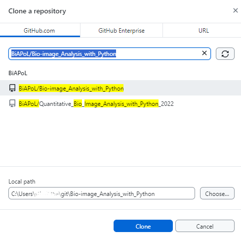
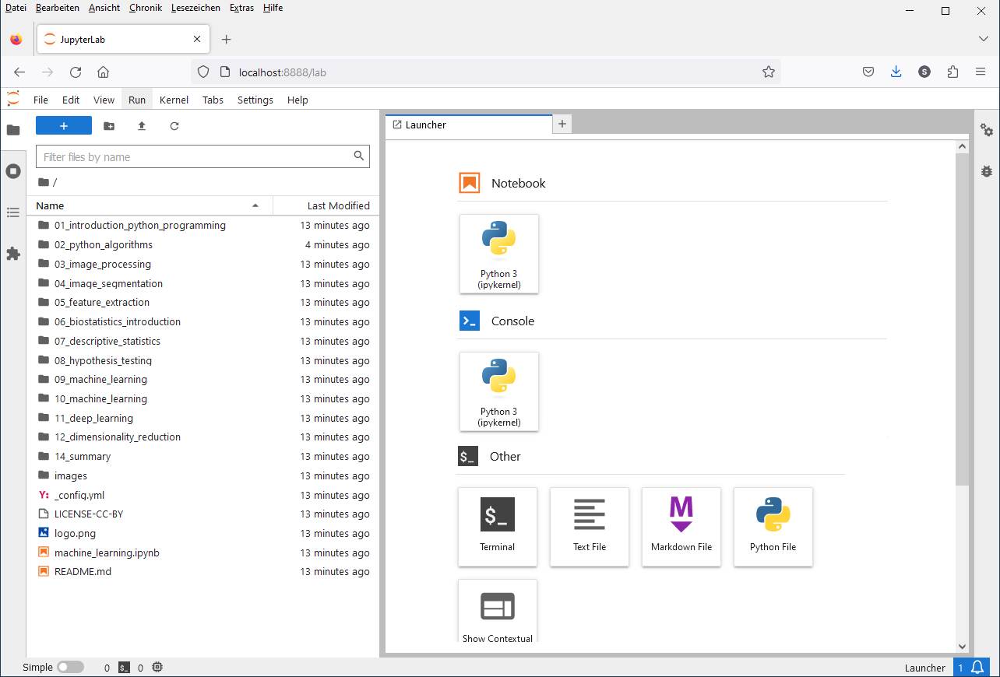
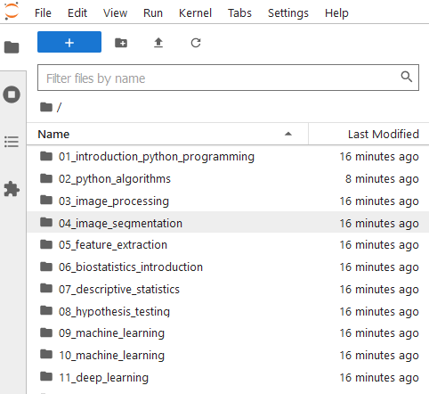
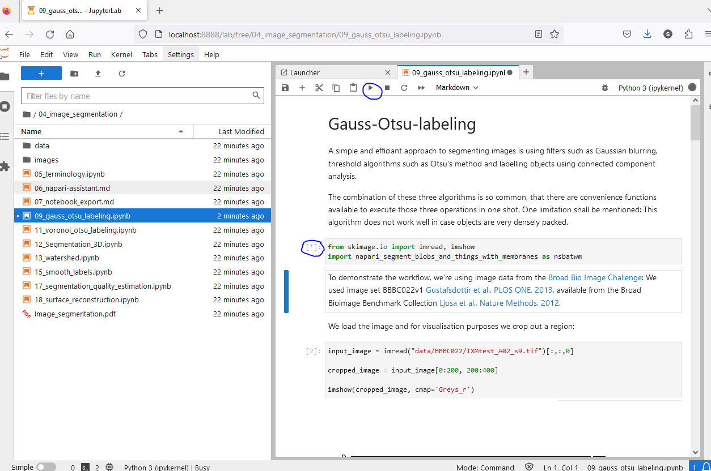
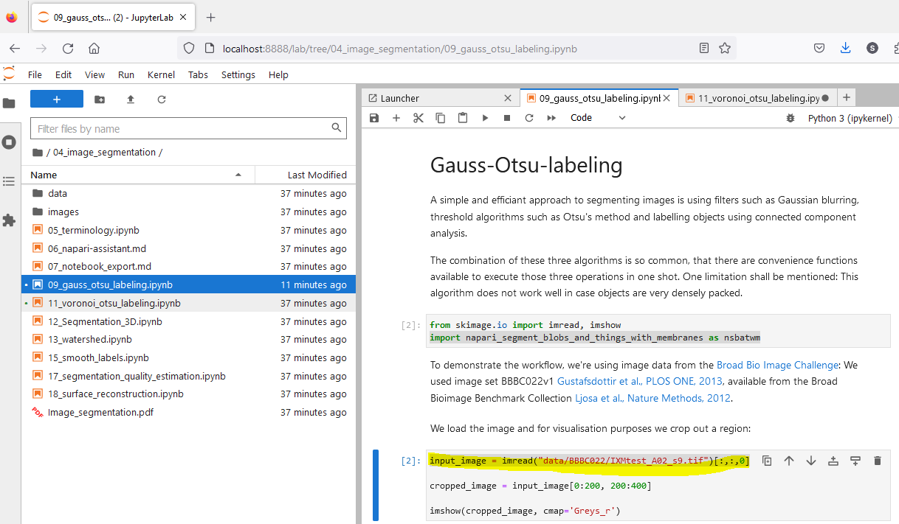

# Running bio image analysis workflows on your machine

[Stefan Hahmann](../readme.md), December 21st 2023

## Introduction

Jupyter Notebooks may be used to run bio image analysis workflows on your machine with your own data. They are a great tool to share workflows with others.
This blog post will show you how to use [Github Desktop](https://desktop.github.com/) and [Jupyter Lab](https://jupyterlab.readthedocs.io/en/stable/) to run a workflow documented in a [Jupyter Notebook](https://jupyter.org/) on your local machine with your own data. 

## Prerequisites

[Git](https://git-scm.com/) is a version control system that allows you to track changes in your files. It is widely used in software development, because source files of code are frequently changed during the development process. Files that belong together are stored in a so-called repository.
A repository can be stored on a local computer or on a web server. Git allows you to synchronize your local repository with a remote repository. This is useful, if you want to collaborate with other people on the same files.


[GitHub](https://github.com/) is a web-based hosting service for Git repositories. [GitHub Desktop](https://desktop.github.com/) is a client for Git and Github. It allows you to manage your Git repositories locally on your computer.

 

[Jupyter Notebooks](https://jupyter.org/) are documents that contain code, equations, visualizations and narrative text. They are widely used in data science and research. The can contain workflows that help you to analyse your data. [Jupyter Lab](https://jupyterlab.readthedocs.io/en/stable/) allows you to edit and run Jupyter Notebooks.


[Python](https://www.python.org/) is a programming language that is widely used in data science and research.

[Napari](https://napari.org) is a multi-dimensional image viewer implemented in Python. 

## Installation

### Git

There is no need to install Git separately before installing GitHub Desktop. GitHub Desktop includes a bundled version of Git, so when you install GitHub Desktop, it will also install Git as part of the process.

### GitHub Desktop

Download and install [GitHub Desktop](https://desktop.github.com/). Choose the version for your operating system. GitHub.com provides installers for Windows and Mac. Users on Unix-like systems may follow these [instructions](https://dev.to/rahedmir/is-github-desktop-available-for-gnu-linux-4a69) to install a [fork](https://github.com/shiftkey/desktop/releases) of GitHub Desktop.

### Jupyter Lab

The installation of Jupyter Lab on your local machine is part of the installation of Python and Conda. You can follow the instructions in [Getting started with Miniforge and Python](../../mara_lampert/getting_started_with_mambaforge_and_python/readme) for this.

You should have installed now Python and the environment [devbio-napari](https://github.com/haesleinhuepf/devbio-napari), a distribution of napari with a set of plugins for bioimage analysis.

## Clone the repository

Open GitHub Desktop and click "File" > "Clone a repository from the Internet...". Enter the name of the repository you want to clone, e.g.:  [BiAPoL/Bio-image_Analysis_with_Python](https://github.com/BiAPoL/Bio-image_Analysis_with_Python) and the local path where you want to store the repository on your computer. Click "Clone".


## Starting Jupyter Lab

Open a terminal and navigate to the folder where you have cloned the repository. 

Activate the environment by entering this (assuming you have used the name `my_first_env` for your environment, otherwise `my_first_env` must be replaced by the name of your environment): 

```
mamba activate my_first_env
```

Start [Jupyter lab](https://jupyter.org/) from the terminal like this:

```
jupyter lab
```

A browser will open and show you the following web page.



## Running a Jupyter Notebook

Navigate to the notebook you want to run and click on it. Notebooks have the file extension `.ipynb`. The notebook will open in a new tab.



Run the notebook by clicking on the "Run" button in the toolbar or by pressing "Shift + Enter". While a cell is running, a star is shown in the square brackets on the left side of the cell. When the cell has finished running, a number is shown in the square brackets.



Before you run a cell, you can change the code in the cell. This allows you to adapt the workflow to your needs. You may e.g. change the path to the data you want to analyse.



It is possible to skip cells. This is useful, if you want to run only parts of the workflow. To skip a cell, click on the next cell, after the cell you want to skip and then click on the "Run". This will run the selected cell.


