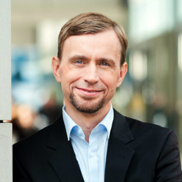

# Stefan Hahmann

Hi! My name is Stefan.

Originally, I studied geodesy at [HTW Dresden](https://www.htw-dresden.de/hochschule/fakultaeten/geoinformation). Towards the end of my studies, I focused in geoinformatics.

During my professional career, I continuously developed software tools in different domains mainly in Java, but also using PHP, JavaScript, R and Python. Before moving to academia, I developed tools for [geomarketing](https://www.microm.de/apps/mapchart-gis). I did PhD at [TU Dresden](https://tu-dresden.de/bu/umwelt/geo/ifk), where I investigated the relationship between space and semantics of social media data.
During my Postdoc, I worked at [Heidelberg University](https://www.geog.uni-heidelberg.de/gis/), where I contributed to the route planning service [OpenRouteService.org](https://maps.openrouteservice.org/#/) and at [Fraunhofer IVI](https://www.ivi.fraunhofer.de/), where I contributed to [Mobikat](https://www.mobikat.net/en.html), a decision support tool for fire departments, rescue services and police.

Since 2022, I work as a [research software engineer](https://de-rse.org/en/) for the Bio-image Analysis Technology Development group ([BiA-PoL](https://physics-of-life.tu-dresden.de/research/core-groups/bio-image-analysis/people)) at the DFG Cluster of Excellence “[Physics of Life](https://physics-of-life.tu-dresden.de/)” at TU Dresden. I am developing plugins for the image analysis software [Fiji](https://imagej.net/software/fiji/) and workflows for the image analysis software [Napari](https://napari.org/stable/), where currently most of the time I am [extending](https://github.com/mastodon-sc/mastodon-deep-lineage) the (cell) tracking module [Mastodon](https://mastodon.readthedocs.io/en/latest/).

# Blog posts

* [Running bio image analysis workflows on your machine](github_desktop_jupyter_notebook/readme)

# Links

* [Twitter](https://twitter.com/stefanhahmann)
* [Github](https://github.com/stefanhahmann/)
* [ORCID](https://orcid.org/0000-0002-8145-7090)
