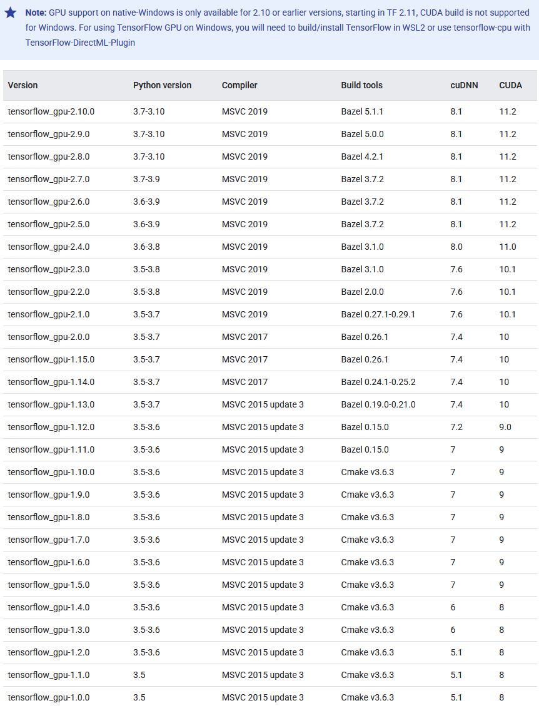
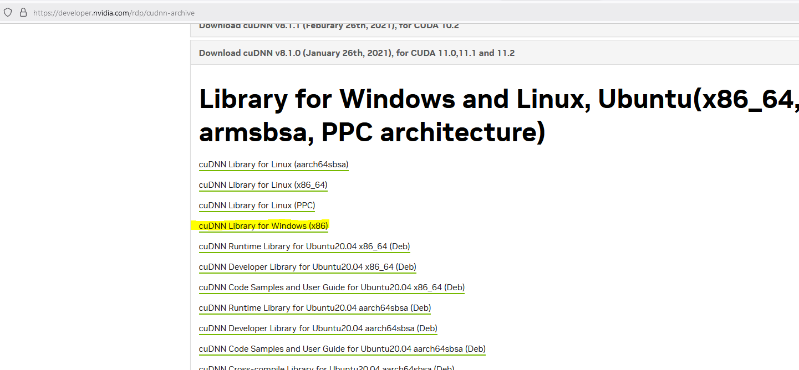
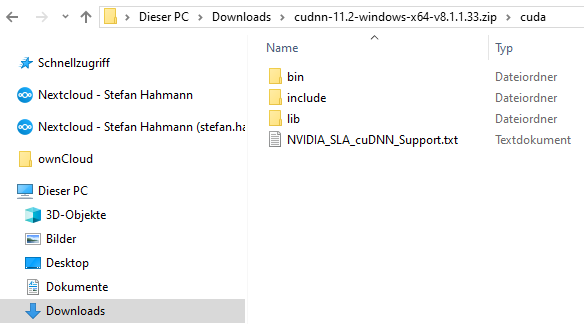
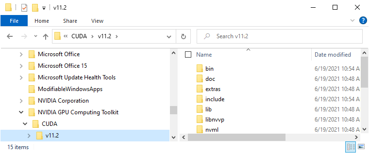
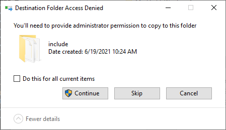
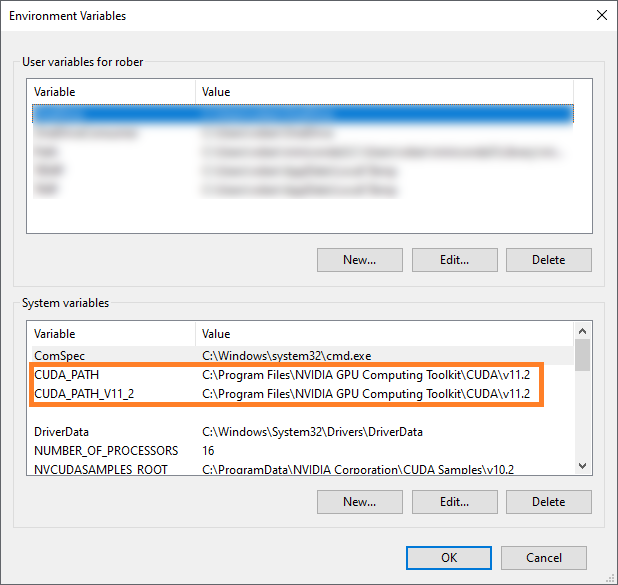
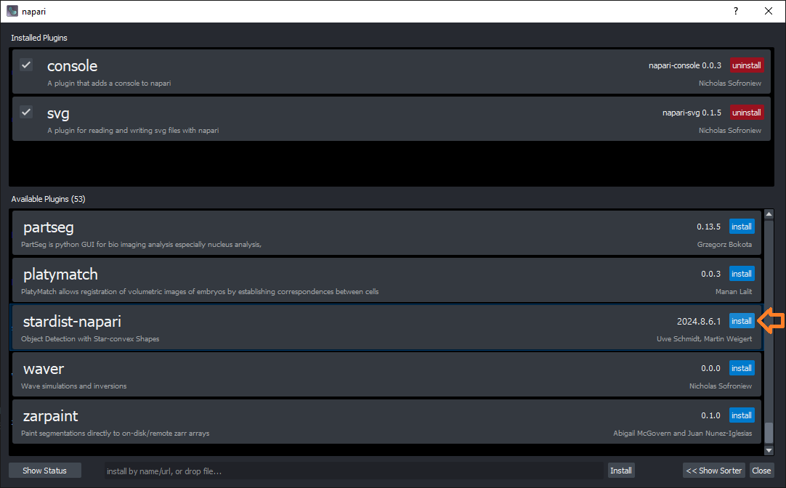
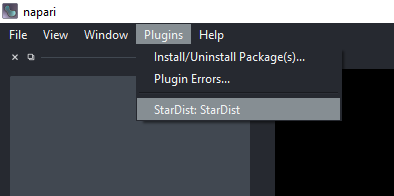
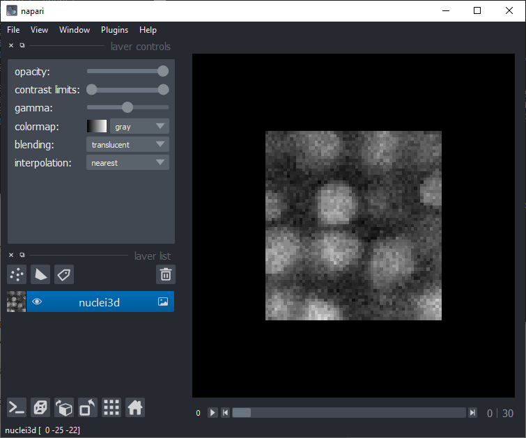
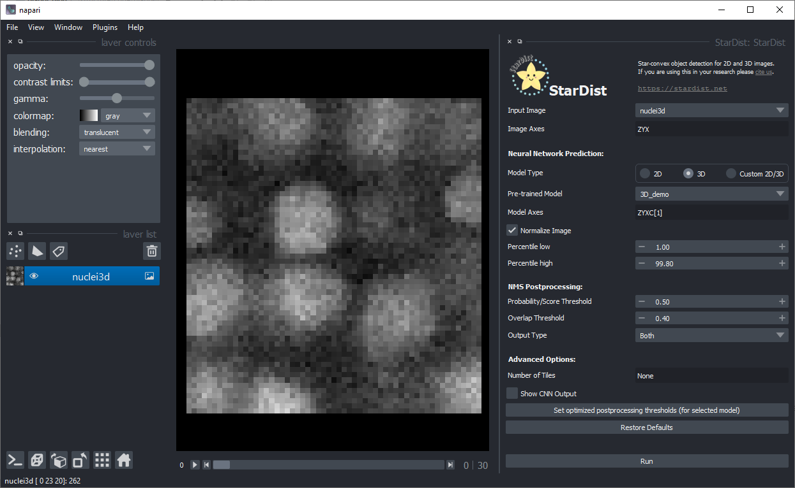

# Using StarDist in napari with GPU-support in Windows (2025)
[Stefan Hahmann](../readme), January 20th 2025

> **_Note:_** This is an update of a [previous Blogpost](https://biapol.github.io/blog/robert_haase/stardist_gpu/readme.html).

3D segmentation using deep learning is computationally costly, it might be necessary from a practical perspective to do it on computers
with powerful graphics processing units (GPUs). One option is to do this in the cloud via Google Colab and for that it is recommended to take a look at [ZeroCostDeepLearning4Microscopy](https://github.com/HenriquesLab/ZeroCostDL4Mic/wiki).
If you would like to run everything on your own Windows computer, you can follow the instructions provided here.

The [StarDist](https://github.com/stardist/stardist/) developers Uwe Schmidt and Martin Weigert recently released a 
[napari plugin](https://github.com/napari/napari) named [stardist-napari](https://github.com/stardist/stardist-napari).
This puts 3D nuclei segmentation using StarDist into the hands of end-users. 
You can see it in action in this [Youtube video](https://www.youtube.com/watch?v=Km1_TnUQ4FM&list=PLilvrWT8aLuZCaOkjucLjvDu2YRtCS-JT&index=5).

Under the hood StarDist uses 
[Tensorflow](https://www.tensorflow.org/), 
[CUDA](https://developer.nvidia.com/cuda-toolkit) 
and [cuDNN](https://developer.nvidia.com/cudnn). As installation of these is not trivial, I took some notes while setting up a Windows computer with these recently (i.e. January 2025) and share the steps here.
If you know tricks or short-cuts, please [get in touch](https://github.com/BiAPoL/blog/issues) and share them!

See also:
* [Stardist Napari Windows conda environment](https://forum.image.sc/t/stardist-napari-windows-conda-environment/97149)
* [Stackoverflow: How to tell if tensorflow is using gpu acceleration from inside python shell?](https://stackoverflow.com/questions/38009682/how-to-tell-if-tensorflow-is-using-gpu-acceleration-from-inside-python-shell)


## Overview
Before you start, you will need administrative privileges on your computer.
If you don't have them, please contact your IT department.

In the following procedure, we will install 
* CUDA 11.2.0
* CUDNN 8.1.0.77 for CUDA 11.2
* tensorflow 2.10.0
* stardist 0.8.5
* napari 0.5.5
* stardist-napari 2024.8.6.1

## CUDA installation
To install CUDA, download this file from [the website](https://developer.nvidia.com/cuda-11.2.0-download-archive?target_os=Windows&target_arch=x86_64&target_version=10&target_type=exelocal) and install them in this order.
Follow the instructions. This may take a while.

* `cuda_11.2.0_460.89_win10.exe`

Note: There is a newer version of CUDA available (>=12), but it is not compatible with the current version of tensorflow-gpu. Thus, we need to stick to CUDA 11.2.0. 
For more information see [Install tensorflow](https://www.tensorflow.org/install/source_windows).

There is a table, which shows the compatibility of different versions of CUDA and tensorflow-gpu.




## cuDNN Library installation

For downloading the cuDNN library you need an NVidia developer account. 
[Sign up](https://developer.nvidia.com/login) and [download CUDNN from this page](https://developer.nvidia.com/rdp/cudnn-archive):



Installation of cuDNN basically means unzipping the archive you downloaded and navigating into it. You can then copy these files:



Into the installation directory of CUDA, e.g. `C:\Program Files\NVIDIA GPU Computing Toolkit\CUDA\v11.2`:



At that point, you may need administrator privileges to click on `Continue` in this dialog:



After CUDA and cuDNN have been installed, it may make sense to restart the computer.

### Checking CUDA and cuDNN installation

If the installation worked correctly, you will find some entries in the Environment Variables of your computer. 
To read them, click the Start Menu and enter "enviro". When the Windows Search suggests "Edit Environment Variables" hit enter:


A dialog will open, click on "Edit Environment Variables":


In the upcoming dialog, two entries should exist and point to the path were you just installed CUDNN:



If these entries don't exist, you can enter them by hand. However, it is recommended to go back and install CUDA and cuDNN again.

## Installing Mamba, Python and Tensorflow

In order to make Tensorflow use the GPU, we need to install tensorflow libraries. 
As there are some conflicts between different versions of CUDA, Tensorflow, Python and others, I recommend installing specifically the versions, I'm using here:
If you don't have conda installed yet, I recommend installing [miniforge](https://github.com/conda-forge/miniforge). The installer can be downloaded [here](https://github.com/conda-forge/miniforge/releases/latest/download/Miniforge3-Windows-x86_64.exe). 
This blog post contains an [installation instruction](https://biapol.github.io/blog/mara_lampert/getting_started_with_miniforge_and_python/readme.html).

Assuming miniforge is set up, we start by creating a new environment and specifically installing python 3.10, cudutoolkit 11.2, cudnn 8.1.0 and pip. Installing pip within the environment has the advantage that installing package using pip, which will be done in later steps, will not interfer with the system pip.
```shell
mamba create --name napari-stardist-gpu python=3.10 cudatoolkit=11.2 cudnn=8.1.0 pip
```

Afterwards, you can activate this environment:
```shell
mamba activate napari-stardist-gpu
```

We install tensorflow 2.10.0. TensorFlow 2.10 is the last TensorFlow release that supports GPU on native-Windows. Starting with TensorFlow 2.11, it is required need to install TensorFlow in WSL2.
```shell
pip install tensorflow==2.10.0
```

To check if tensorflow is installed correctly and uses the GPU, we start a python console
```shell
python
```
and enter:
```python
import tensorflow as tf
print("Num GPUs Available: ", len(tf.config.list_physical_devices('GPU')))
```

The output should be some technical details ending with something like:
```
Num GPUs Available:  1
```

You can also ask for more details, by entering:
```python
from tensorflow.python.client import device_lib 
print(device_lib.list_local_devices())
```
This will tell you which GPU is available and also some details about your CPU, which could also run tensorflow:
```
[name: "/device:CPU:0"
device_type: "CPU"
memory_limit: 268435456
locality {
}
incarnation: 6777841064378058334
, name: "/device:GPU:0"
device_type: "GPU"
memory_limit: 3040739328
locality {
  bus_id: 1
  links {
  }
}
incarnation: 317304344239135289
physical_device_desc: "device: 0, name: NVIDIA GeForce RTX 3050 Ti Laptop GPU, pci bus id: 0000:01:00.0, compute capability: 8.6"
]
```

You can leave the python console by entering `quit()`.

## StarDist installation

To install StarDist, you can use pip:
```shell
pip install stardist==0.8.5
```

## Napari + StarDist plugin installation
Napari can be installed using pip using this command:

```shell
pip install napari[all]
```

You can then start napari from the command line:
```shell
napari
```

For installing the StarDist plugin, click on the menu `Plugins > Install/Uninstall packages...`. 
This dialog will open, where you can just search for the plugin and click the `Install` button next to it:



You then need to restart napari. Afterwards, a new menu entry will show up under `Plugins`:



If you experience any problems during the installation, it may help in some case to clear mamba and pip caches before processing through the installation steps, since in some cases mamba / pip will reuse existing but non-matching versions of libraries that they find in their caches:
```shell
mamba clean -a -y
pip cache purge
```

## Testing the StarDist napari plugin

For testing the plugin, you can use example data StarDist provides. You can find it in the menu `File > Open Samples... > StarDist > Nuclei (3D)`.



Then you should be able to activate the plugin from the menu `Plugins > StarDist : StarDist`. 
As the default-values fit to the example data, you can just click on `Run` in the bottom right:



To make sure that the installation of the GPU-related software worked, you can check if the GPU is indeed used, by looking at the command line window in the background :


Furthermore, after a moment of waiting the segmented nuclei should show up:


Also use the 3D view on the bottom left:


Last but not least, please keep in mind that training your own model for your own data can be beneficial for segmentation quality.
Check out the [StarDist website](https://github.com/stardist/stardist) and [example notebooks](https://github.com/stardist/stardist/tree/master/examples) to learn more.
