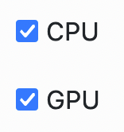
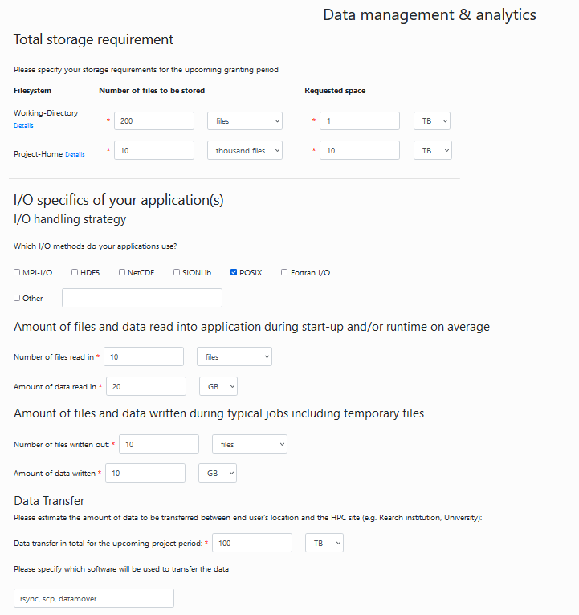
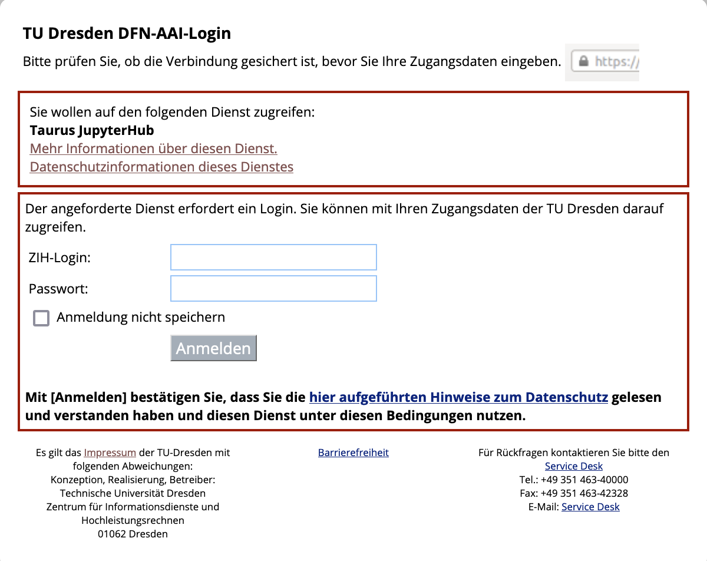
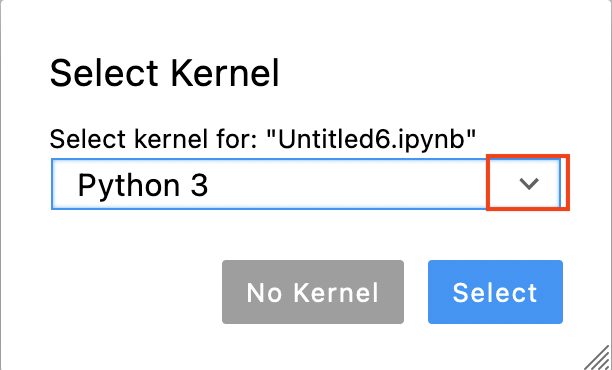

# Setting up GPU-accelerated image processing on the TUD HPC cluster

[Till Korten](https://biapol.github.io/blog/till_korten), July 29th 2022

The [High Performance Computing (HPC) cluster at the compute center (ZIH) of the TU Dresden](https://tu-dresden.de/zih/hochleistungsrechnen/hpc?set_language=en) provides a lot of computational resources including GPU support, which we can use for analyzing data in the life-sciences.
This blog post explains how to set up an account on the cluster. [This follow-up article](../devbio-napari_cluster/readme.md) explains how you can then run your own [jupyter notebooks](https://jupyter.org/) using some [napari](https://napari.org) plugins and GPU-accelerated image processing python libraries such as [clEsperanto](https://clesperanto.net) on the cluster.

## This blog post is for you if

* you want to [run devbio-napari tools](../devbio-napari_cluster/readme.md) on the cluster.
* you are comfortabel with the command line

If you need help with the setup, please do not hesitate to contact us

## See also

* [ZIH HPC Documentation](https://doc.zih.tu-dresden.de/)

## Step 1: Get access to the ZIH cluster

Before you can use the cluster, you need to [apply for an HPC project](https://tu-dresden.de/zih/hochleistungsrechnen/zugang/projektantrag?set_language=en).

In most cases, a NHR trial project will provide plenty of resources for your needs, so that you can follow our recommendations for filling out the application:

01. Log in to the [online project application form](https://projects.hpc.tu-dresden.de/jards/WEB/application/login.php?appkind=nhr)
02. Application List: Scroll down and click on the button "New Project Application"

    

03. Project Type: Select "trial project (< 42000 CPU hours per year)

    

04. Choose PI and PC: Enter the email addresses of the principal investigator (PI) and a person to contact (PC). If you are not the PI, click on the button "change my role to Person to Contact" so that you can enter the email address of your PI.

    

05. Principal Investigator: Enter the personal data of your PI
06. Person to Contact: Enter the personal data of the PC
07. Resources: check the boxes for both CPU and GPU:

    

08. NHR CPU res:
    * computing time per year: 42000 core-h
    * Typical number of cores: 6
    * Job-Memory: 10 GB per core
09. NHR GPU res:
    * computing time on GPU: 3000 GPU-hours
    * How many GPU do you use for a single job?: 1
    * How much GB of memory do you use for a typical job?: 12
    * Which GPU programming scheme (CUDA, OpenACC, etc.) do you use? CUDA, OpenCL
    * Which software do you deploy on GPUs (own code, third party)?: Tensorflow, pytorch, OpenCV
10. Project data:
    * Choose a project duration. Enter the estimated duration of the project here (e.g. the duration of the contract of the PC). Note that no matter the total estimated project duration, all projects need to be extended after one year.
    * Choose a title
    * Choose a few keywords, e.g. `image processing, machine learning, data analysis`
    * Enter a short project description, e.g. `Analysis of light-sheet microscopy images of developing organoids using python machine-learning tools such as napari`. If you already have an abstract of a project proposal, we recommend to use parts of that (note the 1500 character limit).
    * Commmissioned research: `No` (unless the project you are doing was specifically commissioned by a company)
    * Select sponsorship (DFG, BMBF, EU, Industry, Other)
    * If you selected `Other`, enter the sponsor in the text field below. e.g. `TU Dresden`
    * Classify your project according to predefined categories. E.g. "Main category": `201 Basic Research in Biology and Medicine` and "Sub category": `201-02 Biophysics`
    * Give reasons that make the use of this supercomputer necessary: e.g. `We need to process large amounts of image data, that would require hours to days on a normal computer. Furthermore, we need a standardized, reproducible environment for data processing.`
    * If the PI or PC were involved in other HPC projects within the last 3 years, you need to fill in the table "Other applications for compute time"
    * Check the box that you are aware that incomplete information may lead to a significant cutback of resources or even to the rejection of the proposal
    * Add other project members that need access to the HPC cluster (note, you can also easily add members later as needed)
11. Software packages: Here is what we recommend for bioimage analysis
    * Compilers: GCC (during installation of some python packages),
    * Programming Languages: Python (and R)
    * Other packages: `singularity, OpenCL, CUDA (Inside singularity containers: PyTorch, Tensorflow, napari)`
    * Packages developed by yourself: `(Inside singularity containers: devbio-napari, pyclesperanto)`
    * Open source: Yes
    * Links: `https://sylabs.io/singularity/, , https://www.khronos.org/opencl/, https://developer.nvidia.com/cuda-toolkit, https://pytorch.org/, https://www.tensorflow.org/, https://napari.org/stable/, https://github.com/haesleinhuepf/devbio-napari, https://github.com/clEsperanto/pyclesperanto_prototype`
    * Parallelization strategy: Hybrid
12. Data management: Fill out your estimated data requirements. Here is what we estimated for an average image analysis project:

    

13. Upload of PDF files: For a trial project, you can skip this step.
14. Finalize application: Click the button "Finalize" at the bottom.
15. You will receive an email with a PDF document that needs to be signed (electronically) by the PI and sent back via email.

For further information, refer to the [ZIH documentation for HPC project applications](https://doc.zih.tu-dresden.de/application/project_request_form/).

## Step 2: Get access fom the cluster to the fileserver

1. If you don't already have one, apply for a [group space on the fileserver](https://selfservice.zih.tu-dresden.de/l/index.php/spor/request-form/)
2. Ask for access to the fileserver from the cluster: Write an email to [hpcsupport](mailto:hpcsupport@zih.tu-dresden.de) and ask them to give you access to your fileserver account. They will then tell you a mount point that usually starts with `/grp/<fileserver_group>/`.

## Step 3: Start a Jupyter session on the ZIH cluster

Go to the [jupyter hub of the ZIH cluster](https://taurus.hrsk.tu-dresden.de/jupyter)
You will be greeted with the TUD login screen. Log in with your ZIH user name and password:



Afterwards, you should see a single button `Start My Server`. Click on it:


Now you get to configure the computing node you want your session to run on. Switch to the advanced configuration by clicking the button `Advanced`. Then you should see something like the image below.

1. Start by choosing a preset (click on 1).
2. You should choose a GPU node preset (2). You can choose between
   * Ampere A100 -> This is what you want if you really need to crunch some numbers. The A100 is more powerful than any gaming GPU and has 40GB graphics memory. However these machines are often more used and it may take longer to get a node on the cluster
   * Tesla K80 -> This is what you want for testing whether your workflows work on a GPU on the cluster and for tasks that are not time critical. The K80 is half as as powerful as a GTX 1080 and has 12GB graphics memory.

Once you are happy with your configuration, click the orange button `Spawn` at the very bottom.


You will now see a wait bar. Do not worry if it does not move, this bar is always at 50%. It usually takes 2-5 min to get a node.


### Trouble shooting

* Check the current utilization (the bars above the preset chooser)
  * the A100 are on the bar labeled `alpha`
  * the K80 are on the bar labeled `gpu2`
  
  If the partition is very full, you may have to wait a long time or not get a session at all.
* If you run out of memory or need more CPU cores, increase the number of CPUs. Note that the memory is per CPU, so if you choose more CPUs, you automatically get more memory.

## Step 4: Open a terminal

Open a terminal by clicking on `File` (1 in the image below) -> `New` (2) -> `Terminal` (3)


## Step 5: Install a custom jupyter kernel for your user

One of the advantages of our approach is, that you can always execute your code with the exac same python environment so that you always get the same result for the same data. Therefore, it is important for you that you know with which version of our python environment you were working. You can find available [versions here](https://gitlab.mn.tu-dresden.de/bia-pol/singularity-devbio-napari/-/releases). Look for the version number at the end of the title. For example `v0.2.1`.

To install a devbio-napari python environment, execute the following code in the terminal:

```bash
git clone https://gitlab.mn.tu-dresden.de/bia-pol/singularity-devbio-napari.git
cd singularity-devbio-napari
./install.sh <version>
```

replace `<version>` with the latest version shown at the top of [the version list](https://gitlab.mn.tu-dresden.de/bia-pol/singularity-devbio-napari/-/releases).

*Note*: In order to ensure [repeatability](https://en.wikipedia.org/wiki/Repeatability) and [reproducibility](https://en.wikipedia.org/wiki/Reproducibility) of the results you obtained from using a singularity container, we strongly recommend and encourage you to keep track of the used container's version. This way, you can ensure the integrity of your analysis workflow further down the line.

Wait 2-15 min until the image is downloaded and verified (the time depends on how much network and disk load is on the cluster). The output should look something like this:


If everything went well, close the terminal by clicking on the small X at the top of the terminal window.

## Step 6: Open a Jupyter Notebook with the newly installed environment

Reload the browser tab. Now open a new notebook by clicking on `File` (1 in the image below) -> `New` (2) -> `Notebook` (3)


Now you are asked to select a kernel. Click on the drop down button (red rectangle in the image below).



Choose the kernel you just installed (`devbio-napari-0.2.1` in the image below).


NB: for an existing notebook, you can click on the kernel name (by default `Python 3`) in the top right corner of the notebook and aelect the devbio-napari kernel as described above.

## Step 7: Verify that the environment works

Run some test code to verify that the environment has everything you need. For example:

```python
import pyclesperanto_prototype as cle
from skimage.io import imread, imsave
```

```python
# initialize GPU
device = cle.select_device("A100")
print("Used GPU: ", device)
```

Used GPU:  \<NVIDIA A100-SXM4-40GB on Platform: NVIDIA CUDA (1 refs)\>

```python
# load data
image = imread('https://imagej.nih.gov/ij/images/blobs.gif')

# process the image
inverted = cle.subtract_image_from_scalar(image, scalar=255)
blurred = cle.gaussian_blur(inverted, sigma_x=1, sigma_y=1)
binary = cle.threshold_otsu(blurred)
labeled = cle.connected_components_labeling_box(binary)

# The maxmium intensity in a label image corresponds to the number of objects
num_labels = cle.maximum_of_all_pixels(labeled)

# print out result
print("Num objects in the image: " + str(num_labels))

# save image to disc
imsave("result.tif", cle.pull(labeled))
```

Num objects in the image: 62.0

```python
cle.available_device_names()
```

\['NVIDIA A100-SXM4-40GB', 'cupy backend (experimental)'\]

## Hints

### Copy data directly to the cluster

This option targets more advanced users. It is faster, because it skips the transfer of data between fileserver and project space. However, it requires specialized file-transfer tools like [WinSCP](http://winscp.net/eng/download.php), [Cyberduck](https://cyberduck.io/) or [Rsync](https://man7.org/linux/man-pages/man1/rsync.1.html).

Please follow the [instructions on how to use the ZIH Export Nodes](https://doc.zih.tu-dresden.de/data_transfer/export_nodes/).

### What hardware is the current node running on?

If you are using an NVidia GPU, you can the [NVidia System Management Interface](https://developer.nvidia.com/nvidia-system-management-interface):

```bash
!nvidia-smi
```

It will give an overview about what's currently going on on your GPU:

```bash
+-----------------------------------------------------------------------------+
| NVIDIA-SMI 470.57.02    Driver Version: 470.57.02    CUDA Version: 11.4     |
|-------------------------------+----------------------+----------------------+
| GPU  Name        Persistence-M| Bus-Id        Disp.A | Volatile Uncorr. ECC |
| Fan  Temp  Perf  Pwr:Usage/Cap|         Memory-Usage | GPU-Util  Compute M. |
|                               |                      |               MIG M. |
|===============================+======================+======================|
|   0  NVIDIA A100-SXM...  On   | 00000000:11:00.0 Off |                    0 |
| N/A   52C    P0    60W / 400W |      0MiB / 40536MiB |      0%      Default |
|                               |                      |             Disabled |
+-------------------------------+----------------------+----------------------+
                                                                               
+-----------------------------------------------------------------------------+
| Processes:                                                                  |
|  GPU   GI   CI        PID   Type   Process name                  GPU Memory |
|        ID   ID                                                   Usage      |
|=============================================================================|
|  No running processes found                                                 |
+-----------------------------------------------------------------------------+
```

another option is

```bash
!numba -s
```

which will tell you everything about your system you ever wanted to know (the output below is just the hardware information section. numba actually provides much more information):

```bash
System info:
--------------------------------------------------------------------------------
__Hardware Information__
Machine                                       : x86_64
CPU Name                                      : znver2
CPU Count                                     : 96
Number of accessible CPUs                     : 6
List of accessible CPUs cores                 : 32 33 34 80 81 82
CFS Restrictions (CPUs worth of runtime)      : None

CPU Features                                  : 64bit adx aes avx avx2 bmi bmi2
                                                clflushopt clwb clzero cmov cx16
                                                cx8 f16c fma fsgsbase fxsr lzcnt
                                                mmx movbe mwaitx pclmul popcnt
                                                prfchw rdpid rdrnd rdseed sahf sha
                                                sse sse2 sse3 sse4.1 sse4.2 sse4a
                                                ssse3 wbnoinvd xsave xsavec
                                                xsaveopt xsaves

Memory Total (MB)                             : 1031711
Memory Available (MB)                         : 974317

__OS Information__
Platform Name                                 : Linux-3.10.0-1160.11.1.el7.x86_64-x86_64-with-glibc2.31
Platform Release                              : 3.10.0-1160.11.1.el7.x86_64
OS Name                                       : Linux
OS Version                                    : #1 SMP Fri Dec 18 16:34:56 UTC 2020
OS Specific Version                           : ?
Libc Version                                  : glibc 2.31

__Python Information__
Python Compiler                               : GCC 10.3.0
Python Implementation                         : CPython
Python Version                                : 3.9.13
Python Locale                                 : en_US.UTF-8

__LLVM Information__
LLVM Version                                  : 10.0.1

__CUDA Information__
CUDA Device Initialized                       : True
CUDA Driver Version                           : 11040
CUDA Detect Output:
Found 4 CUDA devices
id 0    b'NVIDIA A100-SXM4-40GB'                              [SUPPORTED]
                      compute capability: 8.0
                           pci device id: 0
                              pci bus id: 139
id 1    b'NVIDIA A100-SXM4-40GB'                              [SUPPORTED]
                      compute capability: 8.0
                           pci device id: 0
                              pci bus id: 144
id 2    b'NVIDIA A100-SXM4-40GB'                              [SUPPORTED]
                      compute capability: 8.0
                           pci device id: 0
                              pci bus id: 187
id 3    b'NVIDIA A100-SXM4-40GB'                              [SUPPORTED]
                      compute capability: 8.0
                           pci device id: 0
                              pci bus id: 193
Summary:
 4/4 devices are supported
```

Note the 1TB (sic!) of total RAM available on the nodes in the alpha partition of the TUD cluster

## Acknowledgements

I would like to thank Fabian Rost for sharing his extensive experience of how to run python notebooks within singularity containers on the TUD cluster.
