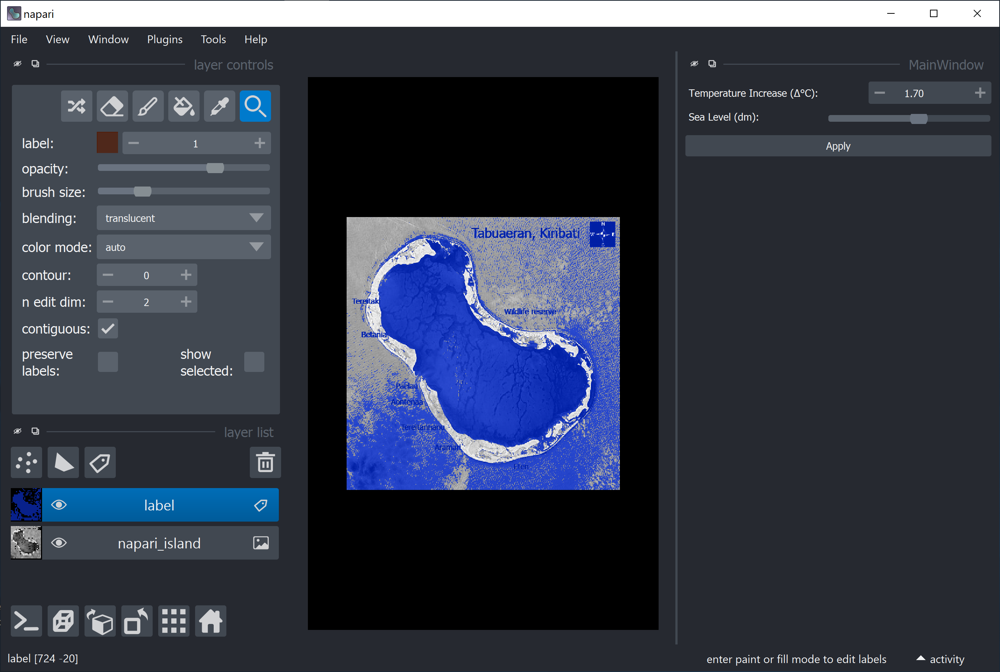
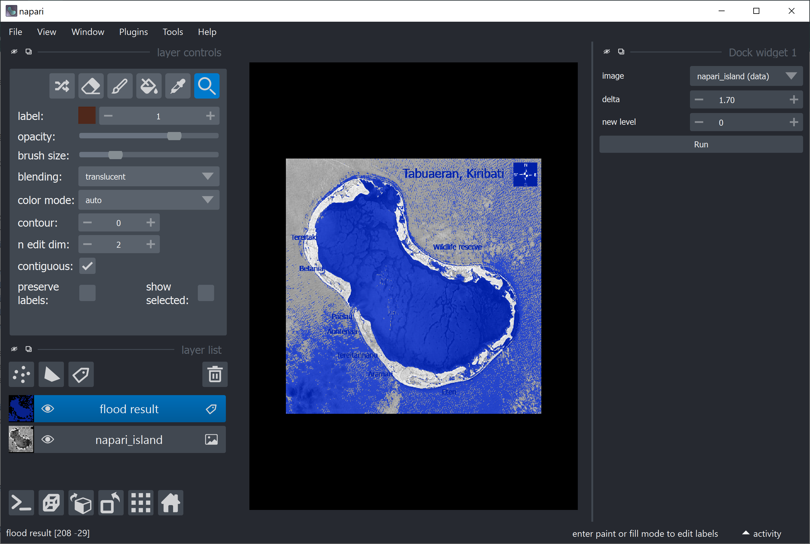
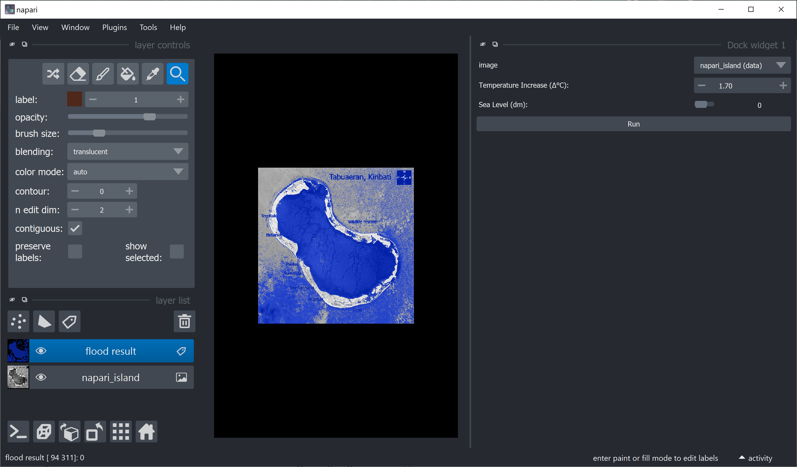
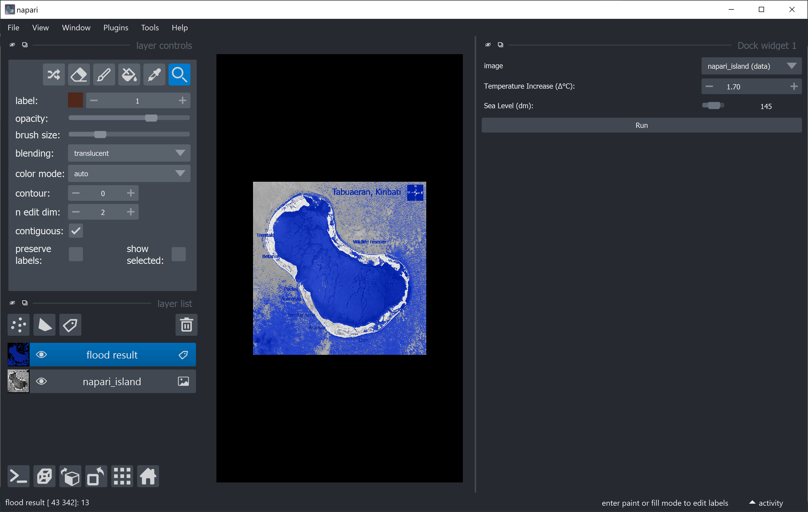

# Custom user interfaces for Python (Part 3)

## Introduction
Graphical user interfaces (*GUIs*) are powerful tools to make your scripts and functions available to users that are not necessarily familiar with a lot of coding, development platforms (e.g. Spyder or PyCharm) - and shouldn't be experienced programmers in order to use your tools.

In this blog, we will cover a few interesting and versatile methods for you to create customized [Qt](https://qt.io)-based GUIs for Python in general. Since our work revolves mostly around the visualization and processing of **images**, we will also show you a few ways to create great user interfaces for [napari](https://napari.org/).

Blogs on this topic will cover:
* [Getting started (Part 1)](https://biapol.github.io/blog/johannes_mueller/entry_user_interf#getting-started)
* [Creating standalone GUIs (Part 2)](https://biapol.github.io/blog/johannes_mueller/entry_user_interf2#creating-advanced-standalone-guis)
* [Creating GUIs for napari (Part 3)](https://biapol.github.io/blog/marcelo_zoccoler/entry_user_interf3#creating-advanced-guis-for-napari)
* [Turning napari GUI into plugins (Part 4)](https://biapol.github.io/blog/marcelo_zoccoler/entry_user_interf3#turning-napari-gui-into-plugins)


# Creating advanced GUIs for napari
The [previous entry](https://biapol.github.io/blog/johannes_mueller/entry_user_interf2#creating-advanced-standalone-guis) showed you how to create more advanced GUIs with the aid of the designer tool. This third part will teach you how to import those GUIs to napari and how to produce them straight from python functions using [magicgui](https://napari.org/magicgui/index.html).

## Table of contents
* [Installing and running napari](#installing-and-running-napari)
* [Calling napari from script](#calling-napari-from-script)
* [Importing your fancy GUI to napari](#importing-your-fancy-gui-to-napari)
* [Creating a callback function](#creating-a-callback-function)
* [Automatically creating a GUI from a function with magicgui](#automatically-creating-a-gui-from-a-function-with-magicgui)
* [Creating a GUI from FunctionGui](#creating-a-gui-from-functiongui)
* Conclusion(#conclusion)

## Installing and running napari

The [napari website](https://napari.org/) has a more complete [installation tutorial](https://napari.org/tutorials/fundamentals/installation.html), but, overall, you should [create a new conda environment](https://biapol.github.io/blog/johannes_mueller/entry_user_interf2/Readme.md#creating-your-environment) and then type

`conda install -c conda-forge napari`

or

`pip install napari[all]`

in the command line. You can check if the installation was successful by calling `napari` from the command line and verifying if this window opens:


You can now add images to it by drag and drop! Pretty easy right? Why don't you give it a try before we continue?
Download the image above and drop it into napari by drag and drop (or use the usual "File -> Open File(s)..."). You should have this:


**Wow! We have napari inside napari!** ~~And that's how you add a GUI to napari! 😆~~

## Calling napari from a script

Sometimes, it may be convenient to call the napari viewer from a script in order to display a series of image processing steps pre-defined in Python code. This can be done in a couple lines:

```
import napari
viewer = napari.Viewer()
```

The code above can be called from [Jupyter Notebook or JupyterLab](https://jupyter.org/), [Spyder](https://www.spyder-ide.org/), or your editor of preference.
It is also possible to add images to the viewer from code. Download this image: [Astronaut photo of Tabuaeran, Kiribati with villages and main landmarks](https://github.com/zoccoler/blog/tree/napari_plugin_desing/marcelo_zoccoler/entry_user_interf3/images/21_Map_of_Tabuaeran_Kiribati_blue.png) by Government of USA, Government of Kiribati, under license CC BY-SA 3.0 <https://creativecommons.org/licenses/by-sa/3.0>, via Wikimedia Commons, where the following changes were made: green and red channels removed, then image was inverted regarding intensity.
Put the image in the same folder as the code and let's expand it a bit:

```
import napari
from skimage.io import imread

viewer = napari.Viewer()
napari_image = imread('21_Map_of_Tabuaeran_Kiribati_blue.png')      # Reads an image from file
viewer.add_image(napari_image, name='napari_island')                # Adds the image to the viewer and give the image layer a name
```

After executing the block of code above, you should see the napari window like this:
(`No module named 'skimage'`? Remember to install scikit-image in your environment with `conda install -c conda-forge scikit-image`)


**Wow! We have napari inside napari! \[2\]**

*Side-note: the napari island is part of the Kiribati country, which like Fiji, is also vulnerable to [climate change effect](https://storymaps.arcgis.com/stories/7f455136b85f4edd8655d15a89b5039f).*

## Importing your fancy GUI to napari

Here, I modified a bit the GUI from the [previous post](https://biapol.github.io/blog/johannes_mueller/entry_user_interf2#creating-a-simple-gui-with-the-designer) and it looks like this:


You can find the '.ui' file to open this GUI with the designer [here](scripts/flood_tool.ui). Download it and then [convert it to python file](https://biapol.github.io/blog/johannes_mueller/entry_user_interf2#convert-gui-to-py-file-and-gui-creation) with `pyuic5 flood_tool.ui -o flood_tool.py` (remeber to navigate to the folder where flood_tool.ui in order to do that).

Now let's add it to napari! Put the 'flood_tool.py' file in the same folder as our script and modify the script as shown below:

```
import napari
from skimage.io import imread
from flood_tool import Ui_MainWindow
from PyQt5.QtWidgets import QMainWindow

# Define the main window class
class FancyGUI(QMainWindow,  Ui_MainWindow):
    def __init__(self, napari_viewer):          # include napari_viewer as argument (it has to have this name)
        super().__init__()
        self.viewer = napari_viewer
        self.setupUi(self)                      # Initialize GUI

viewer = napari.Viewer()
napari_image = imread('21_Map_of_Tabuaeran_Kiribati_blue.png')      # Reads an image from file
viewer.add_image(napari_image, name='napari_island')                # Adds the image to the viewer and give the image layer a name

flood_widget = FancyGUI(viewer)                                     # Create instance from our class
viewer.window.add_dock_widget(flood_widget, area='right')           # Add our gui instance to napari viewer
```

This code does:
* Import your GUI (with `from flood_tool import Ui_MainWindow`);
* Define a class that initializes your GUI (named 'FancyGUI' in this case);
* Pass the napari viewer as an argument to this class (with `def __init__(self, napari_viewer):`);
* Add an instance of this class to the viewer (`viewer.window.add_dock_widget(flood_widget, area='right')`).

When you run the script now, you should see the screen below:


It is now embedded into napari framework! Sweet 🍬!

## Creating a callback function

As you may have noticed, our GUI is there, but it does nothing yet. We need to link widgets to callback functions.
Just for fun, let's create a function that relates temperature increases to sea level.

***Disclaimer:** This specific function, although based on the fact that global warming contributes to incrase sea levels, has no scientific background to support it and it was completely made-up just for a fun illustration. Climate change is a complex subject that involves many internal and external factors which I do not have the expertise to explain.*

```
def flood(image, delta):
    new_level = delta*85
    label_image = image <= new_level
    label_image = label_image.astype(int)*13     # label number 13 is blue in napari
    return(label_image, new_level)
```

This function takes an `image` and a `delta` (temperature) as inputs. It converts delta into `new_level` (new sea level) and creates a label image where the labeled region corresponds to grayscale levels which are below `new_level`. It returns `label_image` and `new_level`. It can be simplified, but let's keep it like this for future reasons.

Now, we need to link this function to the 'Apply' button. This can be done with the general command `pushButton.clicked.connect(callback_function)`.
Let's write a callback function that calls our flood function:

```
def on_flood(self):
    label, level = flood(image, delta)
```

We now have to specify to our callback where it gets the vaiables `image` and `delta`.
* `image` is the input image layer in napari, so let's store it as a numpy array with `image = self.viewer.layers['napari_island'].data`;
* `delta` is the input value inside the Spinbox widget, so let's get it with `delta = self.doubleSpinBox.value()`;
* `label` is the output label image, we have to add it to the viewer with `self.viewer.add_labels(label)`;
* `level` is the output sea level, which we want also to show in our Slider widget, so we set it with `self.horizontalSlider.setValue(level)`.

Lastly, we use a flag (`self.label_layer`) to update the label layer rather than creating a new one every time. The code now looks like this:

```
import napari
from flood_tool import Ui_MainWindow
from skimage.io import imread
from PyQt5.QtWidgets import QMainWindow

def flood(image, delta):
    new_level = delta*85
    label_image = image <= new_level
    label_image = label_image.astype(int)*13 # label 13 is blue in napari
    return(label_image, new_level)

# Define the main window class
class MainWindow(QMainWindow,  Ui_MainWindow):
    def __init__(self, napari_viewer):          # include napari_viewer as argument (it has to have this name)
        super().__init__()
        self.viewer = napari_viewer
        self.setupUi(self)                     # Initialize GUI
        
        self.label_layer = None                # stored label layer variable
        self.pushButton.clicked.connect(self._apply_delta)
    
    def _apply_delta(self):
        image = self.viewer.layers['napari_island'].data    # We use the layer name to find the correct image layer
        delta = self.doubleSpinBox.value()
        label, level = flood(image, delta)
        if self.label_layer is None:
            self.label_layer = self.viewer.add_labels(label)
        else:
            self.label_layer.data = label
        self.horizontalSlider.setValue(level)

viewer = napari.Viewer()
napari_image = imread('./images/21_Map_of_Tabuaeran_Kiribati_blue.png')    # Reads an image from file
viewer.add_image(napari_image, name='napari_island')                       # Adds the image to the viewer and give the image layer a name

flood_widget = MainWindow(viewer)                                          # Create instance from our class
viewer.window.add_dock_widget(flood_widget, area='right')                  # Add our gui instance to napari viewer
```

Now when we increase the tempearture and click Apply, the island starts to flood :cold_sweat::ocean::



## Automatically creating a GUI from a function with magicgui

What if we could 'magically' simplify all that and just say: 'hey computer, please create a GUI for my function'?
We can ~~literally~~ almost do that with 🧙‍♂️[magicgui](https://napari.org/magicgui/index.html)! If we put some annotations right next to the variables in our function, we can create the GUI with one line of code :heart_eyes_cat:! So let's not wait any longer and add those annotations to our function:

```
from napari.types import ImageData, LabelsData

def flood(image: ImageData, delta: float=0, new_level: int=0) -> LabelsData: 
    new_level = delta*85
    label_image = image <= new_level
    label_image = label_image.astype(int)*13 # label 13 is blue in napari
    return(label_image)
```

Here we are specifying that `image` is a data from a napari image layer (`ImageData`), `delta` is `float`, `new_level` is `integer` and the output `label_image` will hold data from a napari labels layer (`LabelsData`).

You may have noticed that we placed `new_level` as input instead of output. That's because magicgui creates widgets (like buttons, sliders, etc) based on the input variables.

Now, here it comes... the one-liner: 🥁🥁

`flood_widget = magicgui(flood)`

Done! GUI was created and stored in `flood_widget`. The full code and the result become like this:

```
import napari
from skimage.io import imread
from magicgui import magicgui
from napari.types import ImageData, LabelsData

def flood(image: ImageData, delta: float=0, new_level: int=0) -> LabelsData: 
    new_level = delta*85
    label_image = image <= new_level
    label_image = label_image.astype(int)*13 # label 13 is blue in napari
    return(label_image)

viewer = napari.Viewer()
napari_image = imread('21_Map_of_Tabuaeran_Kiribati_blue.png')    # Reads an image from file
viewer.add_image(napari_image, name='napari_island')              # Adds the image to the viewer and give the image layer a name 

flood_widget = magicgui(flood)                                    # Create GUI with magicgui
viewer.window.add_dock_widget(flood_widget, area='right')         # Add our gui instance to napari viewer
```



Neat! Just a couple of things missing though. We only get Spinboxes now, what about the Slider? Don't worry, we can fix this still maintaining the one-liner, although a bigger one now :grimacing:. We can add widget options as python dictionnaries, like this:

```
flood_widget = magicgui(flood, delta={'label': 'Temperature Increase (Δ°C):', 
                                           'min': 0, 'max' : 3, 'step': 0.1},
                                new_level={'label':'Sea Level (dm):', 'widget_type':'Slider',
                                           'min': 0, 'max' : 255})
```

Now, you get practically the same result as the earlier approach. If you don't know the widget options, take a look [here](https://napari.org/magicgui/usage/widget_overview.html) to find the widget you want and discover its parameters.



One limitation of this approach is that the 'Sea level' slider does not get updated since it is an input now. If you need that kind of interaction, you have to either stick to [importing/writing the GUI with Qt](#importing-your-fancy-gui-to-napari) or [modify the FunctionGui](#creating-a-gui-from-functiongui), which is our next session.

You can look for further documentation and tutorials at [magicgui quickstart](https://napari.org/magicgui/usage/quickstart.html) and [magicgui in napari](https://napari.org/guides/stable/magicgui.html).

## Creating a GUI from FunctionGui

The third approach is kind of the middle ground between the first two approaches. By using and modifying FunctionGui (the type that is returned by magicgui), we still get the benefits of magicgui annotations, but we have extra editing capabilities. It doesn't necessarily mean it is the best approach, it depends on your demands.

We keep the annotated version of our function, but instead of passing it to magicgui, we will define a new FunctionGui class, based on [this example](https://napari.org/guides/stable/magicgui.html#magicgui-widgets-functiongui) and pass our flood function to FunctionGui. So, I will start with the code shown below:

```
def flood(image: ImageData, delta: float=0, new_level: int=0) -> LabelsData: 
    new_level = delta*85
    label_image = image <= new_level
    label_image = label_image.astype(int)*13 # label 13 is blue in napari
    return(label_image)
    
class MyGui(FunctionGui):
    def __init__(self):
        super().__init__(
          flood,                # Here is where we pass our custom annotated function to FunctionGui
          call_button=True,
          layout='vertical',
          param_options={}
        )
        # do whatever other initialization you want here
```

If we open napari, add our image and add MyGui to napari, we get the same result as shown [before](#figure3) (full code at the end of this section).

Similarly, to match the widgets style we want (like in [previous results](#figure4)), we can provide dictionnaires to the `param_options`, like this:

```
class MyGui(FunctionGui):
    def __init__(self):
        super().__init__(
          flood,                # Here is where we pass our custom annotated function to FunctionGui
          call_button=True,
          layout='vertical',
          param_options={'delta':
                             {'label': 'Temperature Increase (Δ°C):', 
                              'min': 0, 'max' : 3, 'step': 0.1},
                        'new_level':
                            {'label':'Sea Level (dm):', 'widget_type':'Slider',
                             'min': 0, 'max' : 255, 'step' : 1}}
        )
        # do whatever other initialization you want here
```

Up to this point, it looks very similar to magicgui, but with extra code. However, with this approach, we can modify the `__init()__` and the `__call()__` functions to gain access to other widgtes and get/send other variables that are not images. For example, besides `label_image`, we can make our function return `new_level` again as an annotation and use its value to change the slider when the user hits the 'Run' button. Check the complete code and result below:

```
import napari
from skimage.io import imread
from magicgui import magicgui
from napari.types import ImageData, LabelsData, LayerDataTuple
from magicgui.widgets import FunctionGui

def flood(image: ImageData, delta: float=0, new_level: int=0) -> LayerDataTuple: 
    new_level = delta*85
    label_image = image <= new_level
    label_image = label_image.astype(int)*13 # label 13 is blue in napari
    return((label_image, {'name': 'flood result','metadata': {'new_level':new_level}}))

class MyGui(FunctionGui):
    def __init__(self):
        super().__init__(
          flood,                 # Here is where we pass our custom annotated function to FunctionGui
          call_button=True,
          layout='vertical',
          param_options={'delta':
                             {'label': 'Temperature Increase (Δ°C):', 
                              'min': 0, 'max' : 3, 'step': 0.1},
                        'new_level':
                            {'label':'Sea Level (dm):', 'widget_type':'Slider',
                             'min': 0, 'max' : 255}}
        ) 
    def __call__(self):                                                 # Editing default call function (callback function after clicking 'Run')
        label_image = super().__call__()
        new_level = round(label_image[1]['metadata']['new_level'])      # Get metadata 'new_level'
        self.new_level.value = new_level                                # apply 'new_level' to slider ( which is 'self.new_level')

viewer = napari.Viewer()
napari_image = imread('21_Map_of_Tabuaeran_Kiribati_blue.png')    # Reads an image from file
viewer.add_image(napari_image, name='napari_island')              # Adds the image to the viewer and give the image layer a name 

flood_widget = MyGui()                                            # Create GUI from FunctionGui
viewer.window.add_dock_widget(flood_widget, area='right')         # Add our gui instance to napari viewer
```


## Conclusion

We have implemented our GUI in 3 different ways! Check which way is advantageous for you and play with it a little bit, because in the next part we will teach you how to turn it into a napari plugin and distribute it 🎉
