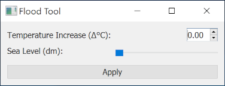

# Custom user interfaces for Python

## Introduction
Graphical user interfaces (*GUIs*) are powerful tools to make your scripts and functions available to users that are not necessarily familiar with a lot of coding, development platforms (e.g. Spyder or PyCharm) - and shouldn't be experienced programmers in order to use your tools.

In this blog, we will cover a few interesting and versatile methods for you to create customized [Qt](https://qt.io)-based GUIs for Python in general. Since our work revolves mostly around the visualization and processing of **images**, we will also show you a few ways to create great user interfaces for [napari](https://napari.org/).

Blogs on this topic will cover:
* [Getting started](https://biapol.github.io/blog/johannes_mueller/entry_user_interf#getting-started)
* [Creating standalone GUIs](https://biapol.github.io/blog/johannes_mueller/entry_user_interf2#creating-advanced-standalone-guis)
* [Creating GUIs for napari](https://biapol.github.io/blog/marcelo_zoccoler/entry_user_interf3#creating-advanced-guis-for-napari)


# Creating advanced GUIs for napari
The [previous entry](https://biapol.github.io/blog/johannes_mueller/entry_user_interf2#creating-advanced-standalone-guis) showed you how to create more advanced GUIs with the aid of the designer tool. This last part will teach you how to impot those GUIs to napari and how to produce them straight from python functions using [magicgui](https://napari.org/magicgui/index.html).

## Table of contents
* [Installing and running napari](#installing-and-running-napari)
* [Calling napari from script](#calling-napari-from-script)
* [Importing your fancy GUI to napari](#importing-your-fancy-gui-to-napari)
* [Creating a callback function](#creating-a-callback-function)
* [Automatically creating a GUI from a function with magicgui](#automatically-creating-a-gui-from-a-function-with-magicgui)
* [Creating a GUI from FunctionGui](#creating-a-gui-from-functiongui)
* [Turning your GUI into a napari plugin](#turning-your-gui-into-a-napari-plugin) 

## Installing and running napari

The [napari website](https://napari.org/) has a more complete [installation tutorial](https://napari.org/tutorials/fundamentals/installation.html), but, overall, you should [create a new conda environment](https://biapol.github.io/blog/johannes_mueller/entry_user_interf2/Readme.md#creating-your-environment) and then type

`conda install -c conda-forge napari`

or

`pip install napari[all]`

in the command line. You can check if the installation was successful by calling `napari` from the command line and verifying if this window opens:


You can now add images to it by drag and drop! Pretty easy right? Why don't you give it a try before we continue?
Download the image above and drop it into napari by drag and drop (or use the usual "File -> Open File(s)..."). You should have this:


**Wow! We have napari inside napari!** ~~And that's how you add a GUI to napari! 😆~~

## Calling napari from script

Sometimes, it may be convenient to call the napari viewer from a script in order to display a series of image processing steps pre-defined in a Python code. This can be done in a couple lines:

```
import napari
viewer = napari.Viewer()
```

The code above can be called from [Jupyter Notebook or JupyterLab](https://jupyter.org/), [Spyder](https://www.spyder-ide.org/), or your IDE of preference.
It is also possible to add images to the viewer from code. Let's expand the code a bit:

```
import napari
from skimage.io import imread

viewer = napari.Viewer()
napari_image = imread('../images/21_Map_of_Tabuaeran_Kiribati_blue.png')   # Reads an image from file
viewer.add_image(napari_image, name='napari_island')                       # Adds the image to the viewer and give the image layer a name
```

After executing the block of code above, you should get the image below (`No module named 'skimage'`? Remember to install scikit-image in your environment with `conda install -c conda-forge scikit-image`):


**Wow! We have napari inside napari! \[2\]**

*Side-note: the napari island is part of the Kiribati country, which like Fiji, is also vulnerable to [climate change effect](https://storymaps.arcgis.com/stories/7f455136b85f4edd8655d15a89b5039f).*

## Importing your fancy GUI to napari

Here, I modified a bit the GUI from the [previous post](https://biapol.github.io/blog/johannes_mueller/entry_user_interf2#creating-a-simple-gui-with-the-designer) and it looks like this:



You can find the '.ui' file to open this GUI with the designer [here]()   !!!! Insert link to file!!! and then [convert it to python file](https://biapol.github.io/blog/johannes_mueller/entry_user_interf2#convert-gui-to-py-file-and-gui-creation) with `pyuic5 flood_tool.ui -o flood_tool.py`.

Now let's add it to napari! Put the 'flood_tool.py' file in the same folder as our script and modify the script as shown below:

```
import napari
from skimage.io import imread
from flood_tool import Ui_MainWindow
from PyQt5.QtWidgets import QMainWindow

# Define the main window class
class FancyGUI(QMainWindow,  Ui_MainWindow):
    def __init__(self, napari_viewer):          # include napari_viewer as argument (it has to have this name)
        super().__init__()
        self.viewer = napari_viewer
        #Initialize GUI
        self.setupUi(self)

viewer = napari.Viewer()
napari_image = imread('./images/21_Map_of_Tabuaeran_Kiribati_blue.png')    # Reads an image from file
viewer.add_image(napari_image, name='napari_island')                       # Adds the image to the viewer and give the image layer a name

flood_widget = FancyGUI(viewer)                                            # Create instance from our class
viewer.window.add_dock_widget(flood_widget, area='right')                  # Add our gui instance to napari viewer
```

The main bullet points here are:
* Import your GUI (with `from flood_tool import Ui_MainWindow`);
* Define a class that initializes your GUI (named 'FancyGUI' in this case);
* Pass the napari viewer as an argument to this class (with `def __init__(self, napari_viewer):`);
* Add an instance of this class to the viewer (`viewer.window.add_dock_widget(flood_widget, area='right')`).

When you run the script now, you should see the screen below:


It is now embedded into napari framework! Sweet 🍬!

## Creating a callback function

As you may have noticed, our GUI is there, but it does nothing yet. We need to link widgets to callback functions.
Just for fun, let's create a function that relates temperature increases to sea level.

**Disclaimer:** This specific function, although based on the fact that global warming contributes to incrase sea levels, has no scientific background to support it and it was completely made-up just for a fun illustration. Climate change is a complex subject that involves many internal and external factors which I do not have the expertise to explain.

```
def flood(image, delta):
    new_level = delta*85
    label_image = image <= new_level
    label_image = label_image.astype(int)*13     # label number 13 is blue in napari
    return(label_image, new_level)
```

This function takes an `image` and a `delta` (temperature) as inputs. It converts delta into `new_level` (new sea level) and creates a label image where the labeled region corresponds to grayscale levels which are below `new_level`. It returns `label_image` and `new_level`. It can be simplified, but let's keep it like this for future reasons.

Now, we need to link this function to the `Apply` button. This can be done with the general command `pushButton.clicked.connect(flood)`.


## Automatically creating a GUI from a function with magicgui

## Creating a GUI from FunctionGui


## Turning your GUI into a napari plugin
