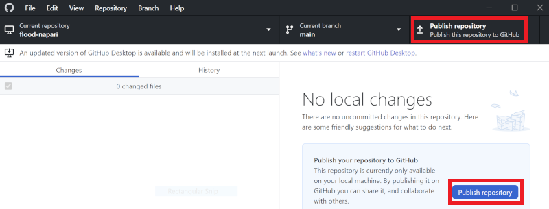
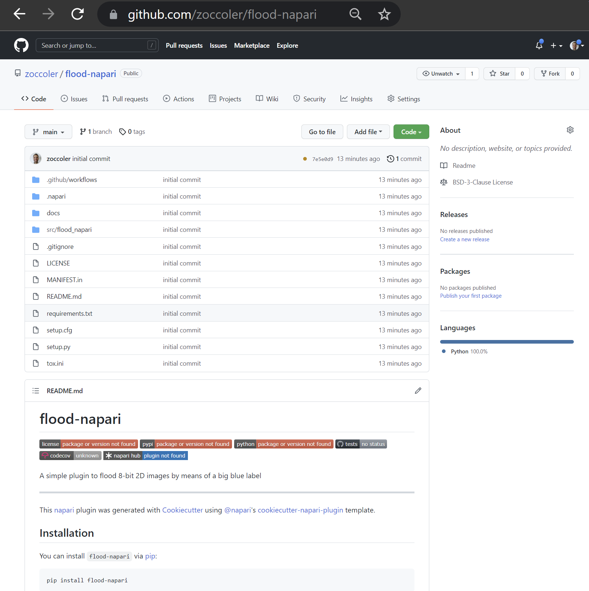

# Custom user interfaces for Python (Part 4)

## Introduction
Graphical user interfaces (*GUIs*) are powerful tools to make your scripts and functions available to users that are not necessarily familiar with a lot of coding, development platforms (e.g. Spyder or PyCharm) - and shouldn't be experienced programmers in order to use your tools.

In this blog, we will cover a few interesting and versatile methods for you to create customized [Qt](https://qt.io)-based GUIs for Python in general. Since our work revolves mostly around the visualization and processing of **images**, we will also show you a few ways to create great user interfaces for [napari](https://napari.org/).

Blogs on this topic will cover:
* [Getting started (Part 1)](https://biapol.github.io/blog/johannes_mueller/entry_user_interf#getting-started)
* [Creating standalone GUIs (Part 2)](https://biapol.github.io/blog/johannes_mueller/entry_user_interf2#creating-advanced-standalone-guis)
* [Creating GUIs for napari (Part 3)](https://biapol.github.io/blog/marcelo_zoccoler/entry_user_interf3#creating-advanced-guis-for-napari)
* [Turning napari GUI into plugins (Part 4)](https://biapol.github.io/blog/marcelo_zoccoler/entry_user_interf3#turning-napari-gui-into-plugins)


# Turning napari GUI into plugins
The [previous entry](https://biapol.github.io/blog/marcelo_zoccoler/entry_user_interf3#creating-advanced-guis-for-napari) showed you three different ways to create GUIs and embbed them into napari locally. This forth and last part will teach you how to transform them into napari plugins! 🏝️ 🚀

## Table of contents
* [Creating a plugin template with cookiecutter](#creating-a-plugin-template-with-cookiecutter)
* [Adding your local repository to Github](#adding-your-local-repository-to-github)
* [Putting your GUI into the template](#putting-your-gui-into-the-template)
* [Publishing your plugin](#publishing-your-plugin)

## Creating a plugin template with cookiecutter

Well, first things first: [create a new conda environment](https://biapol.github.io/blog/johannes_mueller/entry_user_interf2/Readme.md#creating-your-environment). ("Another one?" 😩) Yes, better safe than sorry 😉. Don't forget to activate it.

Napari website has a complete [tutorial](https://napari.org/plugins/stable/for_plugin_developers.html) for creating plugins, and I would say the easiest way is by using [cookiecutter](https://napari.org/plugins/stable/for_plugin_developers.html#cookiecutter-template).

So, let's install and run cookiecutter:

```
pip install cookiecutter
cookiecutter https://github.com/napari/cookiecutter-napari-plugin
```
(`'pip' is not recognized as ...`? 🙀 -> `conda install pip` 😸)

(`'git' is not installed.`? 😾 -> `conda install git` 😸)

The cookiecutter will then start asking you questions about your project. We will answer them one by one, but here is an overview of all of them:

⚠️Spoiler alert⚠️


  1. `full_name [Napari Developer]:` ***type your name***
  2. `email [yourname@example.com]:` ***type your email**, so that people can reach you to talk about your new plugin*
  3. `github_username_or_organization [githubuser]:` ***type your github username** (if you don't have a Github account, you should [create one now](https://github.com/signup?ref_cta=Sign+up&ref_loc=header+logged+out&ref_page=%2F&source=header-home))*
  4. `plugin_name [napari-foobar]:` ***type your plugin name** ex: 'flood-napari'*
  5. `Select github_repository_url:`  
     `    1 - https://github.com/your_github_username/your_plugin_name`  
     `    2 - provide later`  
     `Choose from 1, 2 [1]:`  ***type '1'**, even if you did not create your repository yet, we'll do that later*  
    *Obs: values or words inside square brackets `[]` are the default option if you just hit 'Enter'*
  
  6. `module_name [flood_napari]:` ***type your plugin module name** our plugin has a single module, ex: 'flood_napari'*
  7. `short_description [A simple plugin to use with napari]:` ***type a brief description of your plugin***
  8. `include_reader_plugin [y]:` ***type 'n'**, because our example plugin is not a plugin for reading certain image file types*
  9. `include_writer_plugin [y]:` ***type ''**, because our example plugin does not write anything*
  10. `include_dock_widget_plugin [y]:` ***type 'y' or just hit 'Enter'**, because we want to dock our plugin to napari framework*
  11. `include_function_plugin [y]:` ***type 'n' for this example**, however it could be useful to organize functions into separate files*
  12. `use_git_tags_for_versioning [n]:` ***hit 'Enter'***
  13. `Select docs_tool:`  
       `1 - mkdocs`  
       `2 - sphinx`  
       `3 - none`  
      `Choose from 1, 2, 3 [1]:` ***type '2' for this example**, check [this post] to learn more about sphinx*  
  14. `Select license:`  
       `1 - BSD-3`  
       `2 - MIT`  
       `3 - Mozilla Public License 2.0`  
       `4 - Apache Software License 2.0`  
       `5 - GNU LGPL v3.0`  
       `6 - GNU GPL v3.0`  
      `Choose from 1, 2, 3, 4, 5, 6 [1]:` ***we like to use '1'**, you can also change this later if you want, check options [here](https://ufal.github.io/public-license-selector/)*
      
Done! You will see the screen below with further instructions. 


We will just do instruction number 1 to install this default napari plugin locally:
```
cd flood-napari    # replace 'flood-napari' by your plugin name to go to the right directory
pip install -e .   # install your plugin locally
```

Install napari in your environment (`pip install napari[all]`) and run napari with `napari`.
When you go to the 'Plugins' menu now in napari, you will see your plugin name there.


## Adding your local repository to Github

Download github desktop


Your plugin template address should be a directory located where you were when you typed cookiecutter commands (typically 'C:/Users/Name' for Windows). Here is a picture of its contents:






     
 Notice the contents are the same as the ones in your local folder!


## Putting your GUI into the template


## Publishing your plugin
