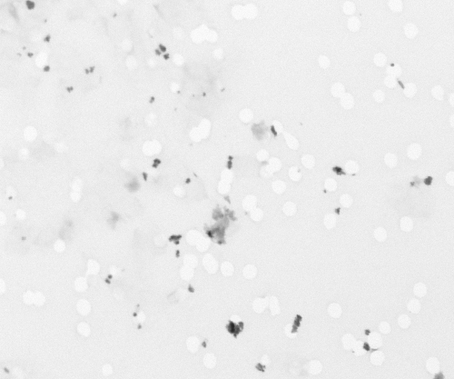

# Jamovi: statistical analysis made visual and easy (powered with R)

Statistical analysis softwares exist for decades. So why care about "just another one". Well, for one main reason: simplicity. And I mean simplicity by a clean convidative interface and an easy usage. Besides that, [Jamovi](https://www.jamovi.org/) is open-source and developed in R, a powerful programming language to perform statistical tests.

Almost every field in science uses statistical analysis as a tool to validate or refuse a hypothesis. Thus, popular commercial softwares, like SPSS, SAS, Origin, Stata, Prism, as well as Excel itself, have been and are used. They are all very powerful platforms, but their initial interface with too many menus and buttons may intimidate new users (besides the price). There is a free similar option to SPSS called PSPP, but since it mimics the latter, their interfaces are similar.
Another options would be using programming languages like Python and R, but that still wards off all non-programmers. 

Recently, two options free and open-source emerged as a solution to this: [JASP](https://jasp-stats.org/) and [Jamovi](https://www.jamovi.org/). They are very much alike, but here I will focus on this last one for no particular reason.

Since I work with image analysis, I will use Jamovi to compare features of different elements in the following image (a sample from imageJ called "TEM_filter_sample"). Let's suppose I did 2 distinct segmentations and I want to compare the shapes of the black element (red contour) with the white elements (yellow contour):

test
