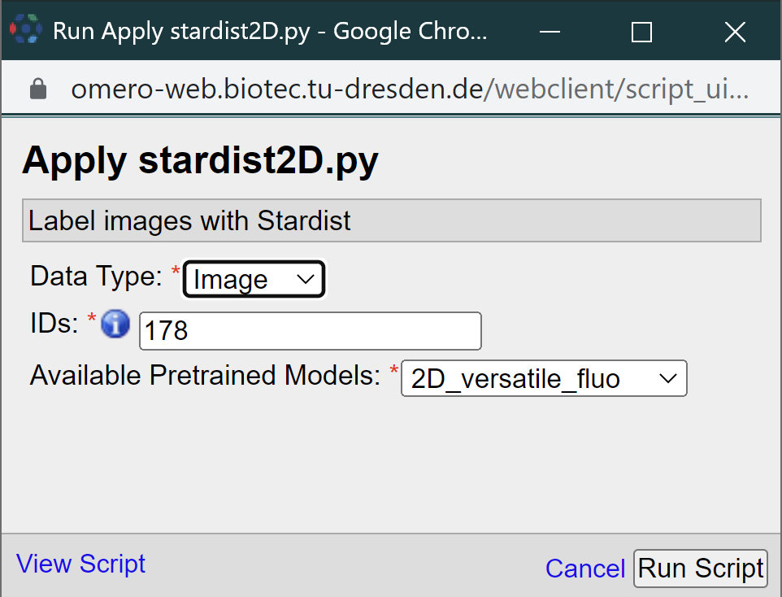
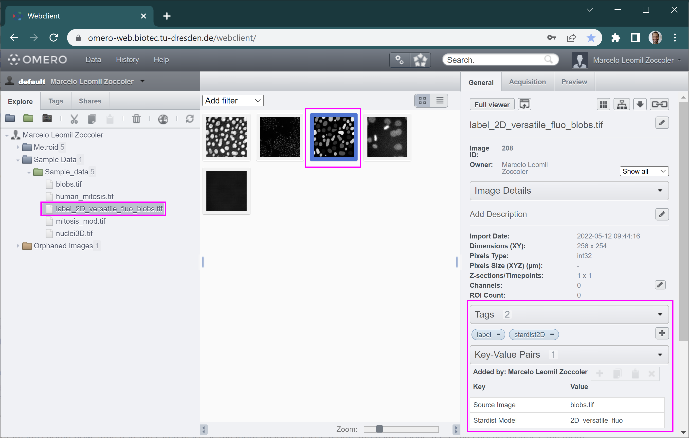

# Loading Images and Running Scripts in BiA-PoL Omero Server
[Marcelo Zoccoler](https://biapol.github.io/blog/marcelo_zoccoler), May 2nd 2022

## Getting access to the BiA-PoL Omero Server

The Bio-Image Analysis group from the Physics of Life Cluster of Excellence has an Omero server **provide some information about the server**.
Access to it may be provided to local users through the following steps:

1. Contact BiA-PoL members to check if you are allowed to get access to the server by email.
2. One of the BiA-PoL members will ask the IT department to create an account for you. You need a ZIH account for that.
3. Configure a VPN access by following [these instructions](https://intranet.crt-dresden.de/it-department/external-access.html).
4. Connect to the "Biotec Crtd Journal Access" VPN.

## Importing data to the Omero Server

You can import data to the server either via command line or via the Desktop Client. Here, we will explain the second option.
The Omero webpage has a good step-by-step tutorial of how to import images to the server using the Desktop client application `Omero.insight`:

- [Import data using the Desktop Client](https://omero-guides.readthedocs.io/projects/upload/en/latest/import-desktop-client.html#setup)

After installing the application, you will need to provide the server address (step 2 of the link above). The server address is https://omero-web.biotec.tu-dresden.de . Then, provide the same ZIH username and password to connect to the server. Remember to be connected to the VPN!

## Running Omero Scripts

After logging in, you should get to the following screen:


Images in Omero are usually organized as:
```
User/Client
└──Project
|    └──Dataset
|        └──Images
└──Orphaned Images
```

The Orphaned Images is the place where images are stored if they have no Project associated to them. You can browse through this file structure by clicking on the `+` buttons to open these directories. Once you reach the Dataset level, you can see image thumbnails in the main panel. If you click on them, you can get the corresponding information on the right side. One of the most important properties is the Project/Dataset/Image ID (red arrow in the figure below), which you will usually need to provide to scripts.


Omero scripts can be run by clicking on the small button with two gears and a green triangle at Omero Insight toolbar. A pop-up menu should open where you can select the origin of your scripts (`omero` or `CMCB`). 


In `omero`, you can run the standard omero scripts and in `CMCB` you can run one of the plugins we are developing. Most of them are work in progress, that is why you may find names starting with 'testing'. In this tutorial, we will use "apply_stardist2D". Clicking on it open a new small window:



There you should provide 3 parameters: the "Data Type" (Dataset or Image), the corresponding ID and one of the pretrained Stardist2D models. Then, click on the "Run Script" button. The activities window should pop-up indicating the status of execution. After the script finish running, it should look like this:


You can download the "Info" and "Error" as text files. "Error" may contain errors or, in this case, just some warnings that can be ignored. "Info" contains information returned from print statements within the script.

The resulting labeled image may not be visible after that. If that is the case, refresh the files by clicking on the refresh button ().



The output image should now appear in the same place as the input image/dataset. It gets the name 'label_2D' + the chosen model + the input image name. It also gets some tags and key/pair values assigned to it to indicate how it was produced (right side panel).
