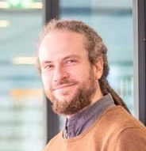

# Robert Haase

My name is Robert and I am computer scientist by training. 
Over the years I turned into an image data scientist working in the life sciences. 
Thus, I'm not a computer scientist anymore and not yet a biologist neither.
In science, I started as student assistant in 2008 in Prof. Nasreddin Abolmaalis Biological and Molecular Imaging group at the OncoRay in Dresden registering microscopy images of histological stainings of tumor tissue with magnetic resonance imaging.
I later worked on swarm intelligence based algorithms for medical image segmentation for positron emission tomography in the cancer research context and received a doctor rerum medicinalium in medical image processing from the Faculty of Medicine Carl Gustav Carus of the TU Dresden.
Afterwards, I returned to working with microscopy images as bio-image analyst, scientific software engineer and data science consultant at the Scientific Computing Facility of the Max Planck Institute for Molecular Cell Biology and Genetics in Dresden.
During these years I learned a lot about various imaging techniques and related biological questions. 
Afterwards, I became postdoc in Gene Myers lab at the Center for Systems Biology and the Max Planck Institute for Molecular Cell Biology and Genetics and started concentrating on bridging the disciplines computer science and biology to forward understanding of how tissues and organisms form. 
There I started studying Tribolium castaneum embryo development and for that programed smart microscopes, real-time GPU-accelerated image analysis and machine learning tools easing the way how scientists interact with multi-dimensional image data to gain new insights.
I also started as lecturer for bio-image analysis, bio-statistics and programming at the Biotechnology Center of the TU Dresden. 
Since 2020 I'm heading the Bio-image Analysis Technology Development group (BiA-PoL) at the DFG Cluster of Excellence "Physics of Life" at the TU Dresden where I also started this blog. 
I serve here as editor supporting students, employees and collaborators of the BiA-PoL in communicating their science with the world.

## Links
* [BiA-PoL group website](https://physics-of-life.tu-dresden.de/en/research/technology-development-groups/bio-image-analysis)
* [Robert on twitter](https://twitter.com/haesleinhuepf)
* [Robert on github](https://github.com/haesleinhuepf)

[https://biapol.github.io/blog/imprint](Imprint)