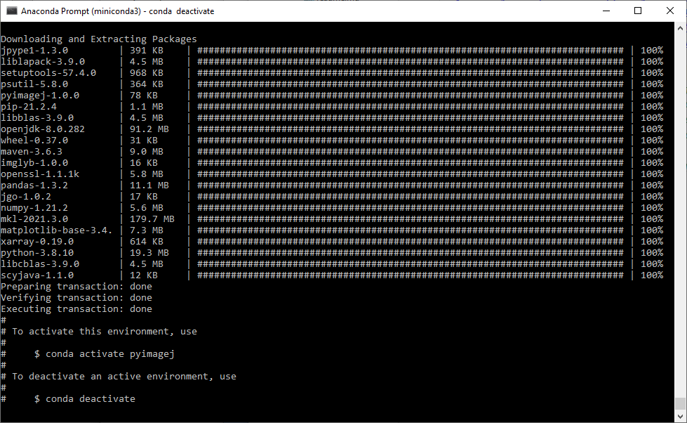

## Running ImageJ macros from python: pyimagej

https://github.com/imagej/pyimagej/


https://github.com/imagej/pyimagej/blob/master/doc/Install.md

```
conda config --add channels conda-forge
conda config --set channel_priority strict
```

```
conda create -n pyimagej pyimagej openjdk=8
```

Just to explain this command a bit. It mentions "pyimagej" twice. Why so? 
The first one comes with a decorator: ```-n pyimagej```. The `-n` is a short version of `--name` and declares that the conda environment we create will be called "pyimagej".
The second "pyimagej" specifies a [conda package named pyimagej](https://anaconda.org/conda-forge/pyimagej). Thus, we are installing `pyimagej` into a conda environment named "pyimagej". 
Furthermore, we also install a [Java Development Kit (JDK)](https://openjdk.java.net/), version 8, into this conda environment as specified with `openjdk=8`.

This will install some packages:



We then just do what the terminal suggests us to do, we activate the environment, again named "pyimagej":
```python
conda activate pyimagej
```

In order to test pyimagej, we also need to install some more stuff such as [jupyter](https://jupyter.org) notebooks and [scikit-image](https://scikit-image.org/) for loading and visualizing images:

```
conda install jupyter notebook scikit-image
```

## Usage

A typical usage scenario might be we have an imagej loaded from disk want to process it using a workflow in ImageJ. Just as an example, I recorded a macro for binarizing the famous "blobs" image and creating a label image from it:
```
run("Blobs (25K)");
setAutoThreshold("Otsu");
setOption("BlackBackground", true);
run("Convert to Mask");
run("Analyze Particles...", "  show=[Count Masks]");
```
Note, ImageJ's [Particle Analyzer](https://imagej.net/imaging/particle-analysis#analyze-particles) produced a perfectly fine label image when "Count masks" is selected in the "Show" pulldown.

In order to integrate this ImageJ Macro into python code, we start with python code for initializing imagej:
```python
import imagej
ij = imagej.init()
```

This can take a while (< 5 minutes) if you run that for the first time. In the background it is now downloading and installing ImageJ.

Next, we transfer an image into ImageJ and "show" it so that ImageJ Macro notices it as the currently selected image. It doesn't show anything by the way because pyimagej entirely runs without graphical user interface. For figuring out how to do this, [this notebook](https://github.com/uw-loci/Notebooks/blob/9ed90842f06c93b1c206d36fef2b13555e7273d9/PyImageJ/Rigid%20registration%20with%20pyimagej.ipynb) and [this one](https://github.com/imagej/pyimagej/blob/master/doc/PyImageJ-Tutorial.ipynb) were very helpful.

```python

```


