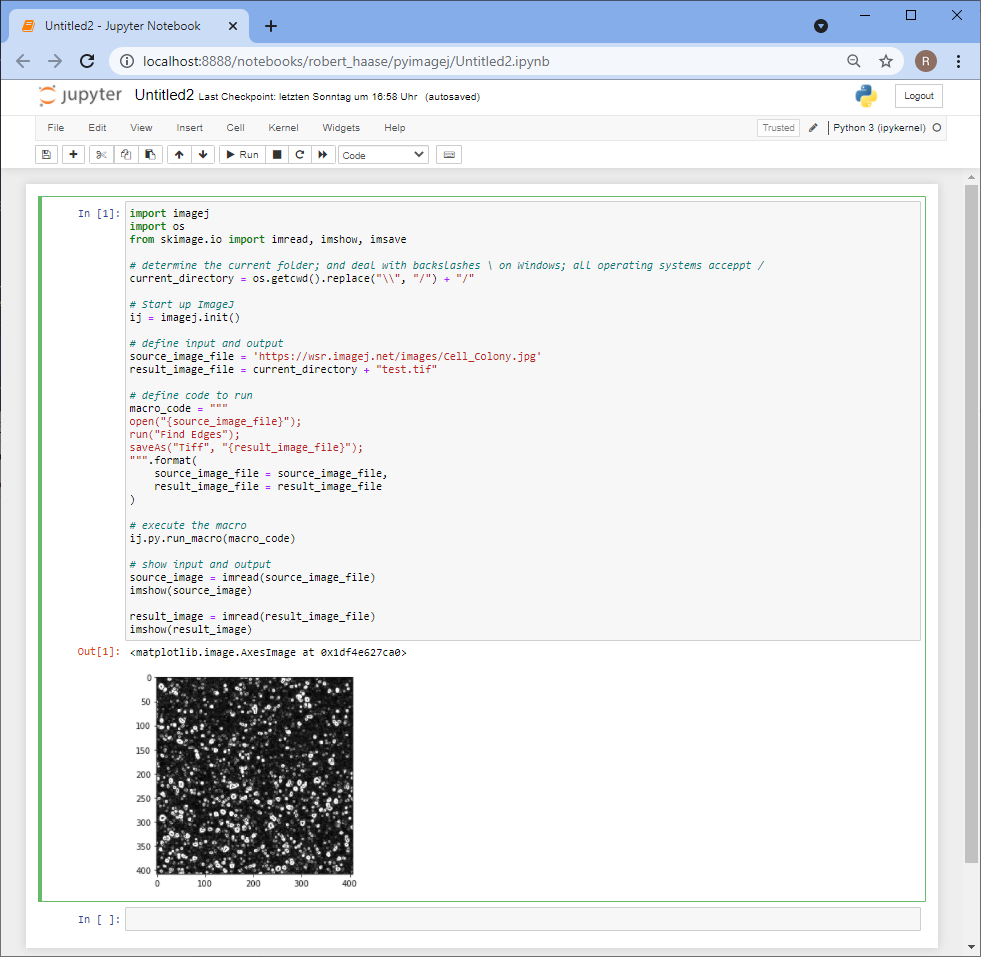

## Running ImageJ macros from python: pyimagej

There is a huge community of image data scientists used to ImageJ macro and also a large community who use python libraries such as 
[scikit-image](https://scikit-image.org/) and 
[scipy](https://scipy.org/) to process and analyse their image data.
Obviously, both communities enjoy certain advantages of their ecosystem.
Goal of the [pyimagej](https://github.com/imagej/pyimagej/) project is to build bridges between these two ecosystems 
and in particular enable the python community to run ImageJ plugins within their python workflows.
Before we can get started, we should 
[download and install conda](https://github.com/BiAPoL/Bio-image_Analysis_with_Python/blob/main/conda_basics/01_conda_environments.md).
Then, we can setup a conda environment specifically for pyimagej as explained in 
[pyimagej's installation instructions](https://github.com/imagej/pyimagej/blob/master/doc/Install.md):

```
conda config --add channels conda-forge
conda config --set channel_priority strict
```

```
conda create -n pyimagej pyimagej openjdk=8
```

Just to explain this command a bit. It mentions "pyimagej" twice, intentionally. 
The first one comes with a decorator: ```-n pyimagej```. The `-n` is a short version of `--name` and declares that the conda environment we create will be called "pyimagej".
The second "pyimagej" specifies a [conda package named pyimagej](https://anaconda.org/conda-forge/pyimagej). Thus, we are installing `pyimagej` into a conda environment named "pyimagej". 
Furthermore, we also install a [Java Development Kit (JDK)](https://openjdk.java.net/), version 8, into this conda environment as specified with `openjdk=8`.

This will install some packages:


We then just do what the terminal suggests us to do, we activate the environment, again named "pyimagej":
```python
conda activate pyimagej
```

In order to test pyimagej, we also need to install some more stuff such as [jupyter](https://jupyter.org) notebooks and [scikit-image](https://scikit-image.org/) for loading and visualizing images:

```
conda install jupyter notebook scikit-image
```

We can then test the installation, e.g. by executing this code in a juypter notebook:
```python
import imagej
import os
from skimage.io import imread, imshow, imsave

# determine the current folder; and deal with backslashes \ on Windows; all operating systems acceppt /
current_directory = os.getcwd().replace("\\", "/") + "/"

# Start up ImageJ
ij = imagej.init()

# define input and output
source_image_file = 'https://wsr.imagej.net/images/Cell_Colony.jpg'
result_image_file = current_directory + "test.tif"

# define code to run
macro_code = """
open("{source_image_file}");
run("Find Edges");
saveAs("Tiff", "{result_image_file}");
""".format(
    source_image_file = source_image_file, 
    result_image_file = result_image_file
)

# execute the macro
ij.py.run_macro(macro_code)

# show input and output
source_image = imread(source_image_file)
imshow(source_image)

result_image = imread(result_image_file)
imshow(result_image)
```
... that should result in this output:


There is also the indication that [pyimagej works on google colab](https://forum.image.sc/t/pyimagej-on-google-colab/32804).

## Usage

... work in progress ...

A typical usage scenario might be we have an imagej loaded from disk want to process it using a workflow in ImageJ. Just as an example, I recorded a macro for binarizing the famous "blobs" image and creating a label image from it:
```
run("Blobs (25K)");
setAutoThreshold("Otsu");
setOption("BlackBackground", true);
run("Convert to Mask");
run("Analyze Particles...", "  show=[Count Masks]");
```
Note, ImageJ's [Particle Analyzer](https://imagej.net/imaging/particle-analysis#analyze-particles) produces a label image when "Count masks" is selected in the "Show" pulldown.

In order to integrate this ImageJ Macro into python code, we start with python code for initializing imagej:
```python
import imagej
ij = imagej.init('2.1.0')
```

The parameter here specifies which version of ImageJ we would like to use. 
It's an optional parameter which is important to make this script reproducible later on. 
That particular versions can be downloaded from a [maven repository]() together with all dependencies.

This can take a while (< 5 minutes) if you run that for the first time. In the background it is now downloading and installing ImageJ.

Next, we transfer an image into ImageJ and "show" it so that ImageJ Macro notices it as the currently selected image. 
It doesn't show anything by the way because pyimagej entirely runs without graphical user interface. 
For figuring out how to do this, [this notebook](https://github.com/uw-loci/Notebooks/blob/9ed90842f06c93b1c206d36fef2b13555e7273d9/PyImageJ/Rigid%20registration%20with%20pyimagej.ipynb) and 
[this one](https://github.com/imagej/pyimagej/blob/master/doc/PyImageJ-Tutorial.ipynb) were very helpful.

```python

```


