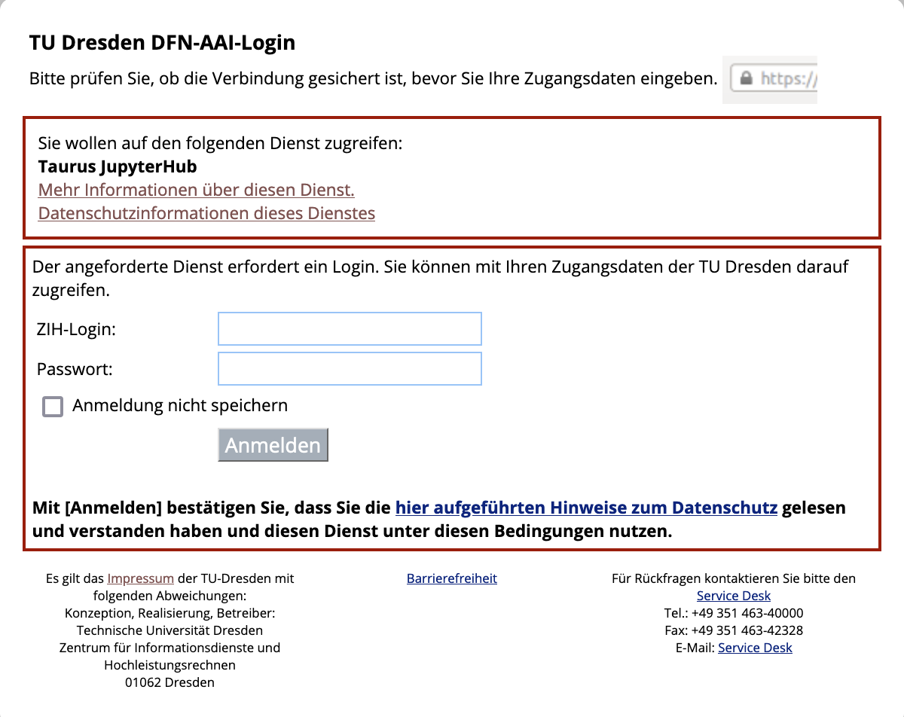
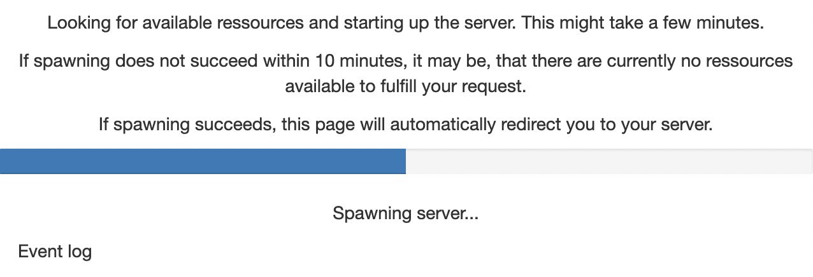
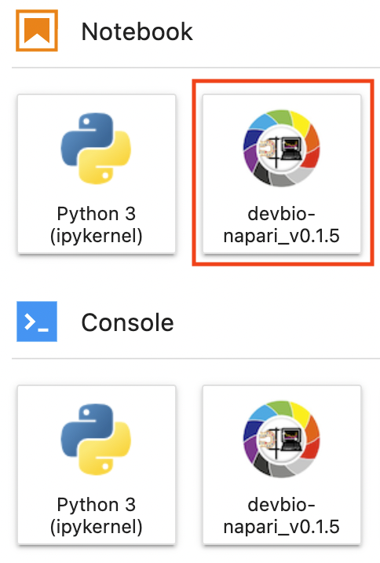
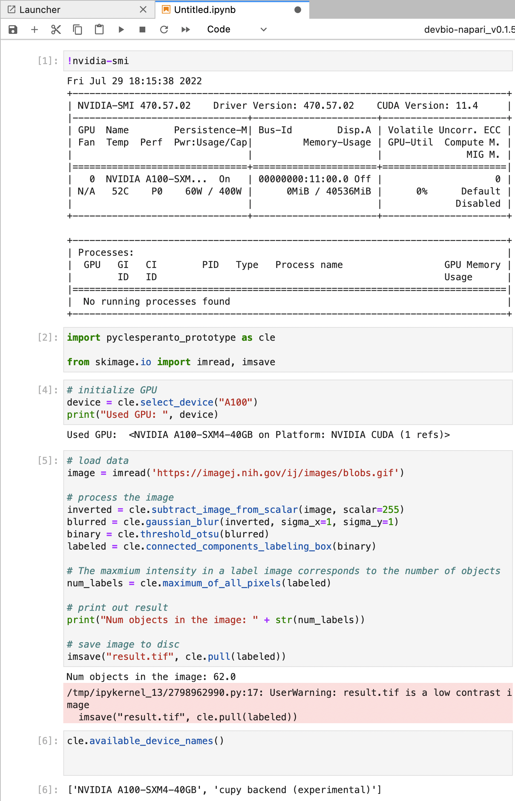

# GPU-accelerated image processing on the TUD HPC cluster
[Till Korten](https://biapol.github.io/blog/till_korten), July 29th 2022

The TUD HPC cluster provides a lot of computing performance including GPU support.
This blog post explains how to run your own jupyter notebooks using [napari](https://napari.org) and/or [clEsperanto](https://clesperanto.net) on the cluster.

### This blog post is for you if:
* data processing takes a significant amount of time on your computer
* the time intensive part of your data processing works without user interaction
* you want to use your computer for other important tasks (such as life after five) while your data are being processed
* you have a working python script or jupyter notebook that processes your data
* the computers available to you limit you because:
  * lacking GPU (or too little GPU RAM)
  * not enough RAM
  * not enough disk space
  * not enough CPUs

### You may need to look elsewhere if:
* you are still actively developing on your workflow and are installing/removing python packages on a regular basis. We are working with singularity images and it is not feasible to frequently build new images for you with new python packages. You may want to look at Roberts article on [using google colab](../../robert_haase/clesperanto_google_colab/).
* your workflow needs a graphical user interface other than standard jupyter notebook stuff

### See also
* [ZIH HPC Documentation](https://doc.zih.tu-dresden.de/)

## Step 1: Get access to the ZIH cluster
Fill out a project proposal and submit it to the compute center as [explained in their documentation](https://tu-dresden.de/zih/hochleistungsrechnen/zugang/projektantrag?set_language=en).

## Step 2: Start a Jupyter session on the ZIH cluster
You will be greeted with the TUD login screen. Log in with your ZIH user name and password:




Afterwards, you should see a single button `Start My Server`. Click on it:


Now you get to configure the computing node you want your session to run on. Switch to the Advanced configuration by clicking the button `Advanced`. Then you should see something like the image below. 

Start by choosing a preset (click on 1). You should choose a GPU node preset (2). You can choose either a n Ampere A100 or a Tesla K80 card. Choose according to the your needs and the current utilization (the bars above the preset chooser) (the A100 are on `alpha`, the K80 are on `gpu2`) If the partition is very full, you may have to wait a long time or not get a session at all. Choose the number of CPUs and memory per cpu as needed. Note that the memory is per CPU, so if you choose more CPUs, you get more memory.

Once you are happy with your configuration, click the orange button `Spawn` at the very bottom.


You will now see a wait bar. Do not worry if it does not move, this bar is always at 50%. It usually takes 2-5 min to get a node.



## Step 3: Open a terminal

Open a terminal by clicking on file (1 in the image below) -> new (2) -> Terminal (3)


## Step 4: Install a custom jupyter kernel for your user

In the terminal, execute the following code:

```bash
git clone https://gitlab.mn.tu-dresden.de/bia-pol/singularity-devbio-napari.git
```
You will be asked for a user name and password. Enter the following:

User name: `git_pull`

Password: `Bc6Yg8k5MyZzURNuWChR`

Once the download has finished, enter the following:

```bash
cd singularity-devbio-napari
./install.sh <version>
```

replace `<version>` with the version of our devbio-napari environment you want to use. At the time of writing, the latest version was `v0.1.5`. Always specify a version (or a tag name you got from us in case we created a custom environment for you). This will ensure that your code is always executed in the same environment and your data analysis is reproducible. Note down the version you use in your lab book!

Wait 2-5 min until the image is downloaded and verified. The output should look something like this:


If everything went well, close the terminal by clicking on the small X at the top of the terminal window.

## Step 5: Open a Jupyter Notebook with the newly installed environment

Reload the browser tab. You should then see a two new icons with the name `devbio-napari_v0.1.5` one in the Notebooks section and one in the Console section. Click on the former (red rectangle in the image below).



## Step 6: Verify that the environment works

Run some test code to verify that the environment has everything you need. For example:



<!-- we should also add instructions on how to get data onto the cluster from the fileserver. -> use material from issue #22 after testing this -->

## Hints

### Troubleshooting

Contact us if you run into problems. **Which contact details should we give here?**

If some python modules are missing, we can create a custom environment for you. However, please understand that we cannot do this every few days, so make sure you tell us **all the additional modules you need at once**. Ideally, you create a minimal working environment on your machine **test it thoroughly** and then export it as an `environment.yml` file like so:

```bash
conda env export | grep -v "^prefix: " > environment.yml
```

If you send us that file, we should have all the information we need.


### What hardware is the current node running on?
If you are using an NVidia GPU, you can the [NVidia System Management Interface](https://developer.nvidia.com/nvidia-system-management-interface):
```
!nvidia-smi
```
It will give an overview about what's currently going on on your GPU:
```
+-----------------------------------------------------------------------------+
| NVIDIA-SMI 470.57.02    Driver Version: 470.57.02    CUDA Version: 11.4     |
|-------------------------------+----------------------+----------------------+
| GPU  Name        Persistence-M| Bus-Id        Disp.A | Volatile Uncorr. ECC |
| Fan  Temp  Perf  Pwr:Usage/Cap|         Memory-Usage | GPU-Util  Compute M. |
|                               |                      |               MIG M. |
|===============================+======================+======================|
|   0  NVIDIA A100-SXM...  On   | 00000000:11:00.0 Off |                    0 |
| N/A   52C    P0    60W / 400W |      0MiB / 40536MiB |      0%      Default |
|                               |                      |             Disabled |
+-------------------------------+----------------------+----------------------+
                                                                               
+-----------------------------------------------------------------------------+
| Processes:                                                                  |
|  GPU   GI   CI        PID   Type   Process name                  GPU Memory |
|        ID   ID                                                   Usage      |
|=============================================================================|
|  No running processes found                                                 |
+-----------------------------------------------------------------------------+
```

another option is
```
!numba -s
```
which will tell you everything about your system you ever wanted to know (the output below is just the hardware information section. numba actually provides much more information):
```
System info:
--------------------------------------------------------------------------------
__Hardware Information__
Machine                                       : x86_64
CPU Name                                      : znver2
CPU Count                                     : 96
Number of accessible CPUs                     : 6
List of accessible CPUs cores                 : 32 33 34 80 81 82
CFS Restrictions (CPUs worth of runtime)      : None

CPU Features                                  : 64bit adx aes avx avx2 bmi bmi2
                                                clflushopt clwb clzero cmov cx16
                                                cx8 f16c fma fsgsbase fxsr lzcnt
                                                mmx movbe mwaitx pclmul popcnt
                                                prfchw rdpid rdrnd rdseed sahf sha
                                                sse sse2 sse3 sse4.1 sse4.2 sse4a
                                                ssse3 wbnoinvd xsave xsavec
                                                xsaveopt xsaves

Memory Total (MB)                             : 1031711
Memory Available (MB)                         : 974317

__OS Information__
Platform Name                                 : Linux-3.10.0-1160.11.1.el7.x86_64-x86_64-with-glibc2.31
Platform Release                              : 3.10.0-1160.11.1.el7.x86_64
OS Name                                       : Linux
OS Version                                    : #1 SMP Fri Dec 18 16:34:56 UTC 2020
OS Specific Version                           : ?
Libc Version                                  : glibc 2.31

__Python Information__
Python Compiler                               : GCC 10.3.0
Python Implementation                         : CPython
Python Version                                : 3.9.13
Python Locale                                 : en_US.UTF-8

__LLVM Information__
LLVM Version                                  : 10.0.1

__CUDA Information__
CUDA Device Initialized                       : True
CUDA Driver Version                           : 11040
CUDA Detect Output:
Found 4 CUDA devices
id 0    b'NVIDIA A100-SXM4-40GB'                              [SUPPORTED]
                      compute capability: 8.0
                           pci device id: 0
                              pci bus id: 139
id 1    b'NVIDIA A100-SXM4-40GB'                              [SUPPORTED]
                      compute capability: 8.0
                           pci device id: 0
                              pci bus id: 144
id 2    b'NVIDIA A100-SXM4-40GB'                              [SUPPORTED]
                      compute capability: 8.0
                           pci device id: 0
                              pci bus id: 187
id 3    b'NVIDIA A100-SXM4-40GB'                              [SUPPORTED]
                      compute capability: 8.0
                           pci device id: 0
                              pci bus id: 193
Summary:
	4/4 devices are supported
```
Note the 1TB (sic!) of total RAM available on the nodes in the alpha partition of the TUD cluster


# Acknowledgements
I would like to thank Fabian Rost for sharing his extensive experience of how to run python notebooks within singularity containers on the TUD cluster.