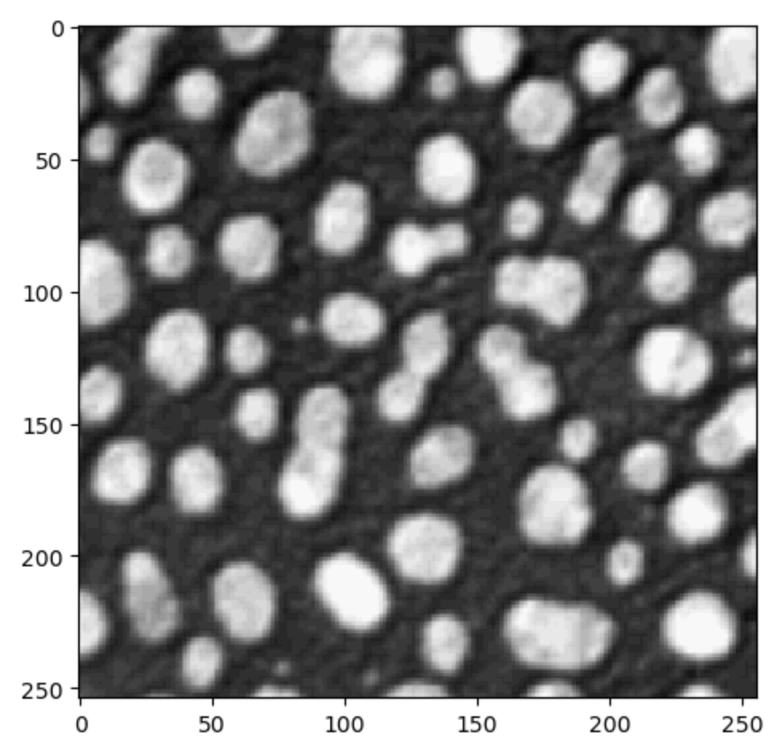

# Using GPU-accelerated image processing on the TUD HPC cluster

[Till Korten](https://biapol.github.io/blog/till_korten), Oct 21st 2022

The [High Performance Computing (HPC) cluster at the compute center (ZIH) of the TU Dresden](https://tu-dresden.de/zih/hochleistungsrechnen/hpc?set_language=en) provides a lot of computational resources including GPU support, which we can use for analyzing data in the life-sciences.
This blog post explains how you can run your own [jupyter notebooks](https://jupyter.org/) using some [napari](https://napari.org) plugins and GPU-accelerated image processing python libraries such as [clEsperanto](https://clesperanto.net) on the cluster.

## This blog post is for you if

* you want to try out using napari plugins in jupyter notebooks without a local installation
* data processing takes a significant amount of time on your computer
* the time-intensive part of your data processing works without user interaction
* you want to use your computer for other important tasks (such as life after five) while your data are being processed
* you have a working python script or jupyter notebook that processes your data
* the computers available to you limit you because:
  * no GPU (or too little GPU RAM)
  * not enough RAM
  * not enough disk space
  * not enough CPUs

## You may need to look elsewhere if

* you are still actively developing on your workflow and are installing/removing python packages on a regular basis. We are working with [singularity containers](https://sylabs.io/singularity/) and it is not feasible to frequently build new containers for you with new python packages. You may want to look at Roberts article on [using Google colab](../../robert_haase/clesperanto_google_colab/) if you need more ressources for your workflow but are still in the process of active development rather than deployment.
* your workflow needs a graphical user interface other than what jupyter notebooks can provide

## See also

* [ZIH HPC Documentation](https://doc.zih.tu-dresden.de/)
* [Detailed cluster setup instructions](../devbio-napari_cluster_setup/readme.md)
* [Using Google colab](../../robert_haase/clesperanto_google_colab/)

## Step 1: Set up your account on the ZIH cluster

Before you get started, you need to set up an account, which is [explained in this blog post](../devbio-napari_cluster_setup/readme.md) (and we are happy to help you with that).

## Step 2: Start a Jupyter session on the ZIH cluster

Go to the [jupyter hub of the ZIH cluster](https://taurus.hrsk.tu-dresden.de/jupyter)
You will be greeted with the TUD login screen. Log in with your ZIH user name and password:


Afterwards, you should see a single button `Start My Server`. Click on it:


Now you get to configure the computing node you want your session to run on. Switch to the advanced configuration by clicking the button `Advanced`. Then you should see something like the image below.

1. Start by choosing a preset (click on 1).
2. Choose the "GPU Ampere A100" preset (2).
3. Click the orange button `Spawn` at the very bottom.


You will now see a wait bar. Do not worry if it does not move, this bar is always at 50%. It usually takes 2-5 min to get a node.


## Step 3: Open a Jupyter Notebook with the devbio-napari environment

Now open a new notebook by clicking on `File` (1 in the image below) -> `New` (2) -> `Notebook` (3)


Now you are asked to select a kernel. Click on the drop down button (red rectangle in the image below).


Choose the kernel that starts with **devbio-napari** (`devbio-napari-0.2.1` in the image below).


Note: for an existing notebook, you can click on the kernel name (by default `Python 3`) in the top right corner of the notebook and select the devbio-napari kernel as described above.

## Step 4: Accessing your data on the HPC cluster

After [setting up the ZIH account](../devbio-napari_cluster_setup/readme.md), you have a folder where your fileserver space is mapped to a folder on the cluster. It should look something like this: `/grp/<fileserver_group>/`.

Note: For security reasons, this folder is read-only. Therefore, you need to transfer the data from the fileserver to a temporary folder on the cluster before you can start working with it. Note: the data on this temporary folder will be **automatically deleted** after 10 days. So please make sure to **transfer the data back once you are done** (see Step 3 below)

To transfer your data, please insert the following **after your import statements** into your notebook:

```Python
from biapol_taurus import ProjectFileTransfer

# We get files from the fileserver:
source_dir = "/grp/<fileserver_group>/path/to/your/data/"
pft = ProjectFileTransfer(source_dir)
pft.sync_from_fileserver()

# make sure that images are read from the correct location
imread = pft.imread
```

Waiting .............sending incremental file list</br>
./</br>
folder/</br>
folder/filename001.tif</br>

sent 65,467 bytes  received 65 bytes  43,688.00 bytes/sec</br>
total size is 65,220  speedup is 1.00

## Step 5: Work with your data

1. you can list files locally available on the cluster

   ```python
   pft.list_files()
   ```

   ['/scratch/ws/0/username-cache/is36zwh_',</br>
   '/scratch/ws/0/username-cache/folder',</br>
   '/scratch/ws/0/username-cache/folder/filename001.tif']

   note: the folder with the cryptic name (`is36zwh_`) is a temporary folder created and managed by `pft`.

2. you can read images

   * single images

     ```Python
     image = imread("folder/filename001.tif")
     ```

     note that this is fast after syncing, while it will be slow the first time you do this without syncing.

   * all `.tif` images

     ```Python
     images = []
     for filename in pft.list_files():
        if filename.endswith(".tif"):
           images.append(imread(filename))
     
     from skimage.io import imshow
     imshow(images[0])
     ```

     

3. after you analysed your data, you may want to save the results
   * as a `.tif` file

     ```python
     from skimage.io import imsave

     full_path = pft.cache_path / "folder/results.tif"
     imsave(full_path, result_image)
     ```

   * from a pandas dataframe to a csv file

     ```python
     full_path = pft.cache_path / "folder/results.csv"
     my_pandas_dataframe.to_csv(full_path)
     ```

## Step 6: Put your data back on the fileserver

Note: This step is **important** if you don't do this **you will loose any data you created/changed on the cluster** because it is automatically deleted after 10 days!

Put the following at the end of your jupyter notebook:

```python
pft.sync_to_fileserver()
```

Waiting .............sending incremental file list</br>
./</br>
folder/</br>
folder/results.csv</br>

sent 467 bytes  received 65 bytes  43,688.00 bytes/sec</br>
total size is 567  speedup is 1.00

## Step 7: Clean up

This step is optional (but encouraged if your data is hundreds of GB), you can skip it if you want to re-analyze the same data again later. The cleanup will happen automatically after 10 days.

```python
pft.cleanup()
```

## Trouble shooting

* If jupyter lab does not start within 10-15 min, maybe all A100 GPUs are in use. In that case, you can either wait (usually it is easier to get a node in the mornings before 10:00 am), or choose the "GPU Tesla K80" preset in step 2 above. Those GPUs are much less performant and thus much less used - so you should get one more easily.
* If you run out of memory or need more CPU cores, increase the number of CPUs in the advanced configuration. Note that the memory is per CPU, so if you choose more CPUs, you automatically get more memory.

## Acknowledgements

I would like to thank Fabian Rost for sharing his extensive experience of how to run python notebooks within singularity containers on the TUD cluster.
