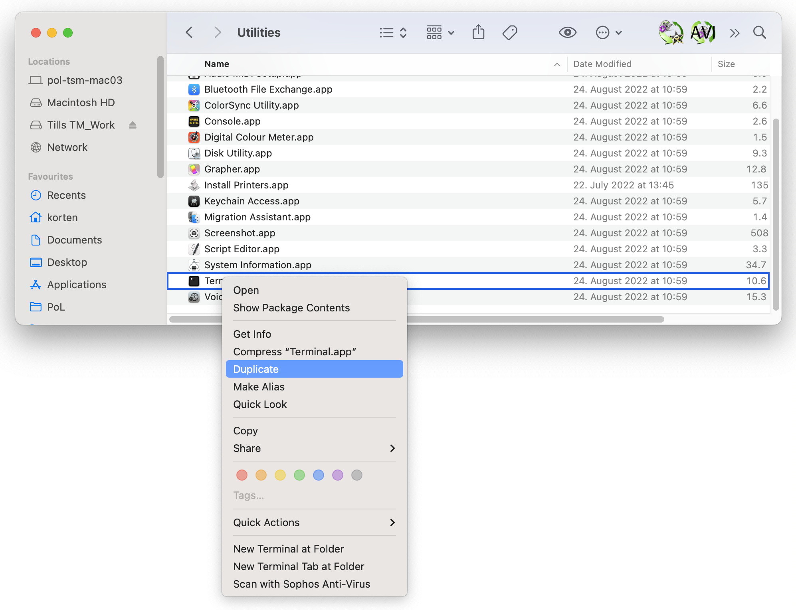
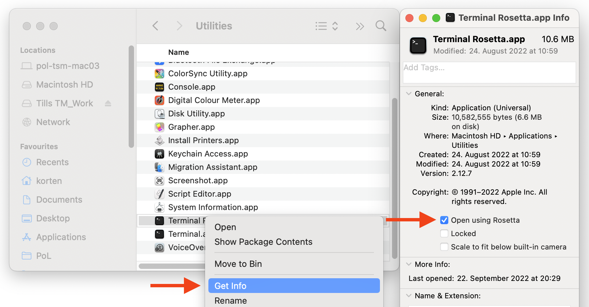

# Installing devbio-napari on an arm64 Mac

Trying to install `devbio-napari` on one of the new Macs with the arm64-based M1 or M2 processors, I got an error message:

```bash
mamba install -c conda-forge devbio-napari
[...]
Looking for: ['devbio-napari']

conda-forge/osx-arm64                                3.4MB @   3.0MB/s  1.3s
conda-forge/noarch                                   9.4MB @   3.6MB/s  2.9s

Pinned packages:
  - python 3.9.*


Encountered problems while solving:
  - nothing provides redlionfish needed by devbio-napari-0.1.5-pyhd8ed1ab_0
```
`conda` also throws an error:
```bash
conda install -c conda-forge devbio-napari
[...]
UnsatisfiableError: The following specifications were found to be incompatible with each other:

Output in format: Requested package -> Available versionsThe following specifications were found to be incompatible with your system:

  - feature:/osx-arm64::__osx==12.6=0
  - feature:|@/osx-arm64::__osx==12.6=0
  - devbio-napari -> __osx
  - devbio-napari -> __win

Your installed version is: 12.6
```
`pip` looks promising, because it starts to install packages. However, it also throws an error:
```bash
pip install devbio-napari
[...]
Collecting PyQt5!=5.15.0,>=5.12.3
  Using cached PyQt5-5.15.7.tar.gz (3.2 MB)
  Installing build dependencies ... done
  Getting requirements to build wheel ... done
  Preparing metadata (pyproject.toml) ... error
  error: subprocess-exited-with-error
[...]
AttributeError: module 'sipbuild.api' has no attribute 'prepare_metadata_for_build_wheel'
[...]
error: metadata-generation-failed
```

The source of all three error messages is that some python packages required for devbio-napari are not (yet?) available for the arm64 processor architecture. My solution was to set up a parallel python/micromamba installation that uses a i386 architecture and the rosetta emulator:

Many steps need admin rights, so make sure you are allowed to use sudo.


## 1. Install Rosetta
```bash
softwareupdate --install-rosetta
```
Then follow the prompts to agree to the license agreement and run the installation.

## 2. Create a Rosetta terminal

Now we need a way to run commands using Rosetta. First, duplicate the Terminal app. Navigate to /Applications/Utilities and duplicate Terminal:



Then rename the new copy to something like “Terminal Rosetta”. Next, right click on the new Terminal, click “Get Info” and check the “Open using Rosetta” box:



You can now use this new terminal to execute commands using Rosetta and the x86 architecture. Use it for the remaining steps.

After opening the terminal, make sure it really uses Rosetta:
```bash
arch

i386
```
if `arch` responds with `arm64`, you are still not using Rosetta. Try to close all terminal instances with `Cmd+q` and start `Terminal Rosetta.app` again.

## 3. Install Homebrew
```zsh
/bin/bash -c "$(curl -fsSL https://raw.githubusercontent.com/Homebrew/install/HEAD/install.sh)"
```
It’s exactly the same as installing Homebrew on the ARM64 architecture, but it will automatically be installed to a different location (`/usr/local/` instead of `/opt/homebrew`).

## 4. Install Micromamba

```bash
brew install --cask mambaforge
```

## 5. Set up the Python environment 

add the following to your `~/.zsh_profile` to automatically use the correct conda and brew versions in a Rosetta (and a non-Rosetta) terminal:
```bash
# rosetta terminal setup
if [ $(arch) = "i386" ]; then

    __conda_setup="$('/usr/local/Caskroom/mambaforge/base/bin/conda' 'shell.zsh' 'hook' 2> /dev/null)"
    if [ $? -eq 0 ]; then
        eval "$__conda_setup"
    else
        if [ -f "/usr/local/Caskroom/mambaforge/base/etc/profile.d/conda.sh" ]; then
            . "/usr/local/Caskroom/mambaforge/base/etc/profile.d/conda.sh"
        else
            export PATH="/usr/local/Caskroom/mambaforge/base/bin:$PATH"
        fi
    fi
    unset __conda_setup

    eval "$(/usr/local/bin/brew shellenv)"
    export PATH="/usr/local/opt/openjdk/bin:$PATH"
        alias brew86="/usr/local/bin/brew"
        alias pyenv86="arch -x86_64 pyenv"
else
    # >>> conda initialize >>>
    # !! Contents within this block are managed by 'conda init' !!
    __conda_setup="$('/opt/homebrew/Caskroom/mambaforge/base/bin/conda' 'shell.zsh' 'hook' 2> /dev/null)"
    if [ $? -eq 0 ]; then
        eval "$__conda_setup"
    else
        if [ -f "/opt/homebrew/Caskroom/mambaforge/base/etc/profile.d/conda.sh" ]; then
            . "/opt/homebrew/Caskroom/mambaforge/base/etc/profile.d/conda.sh"
        else
            export PATH="/opt/homebrew/Caskroom/mambaforge/base/bin:$PATH"
        fi
    fi
    unset __conda_setup

    # <<< conda initialize <<<

    eval "$(/opt/homebrew/bin/brew shellenv)"
    export PATH="/opt/homebrew/opt/openjdk/bin:$PATH"

fi
```
Make sure to not use `conda init` afterwards, because it will overwrite the paths such that the same conda version (the one which you executed) is used in both native (arm64) and Rosetta (i386) mode.

## 6. Install devbio-napari

We have set up zsh to use conda for environment management, hence we use conda to create the environment and mamba for installation in a second step (because conda may take several hours, while mamba takes minutes to install devbio napari).
```bash
conda create -n devbio-napari-env python=3.9
conda activate devbio-napari-env
mamba install -c conda-forge devbio-napari ocl_icd_wrapper_apple
```

## Resources

[towards datascience blog article](https://towardsdatascience.com/how-to-use-manage-multiple-python-versions-on-an-apple-silicon-m1-mac-d69ee6ed0250)
