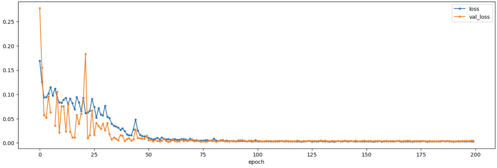
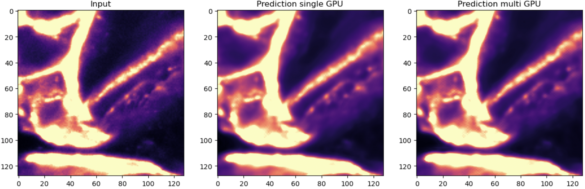

# Training Noise to Void on multiple GPUs

Training Noise to Void (N2V) models can be tedious. [On the taurus cluster](../devbio-napari_cluster/readme.md), you have multiple GPUs A100 GPUs available. Training on one of these is already 5-10 times faster than on a typical laptop GPU. However, on the cluster you even have the opportunity to use up to 8 A100 GPUs - sounds promising, right? In this blog post, we are exploring, how training works technically, and what the speed gain is.

## Training on a single GPU

We are going to use a slightly modified version of [the example notebook for training 3D models from the N2V repository](https://github.com/juglab/n2v/blob/main/examples/3D/01_training.ipynb).

We only modify the cell with the hyperparameters in order to get better results than in their example and to be closer to real trainin times:

```Python
# You can increase "train_steps_per_epoch" to get even better results at the price of longer computation. 
num_GPU = 1
batch_size = int(16 * num_GPU)
learning_rate = 0.0004 * num_GPU
epochs = int(200 / num_GPU)
config = N2VConfig(X, unet_kern_size=3, 
                   train_steps_per_epoch=200,train_epochs=epochs, train_loss='mse', batch_norm=True, 
                   train_batch_size=batch_size, n2v_perc_pix=0.198, n2v_patch_shape=patch_shape, 
                   n2v_manipulator='uniform_withCP', n2v_neighborhood_radius=5, train_learning_rate=learning_rate)

# Let's look at the parameters stored in the config-object.
vars(config)
```

{'means': ['1152.6188'],</br>
 'stds': ['2689.561'],</br>
 'n_dim': 3,</br>
 'axes': 'ZYXC',</br>
 'n_channel_in': 1,</br>
 'n_channel_out': 1,</br>
 'unet_residual': False,</br>
 'unet_n_depth': 2,</br>
 'unet_kern_size': 3,</br>
 'unet_n_first': 32,</br>
 'unet_last_activation': 'linear',</br>
 'unet_input_shape': (None, None, None, 1),</br>
 'train_loss': 'mse',</br>
 'train_epochs': 200,</br>
 'train_steps_per_epoch': 200,</br>
 'train_learning_rate': 0.0004,</br>
 'train_batch_size': 16,</br>
 'train_tensorboard': True,</br>
 'train_checkpoint': 'weights_best.h5',</br>
 'train_reduce_lr': {'factor': 0.5, 'patience': 10},</br>
 'batch_norm': True,</br>
 'n2v_perc_pix': 0.198,</br>
 'n2v_patch_shape': (16, 64, 64),</br>
 'n2v_manipulator': 'uniform_withCP',</br>
 'n2v_neighborhood_radius': 5,</br>
 'single_net_per_channel': True,</br>
 'blurpool': False,</br>
 'skip_skipone': False,</br>
 'structN2Vmask': None,</br>
 'probabilistic': False}

Note that we already calculate batch size, learning rate and number of epochs based on the number of GPUs we want to use. For now, we use just one GPU.

With these parameters, the training takes about 42 min on a single A100 GPU:

```
CPU times: user 26min 42s, sys: 6min 19s, total: 33min 1s
Wall time: 42min 31s
```

And we get a decently trained model:



## Training on 4 GPUs

Here comes the cool part, in order to enable training on multiple GPUs with tensorflow, we only need to change very few lines.

First we adapt the hyperparameters to 4 GPUs:

```Python
# You can increase "train_steps_per_epoch" to get even better results at the price of longer computation. 
num_GPU = 1
batch_size = int(16 * num_GPU)
learning_rate = 0.0004 * num_GPU
epochs = int(200 / num_GPU)
config = N2VConfig(X, unet_kern_size=3, 
                   train_steps_per_epoch=200,train_epochs=epochs, train_loss='mse', batch_norm=True, 
                   train_batch_size=batch_size, n2v_perc_pix=0.198, n2v_patch_shape=patch_shape, 
                   n2v_manipulator='uniform_withCP', n2v_neighborhood_radius=5, train_learning_rate=learning_rate)

# Let's look at the parameters stored in the config-object.
vars(config)
```

{'means': ['1152.6188'],</br>
 'stds': ['2689.561'],</br>
 'n_dim': 3,</br>
 'axes': 'ZYXC',</br>
 'n_channel_in': 1,</br>
 'n_channel_out': 1,</br>
 'unet_residual': False,</br>
 'unet_n_depth': 2,</br>
 'unet_kern_size': 3,</br>
 'unet_n_first': 32,</br>
 'unet_last_activation': 'linear',</br>
 'unet_input_shape': (None, None, None, 1),</br>
 'train_loss': 'mse',</br>
 'train_epochs': 50,</br>
 'train_steps_per_epoch': 200,</br>
 'train_learning_rate': 0.0016,</br>
 'train_batch_size': 64,</br>
 'train_tensorboard': True,</br>
 'train_checkpoint': 'weights_best.h5',</br>
 'train_reduce_lr': {'factor': 0.5, 'patience': 10},</br>
 'batch_norm': True,</br>
 'n2v_perc_pix': 0.198,</br>
 'n2v_patch_shape': (16, 64, 64),</br>
 'n2v_manipulator': 'uniform_withCP',</br>
 'n2v_neighborhood_radius': 5,</br>
 'single_net_per_channel': True,</br>
 'blurpool': False,</br>
 'skip_skipone': False,</br>
 'structN2Vmask': None,</br>
 'probabilistic': False}

 Note how we use a four times larger batch size and learning rate, because we distribute the batches over four GPUs. It has been shown [that a larger batch size justifies an equal increase in learning rate](https://www.baeldung.com/cs/learning-rate-batch-size). Because we expect this to converge faster, we reduce the number of epochs accordingly.


 In order to enable tensorflow to parallelize to multiple GPUs, we simply add three lines of code before we create the model:

 ```python
import tensorflow as tf
mirrored_strategy = tf.distribute.MirroredStrategy()
with mirrored_strategy.scope():
    model = N2V(config=config, name=model_name, basedir=basedir)
```

The first line imports tensorflow, the second line defines a strategy how tensorflow synchronizes the data between GPUs, and the third line makes sure that the model uses variables that are synchronized between GPUs. See the [tensorflow documentation](https://www.tensorflow.org/guide/distributed_training) for more details.

With these parameters, the training takes about 20 min on four A100 GPUs:

```
CPU times: user 27min 41s, sys: 3min 45s, total: 31min 26s
Wall time: 20min 26s
```

And we get a decently trained model:


Note how the loss is less noisy because of the larger batch size, but the overall shape of the loss is very similar.

## Denoising performance

Let's plot the denoising results side-by-side:



both networks perform very similar

## Conclusions

So we got just a 2-times speedup with 4 GPUs - what gives?

The problem is that after each batch is processed, the parameters must be synchronized between the GPUs, resulting in data transfer overhead. Therefore, It seems that